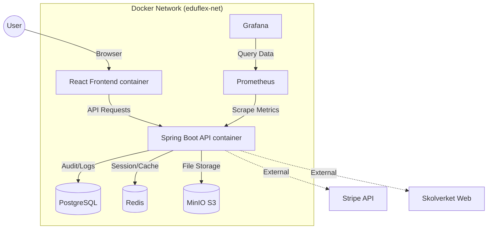

<p align="center">
  
</p>

<h1 align="center">🎓 EduFlex LMS 2.0</h1>

<p align="center">
  <em>The Complete Enterprise Learning Platform for Modern Education</em><br/>
  <em>Developed & maintained by <strong>Alex Weström / Fenrir Studio</strong></em>
</p>

<p align="center">
  <a href="#-english">🇬🇧 English</a> &nbsp;&nbsp;&nbsp;|&nbsp;&nbsp;&nbsp; <a href="#-svenska">🇸🇪 Svenska</a>
</p>

---

<p align="center">
  
  
  
  
  
  
</p>


### 🆕 Latest Updates (Jan 2026)

*   **Advanced Calendar System:** Complete calendar overhaul with precise time positioning, dynamic event heights, and teacher approval workflow. Students can book meetings with teachers, who can approve/reject/delete bookings. Events display at exact times (e.g., 10:30) with accurate duration visualization.
*   **Participant Filtering:** Students see only classmates and teachers in booking dropdowns, ensuring privacy and relevant connections.
*   **Modern Flat Design:** Refreshed calendar UI with clean, flat design matching the EduFlex design system.
*   **Global Dashboard Customization:** All users (Admin, Teacher, Student, Mentor) can now customize their dashboard widgets. Toggle visibility of stats, graphs, and lists via the new "Eye" icon.
*   **Course View Refactoring:** Merged "Activity" and "Attendance" tabs for teachers to provide a consolidated view. Restricted sensitive student data visibility.
*   **SSO Accuracy:** Fixed login tracking for Single Sign-On users. The "Studentuppföljning" now correctly reports last login times for Keycloak users.
*   **Stability:** Resolved JSON recursion bugs in User API and fixed Docker network communication for authentication services.

---


<div id="-english"></div>

## 🇬🇧 English

### 📖 Table of Contents
- [About the Project](#-about-the-project)
- [Key Features](#-key-features)
- [System Architecture](#-system-architecture)
- [Technology Stack](#-technology-stack)
- [Getting Started](#-getting-started)
- [Configuration](#-configuration)
- [Modules Deep Dive](#-modules-deep-dive)
- [Localization](#-localization)
- [Roadmap](#-roadmap)
- [License](#-license)

### 🏫 About the Project

**EduFlex 2.0** is a robust, cloud-native Learning Management System (LMS) engineered for scalability and user engagement. It bridges the gap between traditional enterprise LMS (often clunky and boring) and modern consumer apps (gamified, fast, and beautiful).

Whether you are a single educator, a private school, or a municipal education board, EduFlex scales to meet your needs using a microservices-ready architecture orchestrating storage, caching, and compute.

### 🌟 Key Features

#### 🍎 Core Education
- **Course Management:** Create comprehensive courses with rich text, video, attachments and quizzes.
- **SCORM / xAPI Support:** Import interactive course packages from Articulate/Adobe Captivate.
- **Assignment Engine:** Students submit files, teachers grade with feedback.
- **Certification:** Automatically generating verifiable PDF certificates upon course completion.

#### 🎮 Gamification & Engagement
- **Points & Levels:** Users earn XP for logging in, completing lessons, and acing quizzes.
- **Badges:** Visual achievements using Lucide iconography.
- **Leaderboards:** Foster healthy competition (toggleable per course).

#### 🇸🇪 Skolverket Integration
- **Curriculum Mapping:** Direct integration with Swedish National Agency for Education (Skolverket).
- **Automated Import:** Python mechanisms to fetch course codes, descriptions, and grading criteria.
- **Detailed Views:** View "Kunskapskrav" (Grading Criteria) directly within the course interface.

#### 💼 Revenue & Administration
- **SaaS Ready:** Built-in subscription tiers (Free, Pro, Enterprise).
- **Invoicing:** Automatic PDF invoice generation for recurring payments.
- **User Management:** Detailed profiles with avatar uploads (MinIO backed).
- **Role-Based Access Control (RBAC):** Granular permissions for Super Admin, Admin, Teacher, and Student.
- **Configurable Dashboards:** Admins can define specific dashboard layouts (Admin, Principal, Teacher, Student, Mentor) for any role.
- **Enterprise Themes & Whitelabel:** Complete visual customization for Enterprise customers with 7 professional design systems:
  - **EduFlex Classic:** Traditional sidebar layout with professional aesthetics
  - **EduFlex Focus:** Minimalist design with left-marker navigation and floating container
  - **EduFlex Horizon:** Top navigation with beige gradient and gold accents
  - **EduFlex Nebula:** Glassmorphic design with purple/lavender palette
  - **EduFlex Ember:** Card-contained sidebar with orange accents and dark green background
  - **EduFlex Voltage:** Acid lime neon theme with integrated dark sidebar
  - **EduFlex Midnight:** Dark mode with mint green accents and pill navigation
  - **EduFlex Pulse:** Music player-inspired with bright red and circular navigation
- **Theme Manager:** Real-time preview and customization of colors, typography, spacing, and layout per tenant.

#### 📊 Analytics & Insights (New)
- **Principal Dashboard:** Dedicated view for school leaders with high-level metrics (Revenue, Active Users, Server Health).
- **Risk Analysis:** AI-driven widgets identifying students at risk of failing or dropping out.
- **CSN Reporting:** Automated export of student attendance and activity data for CSN compliance.
- **Drill-Down:** Deep-dive into individual student history, logged hours, and activity logs.

#### 🌍 Localization
- **Multi-language Support:** Fully translated UI for minimal friction.
- **Supported Languages:** Swedish (Primary), English, Arabic, Norwegian, Danish, Finnish, German, French, Spanish.

#### 🛠 Monitoring & Maintenance (New)
- **Real-time Debug Terminal:** "Matrix-style" live log streamer for instant backend feedback.
- **Client Error Tracking:** Automatic capture of frontend crashes and JavaScript errors.
- **Log Dashboard:** Searchable, color-coded view of server logs directly in the Admin UI.

---

### 📸 Screenshots

|  |  |
|:---:|:---:|
| **Admin Dashboard** | **Teacher Dashboard** |

|  |  |
|:---:|:---:|
| **AI Quiz Generator** | **System Settings** |

|  |  |
|:---:|:---:|
| **Analytics & Insights** | **Live Debug Terminal** |

---

### 🛠 System Architecture

EduFlex utilizes a containerized architecture managed by **Docker Compose**. This ensures identical environments from development to production.



### 💻 Technology Stack

#### Frontend Service (`eduflex-frontend`)
- **Core:** React 19, Vite (Build Tool)
- **State:** Zustand (Global State), React Context
- **Styling:** Tailwind CSS v4, Lucide React (Icons)
- **Internationalization:** i18next
- **Data Viz:** Recharts (Analytics)

#### Backend Service (`eduflex-backend`)
- **Core:** Java 21, Spring Boot 3.4
- **Security:** Spring Security 6
- **Data:** Spring Data JPA (Hibernate), PostgreSQL Driver
- **Caching:** Spring Data Redis
- **Docs:** Swagger / OpenAPI 3.0

#### Infrastructure
- **Database:** PostgreSQL 15 (Alpine)
- **Object Storage:** MinIO (S3 compatible)
- **Cache:** Redis 7 (Alpine)
- **Monitoring:** Prometheus & Grafana
- **Backups:** Automatic daily PostgreSQL dumps

---

### 🚀 Getting Started

#### Prerequisites
- **Docker Desktop** (latest version)
- **Git**

#### Installation

1.  **Clone the Repository**
    ```bash
    git clone https://github.com/alexwest1981/EduFlex.git
    cd EduFlex
    ```

2.  **Start the System**
    This command builds the images and spins up all 7 containers (DB, Redis, MinIO, Backend, Frontend, Prometheus, Grafana).
    ```bash
    docker compose up --build -d
    ```

3.  **Access the Application**
    - **Frontend (LMS):** [http://localhost:5173](http://localhost:5173)
    - **Backend API:** [http://localhost:8080/api](http://localhost:8080/api)
    - **MinIO Console:** [http://localhost:9001](http://localhost:9001) (User: `minioadmin` / Pass: `minioadmin`)
    - **Grafana Dashboards:** [http://localhost:3000](http://localhost:3000) (User: `admin` / Pass: `admin` - Skip password change)

4.  **License Key**
    The system requires a signed license key (`eduflex.license`) to unlock Pro/Enterprise features.

---

### ⚙️ Configuration

#### Environment Variables
The system is pre-configured via `docker-compose.yml`. Key variables include:

| Service | Variable | Description | Default |
|:---|:---|:---|:---|
| **Backend** | `SPRING_DATASOURCE_URL` | DB Connection string | `jdbc:postgresql://db:5432/eduflex` |
| **Backend** | `MINIO_URL` | Internal S3 endpoint | `http://minio:9000` |
| **Frontend** | `VITE_API_BASE_URL` | API Endpoint | `http://localhost:8080/api` |
| **Grafana** | `GF_AUTH_ANONYMOUS_ENABLED` | Allow viewing without login | `true` |

#### Backups
To access the running database directly:
```bash
docker exec -it eduflex-db psql -U postgres -d eduflex
```
Backups are automatically taken daily. To force a backup:
```bash
docker restart eduflex-backup
```


### ❓ Troubleshooting

#### Common Issues

**1. "Port 8080 is already in use"**
This means another service (like Tomcat or Jenkins) is running on your machine.
*   **Fix:** Stop the conflicting service or change the port mapping in `docker-compose.yml` (e.g., `"8081:8080"`).

**2. WebSocket Connection Failed (401/404)**
If the Debug Terminal shows "OFFLINE":
*   Ensure you are using `ws://` protocol (managed automatically by frontend).
*   Check if `SecurityConfig` allows `/ws-log/**`.
*   **Fix:** Run `docker compose down -v` to clear stale volumes and restart.

**3. Database Connection Refused**
*   Wait 10-15 seconds after startup. The Database container needs time to initialize before the Backend can connect.

---

<br />
<br />
<div id="-svenska"></div>


## 🇸🇪 Svenska

### 📖 Innehållsförteckning
- [Om Projektet](#-om-projektet)
- [Nyckelfunktioner](#-nyckelfunktioner)
- [Systemarkitektur](#-systemarkitektur)
- [Teknikstack](#-teknikstack)
- [Kom igång](#-kom-igång)
- [Konfiguration](#-konfiguration-sv)

### 🏫 Om Projektet

**EduFlex 2.0** är ett komplett, molnbaserat **Learning Management System (LMS)** designat för att skala från små utbildningsföretag till stora kommunala verksamheter. Systemet kombinerar modern pedagogik (Gamification, interaktiva element) med affärskritisk funktionalitet (fakturering, prenumerationer) i en säker, Docker-baserad mikrotjänst-arkitektur.

### 🌟 Nyckelfunktioner

#### 🍎 Utbildning (Core)
- **Kurshantering:** Skapa rika kurser med text, video, bilagor och quiz.
- **SCORM / xAPI:** Fullt stöd för uppladdning av paket från Articulate/Captivate.
- **Uppgifter:** Elever lämnar in filer, lärare rättar och ger feedback.
- **Certifikat:** Automatiska, spårbara PDF-diplom vid avklarad kurs.

#### 🎮 Gamification
- **Poäng & Levels:** Användare tjänar XP genom aktivitet och framsteg.
- **Utmärkelser:** Visuella badges för prestationer.
- **Topplistor:** Frivilliga topplistor för att öka engagemanget i klassen.

#### 🇸🇪 Skolverket-integration
- **Kurskoppling:** Direkt koppling till Skolverkets databas.
- **Automatisk Import:** Python-verktyg hämtar kurskoder och beskrivningar.
- **Kunskapskrav:** Visa betygsmatriser (E-A) direkt i kursvyn för elever och lärare.

#### 💼 Administration & Ekonomi
- **SaaS-stöd:** Inbyggda prenumerationsnivåer (Free, Pro, Enterprise).
- **Fakturering:** Automatgenerering av PDF-fakturor.
- **Användarprofiler:** Avancerad profilhantering med bildlagring via MinIO.
- **Rättighetsstyrning (RBAC):** Detaljerade behörigheter för Admin, Lärare och Elev.
- **Konfigurerbara Dashboards:** Administratörer kan styra vilken dashboard-layout (Admin, Rektor, Lärare, Student, Mentor) en roll ska ha.
- **Enterprise-teman & Whitelabel:** Komplett visuell anpassning för Enterprise-kunder med 7 professionella designsystem:
  - **EduFlex Classic:** Traditionell sidopanel med professionell estetik
  - **EduFlex Focus:** Minimalistisk design med vänstermarkör-navigering och flytande container
  - **EduFlex Horizon:** Toppnavigering med beige gradient och guldaccenter
  - **EduFlex Nebula:** Glassmorfisk design med lila/lavendel-palett
  - **EduFlex Ember:** Kortinnesluten sidopanel med orange accenter och mörkgrön bakgrund
  - **EduFlex Voltage:** Syra-lime neon-tema med integrerad mörk sidopanel
  - **EduFlex Midnight:** Mörkt läge med mint-gröna accenter och pill-navigering
  - **EduFlex Pulse:** Musikspelare-inspirerad med klarröd och cirkulär navigering
- **Temahanterare:** Realtidsförhandsgranskning och anpassning av färger, typografi, avstånd och layout per tenant.

#### 📊 Analys & Uppföljning (Nytt)
- **Rektorspanel:** Dedikerad vy för skolledare med nyckeltal (Omsättning, Aktiva Användare, Systemhälsa).
- **Riskanalys:** Widgets som identifierar elever i farozonen baserat på närvaro och aktivitet.
- **CSN-rapportering:** Automatisk export av närvarodata för CSN-underlag.
- **Djupdykning:** Detaljerad historik och aktivitetslogg på individnivå.

#### 🌍 Lokalisering
- **Flerspråksstöd:** Hela plattformen är översatt.
- **Stödda språk:** Svenska (Primärt), Engelska, Arabiska, Norska, Danska, Finska, Tyska, Franska, Spanska.


#### 🛠 Övervakning & Underhåll (Nytt)
- **Real-time Debug Terminal:** "Matrix-liknande" live-strömning av loggar för direkt feedback.
- **Klientfelspårning:** Automatisk insamling av frontend-krascher och JavaScript-fel.
- **Log Dashboard:** Sökbar, färgkodad vy av serverloggar direkt i Admin-gränssnittet.

---

### 📸 Skärmdumpar

|  |  |
|:---:|:---:|
| **Admin Översikt** | **Lärarpanel** |

|  |  |
|:---:|:---:|
| **AI Quiz-Generator** | **Systeminställningar** |

|  |  |
|:---:|:---:|
| **Analys & Insikter** | **Live Debug Terminal** |

---

### 🛠 Systemarkitektur

Systemet körs i en container-miljö orkestrerad av **Docker Compose**. Detta garanterar identiska miljöer för utveckling och produktion.

*(Se diagram i den engelska sektionen ovan)*

### 💻 Teknikstack

#### Frontend (`eduflex-frontend`)
- **Ramverk:** React 19, Vite
- **State Management:** Zustand
- **Design:** Tailwind CSS v4, Lucide React
- **Grafer:** Recharts

#### Backend (`eduflex-backend`)
- **Kärna:** Java 21, Spring Boot 3.4
- **Säkerhet:** Spring Security 6, JWT
- **Databas:** PostgreSQL 15, Spring Data JPA
- **Cache:** Redis 7

#### Infrastruktur
- **Objektlagring:** MinIO (S3-kompatibel för filer/bilder)
- **Övervakning:** Prometheus & Grafana
- **Backups:** Dagliga automatiska backuper av PostgreSQL

---

### 🚀 Kom igång

#### Förutsättningar
- **Docker Desktop** (senaste versionen)
- **Git**

#### Installation

1.  **Klona projektet**
    ```bash
    git clone https://github.com/alexwest1981/EduFlex.git
    cd EduFlex
    ```

2.  **Starta systemet**
    Detta bygger och startar alla 7 containers (DB, Redis, MinIO, Backend, Frontend, Monitorering).
    ```bash
    docker compose up --build -d
    ```

3.  **Öppna applikationen**
    - **LMS (Frontend):** [http://localhost:5173](http://localhost:5173)
    - **API Docs:** [http://localhost:8080/api](http://localhost:8080/api)
    - **MinIO (Filer):** [http://localhost:9001](http://localhost:9001) (Anv: `minioadmin` / Lös: `minioadmin`)
    - **Grafana (Statistik):** [http://localhost:3000](http://localhost:3000) (Anv/Lös: `admin`)

---

### ⚙️ Konfiguration (Sv)

#### Miljövariabler
Systemet är förkonfigurerat via `docker-compose.yml`. Viktiga variabler:

| Tjänst | Variabel | Beskrivning | Standardvärde |
|:---|:---|:---|:---|
| **Backend** | `SPRING_DATASOURCE_URL` | Databaslänk | `jdbc:postgresql://db:5432/eduflex` |
| **Backend** | `MINIO_URL` | Intern S3-länk | `http://minio:9000` |
| **Frontend** | `VITE_API_BASE_URL` | API-länk | `http://localhost:8080/api` |


### ❓ Felsökning

#### Vanliga Problem

**1. "Port 8080 is already in use"**
Betyder att en annan tjänst (t.ex. en gammal Java-process eller Tomcat) körs på port 8080.
*   **Lösning:** Stäng av den andra tjänsten eller ändra port i `docker-compose.yml` (t.ex. till `"8081:8080"`).

**2. Debug Terminal visar "OFFLINE"**
Om terminalen inte kopplar upp:
*   Webbläsaren kanske cachar gamla JS-filer. Testa "Hård uppdatering" (Ctrl+F5).
*   Nätverksfel i Docker?
*   **Lösning:** Kör `docker compose down -v` och sedan `up --build` igen för att rensa skräp.

**3. Databasfel vid uppstart**
*   PostgreSQL tar några sekunder på sig att vakna. Backend försöker automatiskt igen, så ha is i magen i ca 15 sekunder.

---

## ⚖️ Licens & Kontakt

**EduFlex™ © 2026 Alex Weström / Fenrir Studio**

**Proprietary Software.**
Otillåten kopiering, modifiering eller distribution är förbjuden utan giltig licens.
Källkoden tillhandahålls endast för auktoriserad utveckling och underhåll.

För Enterprise-frågor:
📧 **alexwestrom81@gmail.com**

<p align="center"> 
   
</p>
