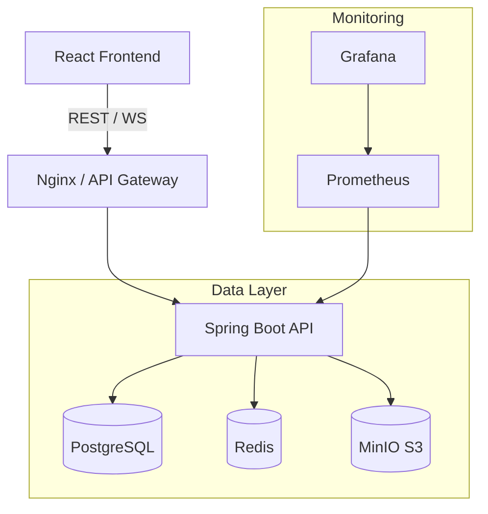

<p align="center">
  
</p>

<h1 align="center">🎓 EduFlex LMS 2.0</h1>

<p align="center">
  <em>Next-Generation Enterprise Learning Platform</em><br/>
  <em>Developed & maintained by <strong>Alex Weström / Fenrir Studio</strong></em>
</p>

---

<p align="center">
  
  
  
  
  
  
  
  
</p>


---

## 🏫 Om Projektet

**EduFlex 2.0** är ett komplett, molnbaserat **Learning Management System (LMS)** designat för att skala från små utbildningsföretag till stora kommunala verksamheter.
Systemet kombinerar modern pedagogik (**Gamification, SCORM, QuizRunner**) med affärskritisk funktionalitet (**Prenumerationer, Fakturering, Analytics**) i en säker, Docker-baserad mikrotjänst-arkitektur.


### 🌟 Nytt i Version 2.0

- **📦 SCORM Integration:** Fullt stöd för uppladdning och uppspelning av interaktiva utbildningspaket (SCORM 1.2 / xAPI).
- **💰 Revenue Management:** Inbyggt stöd för prenumerationer (SaaS), automatiska fakturor och betalningar via Stripe/Swish.
- **⚡ Enterprise Performance:** Redis-caching för blixtsnabba laddtider och WebSocket-skalning.
- **📊 Advanced Analytics:** Djupgående grafer över MRR (Monthly Recurring Revenue), Churn, och Student Progress.
- **🔒 Security Hardening:** RSA-licensnycklar, Rate Limiting, Audit Logs och strikt RBAC (Role Based Access Control).
- **☁️ Object Storage:** Integration med **MinIO/S3** för skalbar filhantering.

---

## 🚀 Ekosystem & Moduler

### 🎓 Utbildning (Core)
- **Course Builder:** Skapa rika kurser med text, video, quiz och uppgifter.
- **QuizRunner 2.0:** Avancerade prov med tidsgränser, slumpmässiga frågor och AI-generering.
- **Gamification:** Poäng, levels, badges och topplistor för att öka engagemanget.
- **Certifikat:** Automatgenererade PDF-diplom med verifierbara ID:n.

### 💼 Affär & Administration (Revenue)
- **Subscription Plans:** Skapa Guld/Silver/Brons-nivåer med olika behörigheter.
- **Invoice Engine:** Automatisk generering och utskick av PDF-fakturor.
- **License Manager:** Hantera licenser för företagskunder med "Seats" och utgångsdatum.

### 🛠️ Integration & Teknik
- **LTI 1.3:** Seamless integration med Canvas, Moodle och Teams.
- **SSO:** Logga in med Google, GitHub eller Microsoft Entra ID.
- **API First:** Fullständigt REST API för integration med tredjepartssystem.

---

## 📸 Skärmdumpar

### Rollbaserade Dashboards
| Student (Gamified) | Teacher (Control) | Admin (Analytics) |
|:--:|:--:|:--:|
|  |  |  |

### Enterprise Modules
| Revenue / Fakturor | System Moduler | SCORM Player |
|:--:|:--:|:--:|
|  |  | *Kommer snart* |

---

## 🛠️ Teknisk Arkitektur

Projektet körs i en containeriserad miljö orkestrerad via **Docker Compose**.



### Tech Stack
- **Frontend:** React 19, Vite, Tailwind CSS v4, Zustand, Recharts.
- **Backend:** Spring Boot 3.4, Java 21, Hibernate, Spring Security 6.
- **Infrastructure:** Docker, PostgreSQL 15, Redis 7, MinIO, Prometheus, Grafana.
- **DevOps:** GitHub Actions (CI/CD), Automated Backups.

---

## 📦 Installation (Docker)

Starta hela miljön med ett enda kommando:

```bash
# 1. Klona repot
git clone https://github.com/alexwest1981/EduFlex.git
cd EduFlex

# 2. Starta (Databas, Backend, Frontend, Redis, MinIO)
docker compose up --build -d

# 3. Access
# Frontend: http://localhost:5173
# Backend API: http://localhost:8080/api
# MinIO Console: http://localhost:9001
# Grafana: http://localhost:3000
```

---

## 📆 Roadmap & Status

### ✅ Completed (Phase 1 & 2)
- [x] Core LMS (Courses, Lessons, Users)
- [x] Gamification Engine
- [x] Role-Based Dashboards
- [x] PDF Certificates
- [x] Internal Messaging & Chat

### 🚧 Current Focus (Phase 3: Enterprise)
- [x] **Revenue Management (Subscriptions/Invoices)**
- [x] **SCORM / xAPI Support**
- [x] **High Availability (Redis/Caching)**
- [/] Mobile App (PWA)
- [ ] Multi-tenancy (SaaS mode)

---

## ⚖️ Licens & Kontakt

### EduFlex™ © 2026 Alex Weström / Fenrir Studio
*Proprietary Software. Unauthorized copying, modification, or distribution is strictly prohibited.*

För licensförfrågningar eller Enterprise-avtal:
📧 **alexwestrom81@gmail.com**

<p align="center"> 
  <br/> 
  <strong>Innovation meets Precision.</strong>
</p>
