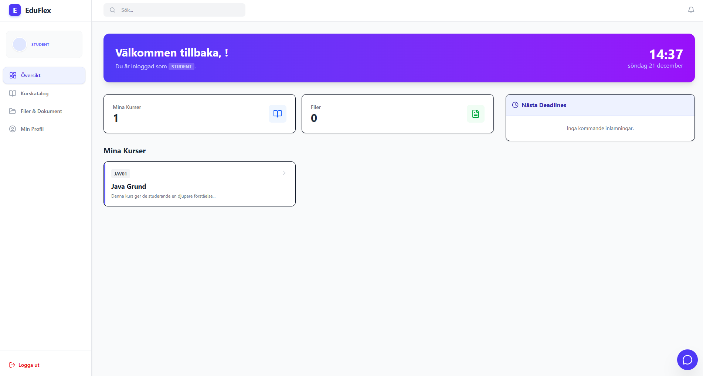
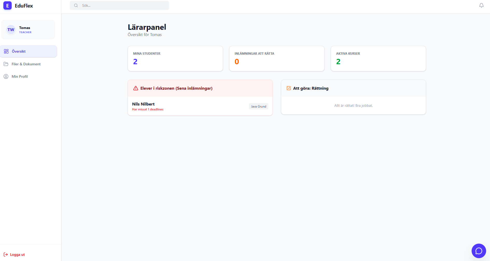
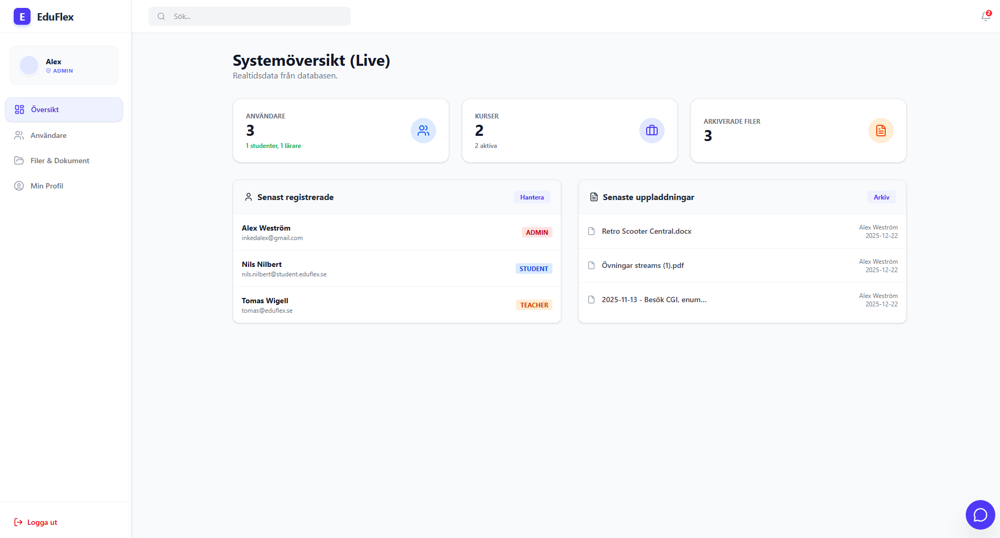

  

<h1 align="center">🎓 EduFlex LMS</h1>

  <em>Developed & maintained by <strong>Alex Weström / Fenrir Studio</strong></em>

---

---

## 🏫 Om Projektet

**EduFlex** är ett modernt, rollbaserat **Learning Management System (LMS)** för skolor, utbildningsföretag och intern företagsutbildning.  
Systemet är byggt med fokus på **säkerhet, prestanda, realtidskommunikation och modulär funktionalitet**, inklusive licenshantering, chatt, forum, quizsystem och dynamiska moduler som kan aktiveras per installation.  

---

## 🚀 Kärnfunktioner

### 👤 Gemensamt för alla användare

- Säker **JWT-autentisering** med rollbaserad åtkomst (Admin, Teacher, Student).
- **Personlig dashboard** med widgets för kurser, deadlines, notifieringar och senaste aktivitet.
- **Profilhantering** med avatar, adress, lösenordsbyte och korrekt serverade profilbilder.
- **Dokumentarkiv** för egna filer med robust felhantering och persistens över sidladdningar.
- **Kalender** med kursstarter, deadline-översikt och händelser.
- **Notifieringscenter** (bell-icon) med systemhändelser, chatt- och bedömningsaviseringar.

### 🎓 För studenter

- **Kurskatalog** med self-enrollment och status (öppen/stängd).
- **Kursvy** med video, filer, länkar och rich text via modern editor.
- **Uppgifter och inlämningar** med tydlig status och feedback.
- **QuizRunner** för att genomföra quiz direkt i kursvy.
- **Forum** per kurs med kategorier och trådar för diskussion.
- **Kursutvärderingar** direkt från dashboard eller kursvy.

### 🍎 För lärare

- **Kurshantering** (CRUD) inklusive start-/slutdatum, status och färgteman per kurs.
- **Materialhantering** med rich text (React-baserad editor) och filuppladdningar.
- **Uppgifts- och rättningsflöde** med bedömning (t.ex. IG/G/VG) och individuell feedback.
- **AttendanceView** för närvaroregistrering per CourseEvent.
- **AssessmentView** med samlad översikt av inlämningar, betyg och quizresultat.
- **QuizBuilder** för att skapa och redigera quiz i CourseDetail.
- **Kursforum** med kategori- och trådskapande för strukturerad diskussion.

### 🛡️ För administratörer

- **Admin Dashboard** med KPI:er, systemlogg och användaröversikt.
- **Användarhantering** (skapa, redigera, inaktivera) med varningar vid kopplade resurser.
- **Kursöversikt** med alla aktiva/arkiverade kurser och redigeringsmodal.
- **Systemarkiv** för filer och global filåtkomst.
- **Licenshantering** med validering, aktivering och låsning av funktionalitet vid ogiltig licens.
- **Modules-flik** i AdminPanel för att slå på/av dynamiska systemmoduler (t.ex. Chat, Gamification, Dark Mode).

---

## 🧩 Modul- & Systemsupport

EduFlex har ett **SystemSettings-baserat modulsystem** där centrala funktioner kan aktiveras och styras dynamiskt via backend och AdminPanel.  

### 🔧 Dynamiska moduler

Exempel på moduler som kan styras via SystemSettings:

- **Chat** – realtidschatt (WebSocket-baserad) som kan aktiveras/inaktiveras.
- **Gamification** – visuella badges (t.ex. i layouten) och poängsystem.
- **Dark Mode** – temaväxling på klientsidan styrd av modulstatus.

Modulstatus exponeras via API och speglas i frontend-layout (t.ex. Gamification-badge när modulen är aktiv).

---

## 💬 Kommunikation & Forum

### Chat

- **Realtidschatt** via WebSocket (SockJS/STOMP).
- **ChatOverlay** med historik, online-användare, bildstöd och notifieringsbadges.
- Säkerhet via WebSocket-auth och uppdaterad SecurityConfig.

### Forum

- **CourseForum** per kurs med kategorier och trådar.
- **POST-endpoint** för att skapa forumkategorier i backend.
- Fixad renderingslogik och endpoints i `api.js` för att hantera forum-CRUD korrekt.
- Recursion-problem i JSON-serialisering löst via `@JsonIgnoreProperties` i relevanta entiteter (User, Course, Forum) för att undvika infinite recursion.

---

## 🧪 Innehåll & Rich Text

EduFlex använder en modern rich text-lösning för kursinnehåll, uppgifter och forum-inlägg.

- Migrerad till **`react-quill-new`** för kompatibilitet med React 19.
- Egen **RichTextEditor-komponent** med memoiserad konfiguration för bättre prestanda.
- HTML-innehåll lagras i databasen och återanvänds i kurs- och uppgiftsvyer.

---

## 📸 Skärmdumpar

### 🎯 Dashboards

  
*Personlig studentvy med kurser, deadlines, quiz och notifieringar.*

  
*Läraröversikt med at-risk-studenter, kursstatus och senaste aktivitet.*

  
*System-KPI:er, senaste händelser och genvägar till adminverktyg.*

### 👤 Profil & Licens

  
*Profil, avatar och dokumenthantering med korrekt bildladdning.*

  
*Licensstatus, aktivering och låsning av moduler vid ogiltig licens.*

### 🧪 Quiz, Forum & Chatt

  
*QuizBuilder och QuizRunner för kursanknutna prov.*

  
*Forum med kategorier, trådar och diskussion per kurs.*

  
*Realtidschatt med notifieringsbadges och användarlista.*

---

## 🛠️ Teknisk Stack

### Frontend

- **React 19** + Vite
- **Tailwind CSS v4** + Lucide React (ikoner)
- **RichText:** `react-quill-new` via egen `RichTextEditor`
- **WebSocket:** SockJS/STOMP för chatt och notifieringar
- **State:** Rollbaserade dashboards och persistent profil/dokument-state
- **Routing:** Custom SPA-routing

### Backend

- **Java** (modern LTS) + **Spring Boot 3.x**
- **Spring Security** (JWT + WebSocket-säkerhet)
- **Spring Data JPA** / Hibernate
- **Databaser:** MySQL (prod) / H2 (dev)
- **SystemSettings-arkitektur** för moduler (Chat, Gamification, Dark Mode)
- **WebConfig**-resource handlers för uppladdade profilbilder
- **REST API** + WebSocket-endpoints

### Prestanda & Stabilitet

- N+1 SELECT-problem löst via `@EntityGraph` på kursrelaterade queries.
- JSON-serialiseringsproblem (infinite recursion / “Document nesting depth”) lösta via `@JsonIgnoreProperties` på User, Course och Forum-relaterade modeller.
- DTO-mappning för t.ex. `UserSummaryDTO` och Course-DTOs justerad för färgfält, datum och relationer.
- CORS-konfiguration uppdaterad med `allowedOriginPatterns` och credential-stöd.

---

## 🧩 Systemarkitektur (översikt)
             ┌─────────────────────────────┐
             │           Frontend          │
             │    React 19 + Vite + TWCSS  │
             ├─────────────────────────────┤
             │ Rollbaserade Dashboards     │
             │ QuizBuilder / QuizRunner    │
             │ ChatOverlay                 │
             │ CourseForum                 │
             │ Attendance & Assessments    │
             │ Profile & Documents         │
             │ Modules UI (Chat/Gamify/DM) │
             └─────────────┬───────────────┘
                           │ REST + WebSocket
                           ▼
          ┌──────────────────────────────┐
          │        Spring Boot API       │
          ├──────────────────────────────┤
          │ Auth & License               │
          │ Course, Quiz, Forum          │
          │ Chat & Notifications         │
          │ Attendance & Assessment      │
          │ SystemSettings (Modules)     │
          │ Recent Activity / Dashboard  │
          └─────────────┬────────────────┘
                        │ JPA/Hibernate
                        ▼
                  ┌──────────────┐
                  │  MySQL / H2  │
                  └──────────────┘

### 🔄 Modulkommunikation

| **Modul**        | **Syfte**                                                            | **Kommunikation**         | **Beroenden**                          |
|------------------|----------------------------------------------------------------------|---------------------------|----------------------------------------|
| Auth             | JWT-autentisering och rollstyrning                                  | REST                      | UserRepository                         |
| License          | Licensvalidering och låsning av funktioner                          | REST                      | User, LicenseEntity                    |
| Dashboard        | Rollbaserade vyer, senaste aktivitet, widgets                        | REST + ev. WebSocket      | User, Course, Activity                 |
| Course           | Kurser, material, datum, status, färg                               | REST                      | CourseRepository (EntityGraph)         |
| Quiz             | QuizBuilder/Runner, resultat                                         | REST                      | Course, QuizRepository                 |
| Chat             | Realtidschatt per kurs/system                                       | WebSocket (STOMP/SockJS)  | UserSession, ChatMessage               |
| Forum            | Kursforum med kategorier och trådar                                 | REST                      | Course, ForumCategory, ForumThread     |
| Attendance       | CourseEvent och närvaroregistrering                                  | REST                      | CourseEvent, User                      |
| Assessment       | Betyg, feedback, submissions, quizresultat                          | REST                      | Course, Submission, QuizResult         |
| Documents        | Dokumentlista, profilerade filer, robust hantering                  | REST                      | User, filsystem / storage backend      |
| SystemSettings   | Modulflaggor (Chat, Gamification, Dark Mode)                         | REST                      | SystemSettingsRepository               |
| Notifications    | Systemaviseringar (chat, grading, forum, licens)                    | WebSocket + events        | User, Chat, Submission, Forum, License |

---

## ⚙️ Installation & Setup

### Förutsättningar

- Node.js 20+ och npm
- Java (LTS) + Maven
- MySQL 8.x (eller H2 för utveckling)

### Frontend

git clone https://github.com/alexwest1981/eduflex-frontend.git 
cd eduflex-frontend 
npm install --legacy-peer-deps 
npm run dev # http://localhost:5173 
 

### Backend

> Se separat backend-repo för detaljerad konfiguration av `application.properties` (databas, filuppladdning, CORS, licensnycklar).
> 
mvn spring-boot:run # http://127.0.0.1:8080/api

Verifiera:

- API: `GET http://127.0.0.1:8080/api/courses`
- Recent activity: `GET http://127.0.0.1:8080/api/dashboard/recent-activity`
- WebSocket endpoint: t.ex. `/ws/eduflex` via SockJS

---

## 📈 Kvalitet & Underhåll

- 100% **live-data** – inga hårdkodade mockups kvar.
- Löpande arbete med prestanda (N+1, DTO-struktur, cachning där relevant).
- Fokus på robust felhantering (forum, filer, profilbilder, editor-kompatibilitet).
- Kodbasen utvecklas kontinuerligt med modulär arkitektur och tydlig domänuppdelning.

---

## ⚖️ Licens & Äganderätt

**EduFlex™** och all relaterad källkod, design, datamodellering och dokumentation ägs av **Alex Weström / Fenrir Studio**.  
Allt innehåll skyddas av svensk upphovsrättslag (1960:729) samt relevanta internationella konventioner.  
Projektet omfattas för närvarande av en **privat, begränsad licens**; all användning, reproduktion eller modifiering kräver skriftligt tillstånd.

### Licensförfrågningar & samarbete

> **Alex Weström**  
> *Fenrir Studio*  
> 📧 [alexwestrom81@gmail.com](mailto:alexwestrom81@gmail.com)  
> 📍 Svenljunga, Sverige  

En övergång till en **öppen licensmodell** (t.ex. MIT eller Apache 2.0) planeras inför framtida publika releaseversioner.

---

   
  Made with ❤️ by <strong>Fenrir Studio</strong> 
  Where innovation meets precision.

