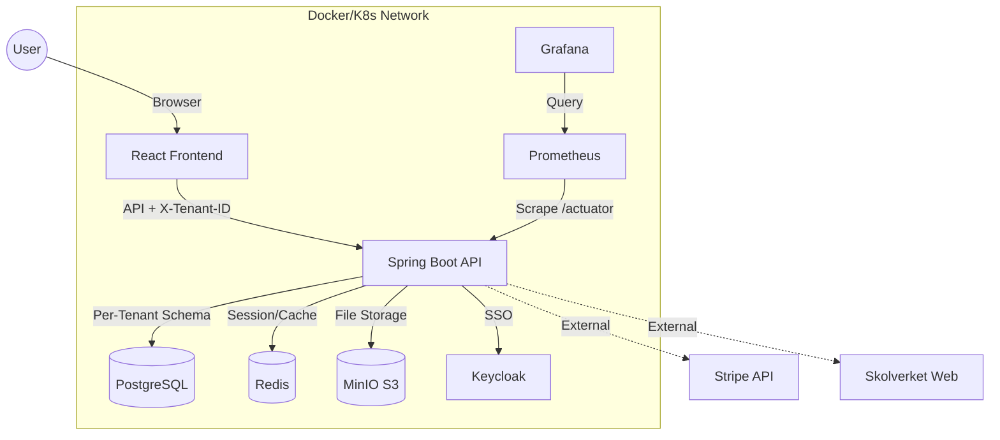
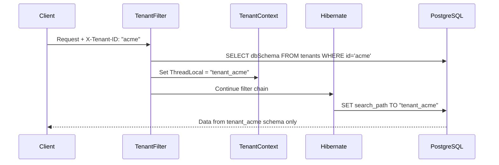

<p align="center">
  
</p>

<h1 align="center">🎓 EduFlex LMS 2.0</h1>

<p align="center">
  <em>The Complete Enterprise Learning Platform for Modern Education</em><br/>
  <em>Developed & maintained by <strong>Alex Weström / Fenrir Studio</strong></em>
</p>

<p align="center">
  <a href="#-english">🇬🇧 English</a> &nbsp;&nbsp;&nbsp;|&nbsp;&nbsp;&nbsp; <a href="#-svenska">🇸🇪 Svenska</a>
</p>

---

<p align="center">
  
  
  
  
  
  
  
  
  
  
  
  
  
</p>

---

*   **🚀 Performance & E-book Enhancements (Jan 30, 2026):**
    *   **Permanent Caching:** Enabled 1-year persistent caching (`immutable`) for ebook covers and media assets, dramatically improving library load times.
    *   **MinIO Proxy:** Implemented a smart proxy in `StorageController` to serve legacy `/uploads/` paths directly from MinIO without database migration.
    *   **PDF Metadata Engine:** New backend service to extract Table of Contents and render PDF pages as high-quality images for the interactive viewer.

*   **📊 Enterprise Audit & Analytics (Jan 30, 2026):**
    *   **Activity Heatmaps:** Visualized student engagement with GitHub-style contributions graph (last 30 days).
    *   **Course Drop-off Analysis:** New funnel visualization identifying exactly where students stop progressing in a course (supports both Lessons and Materials).
    *   **Deep-Diff Audit Logs:** Complete transparency for Admins – logs now show exact "before/after" JSON snapshots of modified entities.
    *   **Real-Data Reporting:** CSN reports and attendance calculations now use actual `StudentActivityLog` data.

*   **📡 Cloudflare Tunnel & OnlyOffice Stability (Jan 30, 2026):**
    *   **Infrastructure Stability:** Resolved `500 Internal Server Error` and `401 Unauthorized` for external users by updating `SecurityConfig` and `AuthTokenFilter`.
    *   **WebSocket Support:** Enabled `/ws` and `/ws-log` routing via Cloudflare Tunnel for real-time chat and logs.
    *   **OnlyOffice Fix:** Resolved the "Download failed (Code -4)" error and hardened Docker networking (`extra_hosts`).
    *   **Local Dev Optimization:** Updated `run_backend_local.ps1` with Windows-safe path handling and correct MinIO public URLs.

*   **🤖 AI Study Pal & Database Stability (Jan 30, 2026):**
    *   **PDF Indexing Fix:** Resolved Tika/PDFBox version conflict by downgrading to 2.0.31. AI Study Pal now correctly parses large PDF documents.
    *   **Multi-Tenant Migrations:** Robustified Flyway scripts (V5, V6) with `DO` blocks to safely handle schema updates across all tenants.
    *   **Auto-Migration Runner:** Implemented `GlobalMigrationRunner` to automatically synchronize all tenant schemas on application startup.
    *   **Swedish Personality:** Enhanced AI Tutor (Gemini 2.0 Flash) with a supportive "Study Pal" persona in Swedish.

*   **📚 PDF Support in Ebook Library (Jan 30, 2026):**
    *   **Interactive PDF Viewer:** New dedicated viewer for PDF documents with table of contents navigation.
    *   **Backend Rendering:** Integrated Apache PDFBox 2.0.31 for server-side page rendering and metadata extraction.
    *   **TOC Navigation:** Automatic extraction of PDF bookmarks for a structured reading experience.

*   **🤖 AI Tutor Stability Fixes (Jan 27, 2026):**
    *   **Compilation Fix:** Resolved a critical class mismatch (`Embedding` vs `VectorStoreEntry`) that prevented backend builds.
    *   **Runtime Stability:** Fixed a `NullPointerException` in `AITutorService` by filtering out invalid vector embeddings during search.
    *   **Robustness:** AI Tutor now gracefully handles missing data instead of crashing the application.

*   **🔗 Friendly URLs - Course Slugs (Jan 27, 2026):**
    *   **Human-Readable Links:** Courses now use slugs (e.g., `/course/matematik-1`) instead of numeric IDs.
    *   **Automatic Generation:** Slugs are generated from course names with collision handling (e.g., `-1`, `-2`).
    *   **Automated Backfill:** Existing courses are automatically migrated to use slugs on system startup.
    *   **Dual Lookup:** Backward compatibility ensures numeric ID links still function perfectly.

*   **🤖 AI Tutor UI Polish & Chat Fix (Jan 27, 2026):**
    *   **Fixed Height Window:** The AI Tutor chat now maintains a stable 500px/80vh height regardless of message count.
    *   **Optimized Scrolling:** Message area now uses independent scrolling, keeping header and input fixed.
    *   **Layout Stability:** Prevented UI stretching and "close button" disappearance.

*   **🤖 AI Quiz Generation with Google Gemini (Jan 26, 2026):**
    *   **Document-to-Quiz:** Upload PDF, DOCX, DOC, TXT, RTF, or ODT files and automatically generate quiz questions using AI.
    *   **Text Input Mode:** Paste or type text directly to generate questions without file upload.
    *   **Gemini Integration:** Powered by Google Gemini 2.0 Flash for fast, high-quality question generation.
    *   **Configurable Generation:** Choose number of questions (3-15), difficulty level (Easy/Medium/Hard), and language.
    *   **Interactive Preview:** Edit generated questions, modify options, change correct answers, and remove unwanted questions before saving.
    *   **Question Bank Integration:** Optionally add all generated questions to your Question Bank for future reuse.
    *   **Document Parsing:** Apache Tika backend extracts text from multiple document formats with 50,000 character support.
    *   **Teacher/Admin Only:** Accessible via sidebar "AI Quiz" menu for authorized roles.

*   **🏪 EduFlex Community - Content Marketplace (Jan 25, 2026):**
    *   **Cross-Tenant Sharing:** Teachers can publish Quiz, Assignments, and Lessons to a shared marketplace accessible across all tenants.
    *   **Moderation Workflow:** Admin approval flow with pending/published/rejected states and rejection reasons.
    *   **Question Bank Integration:** When installing a Quiz from Community, all questions are automatically copied to your Question Bank for future reuse.
    *   **Rich Metadata:** Subject categories (20+ subjects with icons), difficulty levels, grade levels, and tags for easy discovery.
    *   **Ratings & Reviews:** 5-star rating system with comments to help teachers find quality content.
    *   **ResourceBank Integration:** Community tab integrated directly in the ResourceBank with search, filter, and install functionality.
    *   **Admin Panel:** Dedicated Community moderation page in Admin Dashboard for reviewing pending submissions.
|
*   **📡 Storage & OnlyOffice Stability (Jan 26, 2026):**
    -   **MinIO Public Access:** Fixed image loading issues by ensuring `eduflex-storage` bucket has anonymous download policy.
    -   **OnlyOffice Resolution:** Fixed "Download failed" errors by correcting internal/external hostname handling and Cloudflare routing for versioned assets.
    -   **Infrastructure Guide:** Created a "Source of Truth" document for networking and tunnel configuration in `docs/InfrastructureGuide.md`.
    -   **Hybrid Auth Fixes:** Improved JWT validation in hybrid mode to prevent random 401 Unauthorized errors.

*   **🛠️ Robust OnlyOffice DevOps & UI (Jan 25, 2026):**
    *   **Modal Editor UI:** Refactored document editor into a responsive, centered modal window with backdrop and reliable mounting logic (Ref-based).
    *   **Backend Static Serving:** Implemented direct serving of OnlyOffice assets (`/web-apps`) via Spring Boot to bypass Windows/Docker proxy limitations.
    *   **Proxy Architecture:** Optimized `vite.config.js` to correctly route traffic between Host, Backend (8080), and Docker Containers (8081).
    *   **SSRF Security:** Configured OnlyOffice to allow private IP requests for backend-to-backend communication.
    *   **WebSocket Fix:** Enabled WebSocket proxying for seamless real-time collaboration.

*   **📹 Live Video Classrooms - Jitsi Integration (Jan 24, 2026):**
    *   **Self-hosted Video Conferencing:** Integrated Jitsi Meet for real-time live lessons directly in EduFlex.
    *   **Teacher Controls:** Start instant lessons or schedule them for later with full host controls.
    *   **Dashboard Widget:** Students see upcoming and live lessons on their dashboard with join buttons.
    *   **Course Integration:** "Start Live" button in course view for teachers, auto-join for students.
    *   **Full Features:** Screen sharing, chat, hand raising, participant list, and recording support.
    *   **Docker Included:** Complete Jitsi stack added to docker-compose for self-hosted deployment.

*   **🎬 Video Lesson Integration (Jan 24, 2026):**
    *   **Self-hosted Video Lessons:** Teachers can upload their own video content (MP4, WebM, MOV up to 500MB) directly to courses.
    *   **Professional Video Player:** Custom React player with chapters support, playback speed control (0.5x-2x), keyboard shortcuts, and fullscreen.
    *   **Chapter Navigation:** Visual chapter markers on the progress bar with quick jump functionality.
    *   **Video Metadata:** Automatic detection of video files with duration, file size, and thumbnail support.
    *   **Student Analytics:** Track video completion and progress for student engagement insights.
    *   **Backend API:** New `VideoController` with endpoints for upload, metadata updates, and chapter management.

*   **⚡ ONLYOFFICE Expansion & System Settings (Jan 24, 2026):**
    *   **Course Material Integration:** Support for in-browser editing of course attachments for teachers.
    *   **System Settings UI:** New "ONLYOFFICE" configuration tab for administrators to manage server URLs and status.
    *   **Health Checks:** Real-time connectivity monitoring between EduFlex and ONLYOFFICE Document Server.
    *   **Generalized Architecture:** Document editing framework now supports any repository-backed entity (Documents, Materials, Lessons).
    *   **OpenAPI / Swagger:** Implemented `springdoc-openapi` for automated API documentation at `/swagger-ui.html`.
    *   **Documentation Restructuring:** Organized guides and API docs into clear subdirectories in `docs/`.

*   **🔗 LTI 1.3 Certified Integration & Admin Tools (Jan 24, 2026):**
    *   **Secure Launch Flow:** Implemented full cryptographic verification (public key/JWKS) using Nimbus JOSE. No mocks—real OIDC authentication.
    *   **Auto-Provisioning:** Users launching from Canvas/Moodle are automatically created/updated with correct roles (Instructor -> Teacher) and names.
    *   **Administration UI:** Added a dedicated **"Integrationer"** tab in the Admin Dashboard to manage LTI platforms without DB access.
    *   **Frontend Handlers:** Created specific `/lti-success` and `/lti-error` handlers for a seamless single-sign-on experience.
    *   **Bug Fixes:** Resolved deprecated URL constructors and User model issues in the security layer.

*   **📅 Enhanced Calendar & Search Tools (Jan 23, 2026):**
    *   **View Flexibility:** Added seamless switching between **Day, Week, and Month** views for better planning visibility.
    *   **Visual Enhancements:** Sundays are now clearly highlighted with a red background for improved week-at-a-glance readability.
    *   **Advanced Filtering:** Added multi-select for event types (Lesson, Meeting, Workshop, etc.) in the calendar view.
    *   **Admin Search:** Integrated a global search bar in the calendar header for administrative roles.
    *   **Student Course Filtering:** Students can now isolate events for specific courses, just like teachers.
    *   **Hybrid Authentication:** Enabled simultaneous support for Keycloak SSO and Internal Auth, fixing 401 issues in hybrid mode.
    *   **Backend Support:** Updated `CalendarService` and controllers with server-side filtering and search logic.

*   **🛡️ System Stability & Security:**
    *   **Whitelabel & 500 Fixes:** Resolved the circular "Whitelabel Error Page" loop and hidden NPEs. Enhanced diagnostic logging with 💥 markers for easier troubleshooting.
    *   **Auth Principal Resolution:** Fixed 401/500 errors by supporting both `Jwt` and `UserDetails` across all core controllers.
    *   **HTTPS Enforcement:** All mixed content resolved; file URLs (materials, avatars) now use secure HTTPS.
    *   **Infrastructure Cleanup:** Cleaned root directory; moved scripts to `/scripts`, logs to `/logs`, and internal files to `.agent` (all now git-ignored).

*   **📅 Calendar & Navigation Refactor:**
    *   **Dynamic Role-Based Filtering:** Replaced hardcoded staff roles with a dynamic "Role -> Person" two-step selection for better scalability.
    *   **Student-Centric View:** Students now filter directly by **Course**, removing unnecessary people-lists for a cleaner experience.
    *   **Enhanced Visibility:** Principals hidden by default; improved visibility rules for Teachers and Mentors.

*   **✉️ Communication & Support Tools:**
    *   **Support Ticket System:** Full-stack multi-tenant system with priority levels (Görs nu/Löst) and high-visibility Dashboard widgets.
    *   **Messaging 2.0:** Rich Text (Quill), message threading, and 10MB multi-file attachments. Added admin-specific "fel-loggar" folder.
    *   **Global Access:** Integrated "Kontakt & Support" across all dashboard themes (Standard, Voltage, Nebula, Pulse, etc.).

*   **⚙️ Platform Foundation & Gamification:**
    *   **Gamification Engine:** Real-time XP, streaks, challenges, and achievements with per-tenant toggle support.
    *   **Multi-Tenancy:** Robust schema-per-tenant isolation with automatic provisioning and OIDC/Keycloak support.
    *   **Skolverket Integration:** Direct mapping to Swedish national curriculum standards and course codes.
    *   **Monitoring:** Full Prometheus/Grafana stack with pre-configured dashboards and a live "Matrix-style" debug terminal.

*   **🎨 UI/UX & Polish:**
    *   **Multilingual Landing Page:** Full i18n support (Swedish/English) with a refined "Request Demo" workflow.
    *   **Theme Engine:** 8 professional design systems with glassmorphism and advanced mobile customization tools.

---

<div id="-english"></div>

## 🇬🇧 English

### 📖 Table of Contents
- [About the Project](#-about-the-project)
- [Key Features](#-key-features)
- [System Architecture](#-system-architecture)
- [Technology Stack](#-technology-stack)
- [Multi-Tenancy](#-multi-tenancy)
- [Getting Started](#-getting-started)
- [Configuration](#-configuration)
- [Authentication Modes](#-authentication-modes)
- [API Reference](#-api-reference)
- [Modules Deep Dive](#-modules-deep-dive)
- [Monitoring & Observability](#-monitoring--observability)
- [Localization](#-localization)
- [Deployment Options](#-deployment-options)
- [Roadmap](#-roadmap)
- [License](#-license)

---

### 🏫 About the Project

**EduFlex 2.0** is a robust, cloud-native Learning Management System (LMS) engineered for scalability and user engagement. It bridges the gap between traditional enterprise LMS (often clunky and boring) and modern consumer apps (gamified, fast, and beautiful).

Whether you are a single educator, a private school, or a municipal education board, EduFlex scales to meet your needs using a microservices-ready architecture orchestrating storage, caching, and compute.

**Key Differentiators:**
- 🏢 **True Multi-Tenancy:** Schema-per-tenant isolation for complete data separation
- 🎮 **Gamification Built-in:** Points, badges, levels, and leaderboards
- 🇸🇪 **Skolverket Integration:** Direct integration with Swedish National Curriculum
- 💼 **SaaS Ready:** Subscription tiers, invoicing, and payment processing
- 🎨 **White-label Support:** 8 design systems with complete visual customization

---

### 🌟 Key Features

#### 🍎 Core Education
| Feature | Description |
|---------|-------------|
| **Course Management** | Rich courses with text, video, attachments, and quizzes |
| **Video Lessons** | Self-hosted video uploads with chapters, speed control, and analytics |
| **Live Classrooms** | Jitsi-powered video conferencing with scheduling and dashboard widget |
| **SCORM / xAPI Support** | Import packages from Articulate/Adobe Captivate |
| **Assignment Engine** | File submissions with teacher grading and feedback |
| **Certification** | Auto-generated verifiable PDF certificates |
| **Lesson Progress** | Track student progress through course materials |
| **Quiz System** | Multiple choice, open-ended, and true/false questions |
| **AI Quiz Generator** | Generate quizzes from documents using Google Gemini AI |
| **E-book Library** | Standalone library for EPUB/PDF with categorized browsing |

#### 🎮 Gamification & Engagement
| Feature | Description |
|---------|-------------|
| **Points & Levels** | XP for logins, lessons, and quiz scores |
| **Badges & Achievements** | Visual achievements with Lucide iconography and unlock conditions |
| **Daily Challenges** | Rotating challenges with bonus XP rewards |
| **Streaks** | Track consecutive login days with streak bonuses |
| **Leaderboards** | Optional class/course rankings |
| **Activity Tracking** | Detailed student activity logs |
| **Per-Tenant Config** | Admins can enable/disable gamification features per organization |
| **Achievement Toast** | Real-time popups when achievements are unlocked |
| **XP Boost Indicator** | Visual indicator for active XP multipliers |

#### 🇸🇪 Skolverket Integration
| Feature | Description |
|---------|-------------|
| **Curriculum Mapping** | Direct Skolverket database integration |
| **Automated Import** | Python tools for course codes and descriptions |
| **Grading Criteria** | "Kunskapskrav" (E-A) directly in course view |
| **CSN Reporting** | Attendance export for CSN compliance |

#### 💼 Revenue & Administration
| Feature | Description |
|---------|-------------|
| **Subscription Tiers** | Free, Pro, Enterprise licensing |
| **Invoicing** | Automatic PDF invoice generation |
| **Payment Integration** | Stripe/Swish abstraction layer |
| **User Management** | Profiles with MinIO-backed avatar uploads |
| **RBAC** | Fine-grained permissions per role |
| **Audit Logging** | Track all critical changes |

#### 🏢 Multi-Tenancy
| Feature | Description |
|---------|-------------|
| **Schema Isolation** | Each tenant in separate PostgreSQL schema |
| **Automatic Provisioning** | Schema + migrations + admin user on registration |
| **Request Routing** | `X-Tenant-ID` header for tenant selection |
| **Tenant API** | Full CRUD for tenant management |

#### 🔔 Real-time Notifications
| Feature | Description |
|---------|-------------|
| **WebSocket Push** | Instant notifications via STOMP/SockJS |
| **Notification Bell** | Header component with unread count badge |
| **Multiple Types** | Assignment, achievement, system, and social notifications |
| **Read/Unread State** | Track which notifications have been seen |
| **Notification History** | Persistent storage with pagination |

#### 👥 Social Features
| Feature | Description |
|---------|-------------|
| **Online Friends Panel** | See who's currently online |
| **Student Contact Modal** | Quick contact options for teachers |
| **Activity Feed** | Recent activity from connections |

#### 🏪 Community Marketplace
| Feature | Description |
|---------|-------------|
| **Content Sharing** | Teachers can publish Quiz, Assignments, and Lessons to a shared marketplace |
| **Moderation Flow** | Admin approval with pending/published/rejected states |
| **Question Bank Sync** | Quiz questions automatically copied to personal Question Bank on install |
| **Subject Categories** | 20+ subject categories with custom icons and colors |
| **Search & Filter** | Find content by subject, type, keywords, and ratings |
| **Ratings & Reviews** | 5-star rating system with user comments |
| **Download Tracking** | Track popular content with download counts |
| **Cross-Tenant** | Content accessible across all EduFlex tenants |

#### 🎨 Enterprise Themes & Whitelabel
Complete visual customization with 8 professional design systems:
- **EduFlex Classic** – Traditional sidebar layout
- **EduFlex Focus** – Minimalist with floating container
- **EduFlex Horizon** – Top navigation with beige gradient
- **EduFlex Nebula** – Glassmorphic purple/lavender
- **EduFlex Ember** – Card sidebar with orange accents
- **EduFlex Voltage** – Acid lime neon with dark sidebar
- **EduFlex Midnight** – Dark mode with mint accents
- **EduFlex Pulse** – Music player-inspired red theme

#### 📊 Analytics & Insights
| Feature | Description |
|---------|-------------|
| **Advanced Analytics Dashboard** | [x] **Advanced Analytics Dashboard** (Implemented Q1 2026)
  - Real-time user activity tracking
  - Course performance metrics
  - At-risk student identification
  - Admin/Teacher specific views |
| **Student Activity Logs** | Deep-dive into individual history |
| **Real-time Debug Terminal** | Matrix-style live log streaming |

#### 🌍 Localization
Fully translated UI supporting:
- 🇸🇪 Swedish (Primary)
- 🇬🇧 English
- 🇸🇦 Arabic
- 🇳🇴 Norwegian
- 🇩🇰 Danish
- 🇫🇮 Finnish
- 🇩🇪 German
- 🇫🇷 French
- 🇪🇸 Spanish

---

### 📸 Screenshots

|  |  |
|:---:|:---:|
| **Admin Dashboard** | **Teacher Dashboard** |

|  |  |
|:---:|:---:|
| **AI Quiz Generator** | **System Settings** |

|  |  |
|:---:|:---:|
| **Analytics & Insights** | **Live Debug Terminal** |

|  |  |
|:---:|:---:|
| **E-book Library** | **Course Catalog** |

|  | |
|:---:|:---:|
| **Resource Bank / Community** | |

---

### 🛠 System Architecture

EduFlex uses a containerized architecture managed by **Docker Compose** or **Kubernetes (Helm)**.



#### Multi-Tenancy Data Flow



---

### 💻 Technology Stack

#### Frontend Service (`eduflex-frontend`)
| Category | Technologies |
|----------|-------------|
| **Core** | React 19, Vite 5 |
| **State** | Zustand, React Context |
| **Styling** | Tailwind CSS v4, CSS Variables |
| **Icons** | Lucide React |
| **Charts** | Recharts |
| **Real-time** | SockJS + STOMP (WebSockets) |
| **i18n** | i18next (9 languages) |
| **Rich Text** | React-Quill-new |

#### Backend Service (`eduflex-backend`)
| Category | Technologies |
|----------|-------------|
| **Core** | Java 21, Spring Boot 3.4 |
| **Security** | Spring Security 6, JWT, OAuth2 |
| **Data** | Spring Data JPA, Hibernate 6.4 |
| **Database** | PostgreSQL 15 |
| **Caching** | Spring Data Redis |
| **Storage** | MinIO/S3 SDK |
| **PDF** | OpenPDF |
| **Migrations** | Flyway (programmatic per-tenant) |
| **API Docs** | Swagger / OpenAPI 3.0 |
| **Monitoring** | Micrometer + Actuator |

#### Infrastructure
| Component | Technology |
|-----------|------------|
| **Database** | PostgreSQL 15 (Alpine) |
| **Cache** | Redis 7 (Alpine) |
| **Object Storage** | MinIO (S3-compatible) |
| **SSO Provider** | Keycloak 24 |
| **Monitoring** | Prometheus + Grafana |
| **Backups** | Daily PostgreSQL dumps |
| **Container Runtime** | Docker 24+ |
| **Orchestration** | Docker Compose / Kubernetes |

---

### 🏢 Multi-Tenancy

EduFlex implements **schema-based multi-tenancy** for complete data isolation.

#### Architecture
```
┌─────────────────────────────────────────────────────────────┐
│                     PostgreSQL Database                      │
├─────────────────┬─────────────────┬─────────────────────────┤
│  public schema  │  tenant_acme    │  tenant_school2        │
│  ───────────────│  ───────────────│  ───────────────────── │
│  • tenants      │  • app_users    │  • app_users           │
│  (metadata)     │  • roles        │  • roles               │
│                 │  • courses      │  • courses             │
│                 │  • (40+ tables) │  • (40+ tables)        │
└─────────────────┴─────────────────┴─────────────────────────┘
```

#### Creating a Tenant

**Via API:**
```bash
curl -X POST http://localhost:8080/api/tenants \
  -H "Content-Type: application/json" \
  -d '{
    "name": "Acme School",
    "domain": "acme.local",
    "dbSchema": "tenant_acme",
    "organizationKey": "acme",
    "adminEmail": "admin@acme.local",
    "adminPassword": "SecurePass123",
    "adminFirstName": "John",
    "adminLastName": "Admin"
  }'
```

**What happens automatically:**
1. ✅ Tenant metadata saved to `public.tenants`
2. ✅ PostgreSQL schema `tenant_acme` created
3. ✅ All 40+ tables migrated via Flyway
4. ✅ ADMIN role created
5. ✅ Admin user created with encrypted password

#### Using X-Tenant-ID Header

All API requests must include the tenant header:
```http
X-Tenant-ID: acme
```

#### Key Components
| File | Purpose |
|------|---------|
| `TenantContext.java` | ThreadLocal tenant storage |
| `TenantFilter.java` | Extracts and validates X-Tenant-ID |
| `TenantIdentifierResolver.java` | Hibernate tenant resolution |
| `SchemaMultiTenantConnectionProvider.java` | Sets PostgreSQL search_path |

> 📖 **Full documentation:** [docs/TENANT_ADMIN_GUIDE.md](docs/TENANT_ADMIN_GUIDE.md)

---

### 🚀 Getting Started

#### Prerequisites
- **Docker Desktop** (latest version)
- **Git**
- **Java 21** (for local backend development)
- **Node.js 20+** (for local frontend development)

#### Quick Start with Docker

1. **Clone the Repository**
   ```bash
   git clone https://github.com/alexwest1981/EduFlex.git
   cd EduFlex
   ```

2. **Start Everything**
   ```bash
   docker compose up --build -d
   ```

3. **Access the Application**
   | Service | URL | Credentials |
   |---------|-----|-------------|
   | **Frontend (LMS)** | http://localhost:5173 | – |
   | **Backend API** | http://localhost:8080/api | – |
   | **Swagger Docs** | http://localhost:8080/swagger-ui.html | – |
   | **MinIO Console** | http://localhost:9001 | minioadmin / minioadmin |
   | **Grafana** | http://localhost:3000 | admin / admin |
   | **Keycloak** | http://localhost:8180 | admin / admin |
   | **Prometheus** | http://localhost:9090 | – |

#### Local Development

**Backend (Spring Boot):**
```bash
cd eduflex
mvn spring-boot:run
```

**Frontend (Vite):**
```bash
cd frontend
npm install
npm run dev
```

---

### ⚙️ Configuration

#### Environment Variables

| Service | Variable | Description | Default |
|---------|----------|-------------|---------|
| **Backend** | `SPRING_DATASOURCE_URL` | DB connection | `jdbc:postgresql://db:5432/eduflex` |
| **Backend** | `MINIO_URL` | S3 endpoint (internal) | `http://minio:9000` |
| **Backend** | `MINIO_PUBLIC_URL` | Public S3 URL (for clients) | `https://storage.eduflexlms.se` |
| **Backend** | `SPRING_REDIS_HOST` | Redis host | `redis` |
| **Backend** | `EDUFLEX_AUTH_MODE` | Auth mode | `internal` |
| **Backend** | `GEMINI_API_KEY` | Google Gemini API key for AI Quiz | – |
| **Frontend** | `VITE_API_BASE_URL` | API endpoint | `http://localhost:8080/api` |

#### application.properties Key Settings

```properties
# Multi-tenancy
spring.jpa.properties.hibernate.multiTenancy=SCHEMA
spring.flyway.enabled=false  # Managed programmatically

# SSO Mode (internal, keycloak, hybrid)
eduflex.auth.mode=internal

# License
eduflex.license.path=eduflex.license
```

---

### 🔐 Authentication Modes

EduFlex supports three authentication modes:

| Mode | Description | Use Case |
|------|-------------|----------|
| `internal` | JWT-based local authentication | Small deployments, development |
| `keycloak` | Full Keycloak SSO | Enterprise with existing IdP |
| `hybrid` | Both internal and Keycloak | Migration scenarios |

Configure via `eduflex.auth.mode` property.

> 📖 **Keycloak Setup:** [docs/TENANT_ADMIN_GUIDE.md#keycloak-administration](docs/TENANT_ADMIN_GUIDE.md#-keycloak-administration)

---

### 📡 API Reference

**Base URL:** `http://localhost:8080/api`

All requests (except `/api/tenants`) require `X-Tenant-ID` header.

#### Key Endpoints

| Method | Endpoint | Description |
|--------|----------|-------------|
| `POST` | `/api/tenants` | Create new tenant |
| `POST` | `/api/auth/login` | Authenticate user |
| `GET` | `/api/courses` | List courses |
| `GET` | `/api/users/me` | Current user profile |
| `GET` | `/api/modules` | System modules |

#### Gamification Endpoints

| Method | Endpoint | Description |
|--------|----------|-------------|
| `GET` | `/api/gamification/achievements` | List all achievements |
| `GET` | `/api/gamification/achievements/user` | User's unlocked achievements |
| `GET` | `/api/gamification/streak` | Current user's streak info |
| `GET` | `/api/gamification/challenges/daily` | Today's daily challenges |
| `POST` | `/api/gamification/challenges/{id}/complete` | Mark challenge as complete |
| `GET` | `/api/gamification/config` | Tenant gamification settings |
| `PUT` | `/api/gamification/config` | Update gamification settings (Admin) |

#### Notification Endpoints

| Method | Endpoint | Description |
|--------|----------|-------------|
| `GET` | `/api/notifications` | List user notifications |
| `GET` | `/api/notifications/unread/count` | Unread notification count |
| `PUT` | `/api/notifications/{id}/read` | Mark notification as read |
| `PUT` | `/api/notifications/read-all` | Mark all as read |

#### AI Quiz Generation Endpoints

| Method | Endpoint | Description |
|--------|----------|-------------|
| `GET` | `/api/ai/quiz/status` | Check if AI generation is available |
| `POST` | `/api/ai/quiz/generate` | Generate quiz from uploaded document (multipart) |
| `POST` | `/api/ai/quiz/generate-from-text` | Generate quiz from plain text |
| `POST` | `/api/ai/quiz/save` | Save generated quiz to database |

#### Community Endpoints

| Method | Endpoint | Description |
|--------|----------|-------------|
| `GET` | `/api/community/browse` | Browse published content with filters |
| `GET` | `/api/community/search?q=` | Full-text search across content |
| `GET` | `/api/community/items/{id}` | Get item details with ratings |
| `GET` | `/api/community/subjects` | List all subject categories |
| `POST` | `/api/community/publish/quiz/{id}` | Submit quiz for review (Teacher) |
| `POST` | `/api/community/publish/assignment/{id}` | Submit assignment for review |
| `POST` | `/api/community/publish/lesson/{id}` | Submit lesson for review |
| `POST` | `/api/community/items/{id}/install` | Install content to local resources |
| `POST` | `/api/community/items/{id}/rate` | Rate and review content |
| `GET` | `/api/community/my-published` | List your submitted content |
| `GET` | `/api/community/admin/pending` | Get pending items (Admin) |
| `POST` | `/api/community/admin/approve/{id}` | Approve pending item (Admin) |
| `POST` | `/api/community/admin/reject/{id}` | Reject with reason (Admin) |

> 📖 **Full API docs:** [docs/API.md](docs/API.md) or Swagger UI

---

### 🎛 Modules Deep Dive

EduFlex uses a **"Kernel + Extensions"** architecture. Features are toggleable:

| Module | Description | License |
|--------|-------------|---------|
| **SCORM** | Upload/play courseware | Enterprise |
| **REVENUE** | Subscriptions & invoicing | Pro+ |
| **GAMIFICATION** | XP, Badges, Leaderboards | Pro+ |
| **CHAT** | WebSocket messaging | Pro+ |
| **SSO** | Keycloak integration | Enterprise |
| **WHITELABEL** | Custom branding/themes | Enterprise |

Toggle via `/api/modules/{key}/toggle` (Admin only).

---

### 📊 Monitoring & Observability

#### Prometheus Metrics
Backend exposes metrics at `/actuator/prometheus`:
- JVM memory, GC, threads
- HTTP request latency & counts
- Database connection pool stats
- Custom business metrics

#### Grafana Dashboards
Pre-configured dashboards for:
- System Overview
- JVM Performance
- HTTP Request Analysis
- Database Performance

#### Real-time Debug Terminal
Admin users can access live log streaming via the built-in "Matrix-style" debug terminal in the Admin UI.

---

### 🚢 Deployment Options

#### Option 1: Docker Compose (Recommended for Dev/Small)
```bash
docker compose up -d
```

#### Option 2: Kubernetes with Helm (Production)
```bash
helm install eduflex ./helm/eduflex \
  --namespace eduflex \
  --create-namespace \
  -f values-production.yaml
```

> 📖 **Helm documentation:** [HELM_README.md](HELM_README.md)

#### Option 3: Manual Deployment
See [docs/ARCHITECTURE.md](docs/ARCHITECTURE.md) for manual setup.

---

### 🗺 Roadmap

| Feature | Status |
|---------|--------|
| Multi-tenancy (Schema-per-tenant) | ✅ Implemented |
| Kubernetes Native (Helm Charts) | ✅ Implemented |
| Keycloak SSO Integration | ✅ Implemented |
| Prometheus/Grafana Monitoring | ✅ Implemented |
| Gamification Engine | ✅ Implemented |
| SCORM/xAPI Support | ✅ Implemented |
| Real-time Notifications (WebSocket) | ✅ Implemented |
| Daily Challenges & Streaks | ✅ Implemented |
| Achievement System | ✅ Implemented |
| Social Features (Online Friends) | ✅ Implemented |
| Support Ticket System | ✅ Implemented |
| HTTPS Storage (Cloudflare Tunnel) | ✅ Implemented |
| Enhanced Calendar (MiniCalendar, Events) | ✅ Implemented |
| Admin UI Redesign (Whitelabel) | ✅ Implemented |
| Video Lessons (Self-hosted, Chapters) | ✅ Implemented |
| Live Classrooms (Jitsi Integration) | ✅ Implemented |
| Community Marketplace | ✅ Implemented |
| Question Bank Integration | ✅ Implemented |
| AI-powered Quiz Generation (Gemini) | ✅ Implemented |
| Advanced Analytics Dashboard | ✅ Implemented |
| Microservices Split (Video/PDF) | 🔜 Q2 2026 |
| Event Bus (Kafka/RabbitMQ) | 🔜 Q3 2026 |
| Mobile App (React Native) | 🔜 Q4 2026 |
| Push Notifications (Mobile) | 🔜 Q4 2026 |

---

### ❓ Troubleshooting

#### Common Issues

**1. "Port 8080 is already in use"**
```bash
# Find and kill process
netstat -ano | findstr :8080
taskkill /PID <PID> /F
```

**2. "Tenant not found" errors**
- Ensure `X-Tenant-ID` header is present
- Verify tenant exists: `curl http://localhost:8080/api/tenants`

**3. Database connection refused**
- Wait 10-15 seconds after startup
- Check: `docker logs eduflex-db`

**4. WebSocket "OFFLINE"**
- Hard refresh browser (Ctrl+F5)
- Check SecurityConfig allows `/ws-log/**`

---

<br />
<br />
<div id="-svenska"></div>

## 🇸🇪 Svenska

### ⚡ Senaste Uppdateringarna
*   **🚀 Prestanda & E-boksförbättringar (30 jan 2026):**
    *   **Permanent Cachning:** Aktiverat 1-års cachning (`immutable`) för bokomslag och media, vilket gör biblioteket blixtsnabbt.
    *   **MinIO Proxy:** Smart proxy i `StorageController` som servar gamla `/uploads/`-länkar direkt från MinIO utan databasändringar.
    *   **PDF-motor:** Ny backend-tjänst som extraherar innehållsförteckning och renderar PDF-sidor som bilder för den interaktiva läsaren.

*   **📡 Cloudflare Tunnel & OnlyOffice Stabilitet (30 jan 2026):**
    *   **Infrastrukturstabilitet:** Åtgärdat `500 Internal Server Error` och `401 Unauthorized` genom att uppdatera `SecurityConfig` och `AuthTokenFilter`.
    *   **WebSocket-stöd:** Aktiverat routing för `/ws` och `/ws-log` via Cloudflare Tunnel för fungerande chatt och realtidsloggar.
    *   **OnlyOffice-fix:** Löst "Nedladdning misslyckades (Code -4)" genom att korrigera nätverkskommunikation (`extra_hosts`) och interna sökvägar.
    *   **Lokal Dev-optimering:** Uppdaterat `run_backend_local.ps1` med Windows-kompatibla sökvägar och korrekta publika MinIO-URL:er.

*   **🤖 AI Study Pal & Databasstabilitet (30 jan 2026):**
    *   **PDF Indexering Fixad:** Åtgärdat versionskonflikt mellan Tika och PDFBox (nedgraderat till 2.0.31). AI Study Pal kan nu extrahera text från PDF korrekt.
    *   **Robustare Migrationer:** Uppdaterat Flyway-skript (V5, V6) med `DO`-block för att säkert hantera multi-tenant-miljöer utan krascher.
    *   **Automatiserad Migration:** Implementerat `GlobalMigrationRunner` som automatiskt migrerar ALLA kundscheman vid uppstart.
    *   **Renare Loggar:** Refaktorerat `AiStudyPalService` med svensk, mänsklig ton i loggningen för bättre monitorering.

*   **📚 PDF-stöd i E-boksbiblioteket (30 jan 2026):**
    *   **Interaktiv PDF-läsare:** Ny dedikerad läsare för PDF-dokument med innehållsförteckning.
    *   **Backend-rendering:** Integrerat Apache PDFBox 2.0.31 för rendering av sidor och extraktion av metadata på serversidan.
    *   **Kapitelnavigering:** Automatisk extraktion av PDF-bokmärken för en strukturerad läsupplevelse.

*   **🌍 Frontend-lokalisering & Lärarpanel (28 jan 2026):**
    *   **Lärarpanel:** Fullständig översättning av alla widgets, tabeller och modaler för lärare till svenska och engelska.
    *   **Elevpanel:** Fullständig översättning av alla widgets (Närvaro, Schema, Gamification, Framsteg) till svenska och engelska.
    *   **E-boksförbättringar:** Implementerat uppladdningsindikator med procentvisare för bättre användarupplevelse vid stora filer.
    *   **Auto-omslag:** Automatiskt generering av bokomslag direkt från EPUB-filer om ingen bild laddas upp manuellt.
    *   **Utökade Gränser:** Höjt gränsen för filuppladdning till 500MB för att stödja tunga e-böcker och videofiler.
    *   **Bugfixar:** Åtgärdat "Invalid hook call"-krasch i Adminpanelen, krasch i mobilvyn ('t is not defined') och rensat upp markdown-formatering.


*   **🤖 AI Tutor Stabilitetsfixar (27 jan 2026):**
    *   **Kompileringsfix:** Löste ett kritiskt fel där backend inte kunde byggas på grund av saknad `Embedding`-klass via `VectorStoreEntry`-refaktorering.
    *   **Runtime-stabilitet:** Fixade en krasch (`NullPointerException`) i `AITutorService` genom att filtrera bort ogiltiga vektordata under sökning.
    *   **Robusthet:** AI-tutorn hanterar nu saknad data snyggt istället för att krascha applikationen.

*   **📚 Fristående E-boksbibliotek (28 jan 2026):**
    *   **Bibliotek i Sidofältet:** Nu tillgängligt som en dedikerad länk i sidofältet för alla roller, inklusive elever.
    *   **Kategorifiltrering:** Ny sidopanel i biblioteket för att filtrera mellan ämnen som Matematik, Programmering, Administration, Ekonomi och mer.
    *   **Rollbaserad Åtkomst:** Elever har läsrättigheter medan Admin, Lärare och Rektorer kan ladda upp och hantera böcker.
    *   **Dynamiska Kategorier:** Systemet känner automatiskt av kategorier från uppladdade böcker och uppdaterar filterlistan.
    *   **Sömlös Integration:** Fullt stöd i samtliga 8 layout-teman och mobilanpassat gränssnitt.

*   **📹 Videouppladdning & MinIO-fixar (28 jan 2026):**
    *   **Backend Proxy via API:** Implementerade en `FileController` som strömmar filer från MinIO genom backenden. Detta löser "Mixed Content"-varningar och 401 Unauthorized-fel vid uppspelning på externa domäner som `eduflexlms.se`.
    *   **Korrekt Filhantering:** Uppladdade videor behåller nu sina ursprungliga filändelser (.mp4, .mov, etc) för korrekt igenkänning av webbläsaren.
    *   **Refaktorerad Lagring:** Flyttat all filhantering i `CourseService` till ett abstrakt lagringslager (`FileStorageService`), vilket möjliggör sömlös växling mellan lokal lagring och MinIO/S3.
    *   **Byggstabilitet:** Åtgärdat beroendekonflikter i `CourseService` som tidigare blockerade produktion-byggen.

*   **🔗 Vänliga URL:er - Kurs-Slugs (27 jan 2026):**
    *   **Läsbara Länkar:** Kurser använder nu "slugs" (t.ex. `/course/matematik-1`) istället för bara siffror.
    *   **Automatisk Generering:** Slugs skapas från kursnamnet med hantering av dubbletter.
    *   **Automatisk Migrering:** Alla befintliga kurser tilldelas slugs automatiskt vid serverstart.
    *   **Dual Lookup:** Gamla siffer-baserade länkar fungerar fortfarande för bakåtkompatibilitet.

    *   **Byggstabilitet:** Åtgärdat beroendekonflikter i `CourseService` som tidigare blockerade produktion-byggen.

*   **🤖 AI Tutor UI-förbättringar (27 jan 2026):**
    *   **Stabil Fönsterstorlek:** Chatten har nu en fast höjd (500px/80vh) för att förhindra att den växer utanför skärmen.
    *   **Sömlös Scroll:** Meddelandeområdet har oberoende scrollning, vilket håller header och inmatningsfält fasta.

*   **🤖 AI Quiz-generering med Google Gemini (26 jan 2026):**
    *   **Dokument-till-Quiz:** Ladda upp PDF, DOCX, DOC, TXT, RTF eller ODT och generera quiz-frågor automatiskt med AI.
    *   **Textinmatning:** Klistra in eller skriv text direkt för att generera frågor utan filuppladdning.
    *   **Gemini-integration:** Drivs av Google Gemini 2.0 Flash för snabb, högkvalitativ frågegenerering.
    *   **Konfigurerbar Generering:** Välj antal frågor (3-15), svårighetsgrad (Enkel/Medel/Svår) och språk.
    *   **Interaktiv Förhandsgranskning:** Redigera genererade frågor, ändra alternativ, byt rätt svar och ta bort oönskade frågor innan sparning.
    *   **Frågebank-integration:** Lägg till alla genererade frågor i din Frågebank för framtida återanvändning.
    *   **Dokumentparsning:** Apache Tika extraherar text från flera dokumentformat med stöd för 50 000 tecken.

*   **🏪 EduFlex Community - Innehållsmarknadsplats (25 jan 2026):**
    *   **Cross-Tenant Delning:** Lärare kan publicera Quiz, Uppgifter och Lektioner till en delad marknadsplats tillgänglig för alla tenants.
    *   **Moderationsflöde:** Admin-godkännande med väntande/publicerad/avvisad status och motiveringar.
    *   **Frågebank-integration:** När du installerar en Quiz från Community kopieras alla frågor automatiskt till din Frågebank.
    *   **Rik Metadata:** Ämneskategorier (20+ ämnen med ikoner), svårighetsgrader, årskurser och taggar.
    *   **Betyg & Recensioner:** 5-stjärnigt betygssystem med kommentarer.
    *   **ResourceBank-integration:** Community-flik integrerad direkt i Resursbanken med sök, filter och installation.
    *   **Admin-panel:** Dedikerad Community-moderationssida i Admin Dashboard.
|
*   **📡 Lagring & OnlyOffice Stabilitet (26 jan 2026):**
    -   **MinIO Publik Åtkomst:** Fixat problem med bilder som inte laddades genom att sätta `eduflex-storage` till "anonymous download".
    -   **OnlyOffice Fix:** Åtgärdat "Nedladdning misslyckades" genom att korrigera hantering av interna/externa värdnamn och Cloudflare-routing.
    -   **Infrastrukturguide:** Skapat en "Source of Truth" för nätverk och tunnel-konfiguration i `docs/InfrastructureGuide.md`.
    -   **Huvuddomän-optimering:** Förbättrad routing för tillgångar och API-anrop via tunneln för att minimera 401-fel.

*   **🛠️ Robust OnlyOffice DevOps & UI (25 jan 2026):**
    *   **Modal Editor UI:** Omarbetade dokumentredigeraren till ett responsivt modal-fönster med stabil laddningslogik.
    *   **Backend Static Serving:** Implementerade direkt servering av OnlyOffice-tillägg via Spring Boot för att kringgå proxy-problem på Windows.
    *   **Proxy-arkitektur:** Optimerade `vite.config.js` för att korrekt routa trafik mellan Host, Backend (8080) och Docker-containrar.
    *   **SSRF-säkerhet:** Konfigurerade OnlyOffice för att tillåta interna IP-anrop mellan backend och dokumentserver.
    *   **WebSocket-fix:** Aktiverade WebSocket-proxy för sömlöst samarbete i realtid.

*   **📹 Live Videoklassrum - Jitsi-integration (24 jan 2026):**
    *   **Självhostad Videokonferens:** Integrerad Jitsi Meet för live-lektioner direkt i EduFlex.
    *   **Lärarverktyg:** Starta direktlektioner eller schemalägg med fulla värd-kontroller.
    *   **Dashboard-widget:** Elever ser kommande och pågående lektioner med "Gå med"-knappar.
    *   **Kursintegration:** "Starta Live"-knapp i kursvyn för lärare, auto-join för elever.
    *   **Funktioner:** Skärmdelning, chatt, handuppräckning, deltagarlista och inspelningsstöd.
    *   **Docker:** Komplett Jitsi-stack inkluderad i docker-compose.

*   **🎬 Video-lektioner (24 jan 2026):**
    *   **Egenuppladdade Videos:** Lärare kan ladda upp egna videor (MP4, WebM, MOV upp till 500MB) direkt till kurser.
    *   **Professionell Videospelare:** React-baserad spelare med kapitelstöd, hastighetsval (0.5x-2x), tangentbordsgenvägar och helskärm.
    *   **Kapitelnavigering:** Visuella kapitelmarkörer på progress-bar med snabbhopp.
    *   **Video-metadata:** Automatisk detektering med längd, filstorlek och thumbnail-stöd.
    *   **Elevanalys:** Spåra video-färdigställande och framsteg för engagemanginsikter.
    *   **Backend API:** Ny `VideoController` med endpoints för uppladdning, metadata och kapitelhantering.

*   **⚡ ONLYOFFICE-expansion & Systeminställningar (24 jan 2026):**
    *   **Kursmaterial-integration:** Stöd för redigering av bilagor i kurser direkt i webbläsaren för lärare.
    *   **Systeminställningar:** Ny "ONLYOFFICE"-flik för administratörer för att hantera server-URL:er och status.
    *   **Hälsokontroller:** Realtidsövervakning av anslutningen till ONLYOFFICE Document Server.
    *   **Generaliserad Arkitektur:** Ramverket för dokumentredigering stöder nu alla entiteter (Dokument, Material, Lektioner).

*   **🔧 Systemstabilitet & Admin-fixar (26 jan 2026):**
    -   **Admin Dashboard:** Åtgärdade kritiska krascher ("Invalid Hook Call") genom att rensa beroendekonflikter och optimera React-imports.
    -   **Kalender-widget:** Fixade laddningsfel genom att implementera korrekt API-endpoint (`/api/events/dashboard-summary`) och url-hantering i frontend.
    -   **API-felhantering:** Förbättrad diagnostik som nu fångar och loggar HTML-svar (404/500) istället för att krascha frontend med `SyntaxError`.
    -   **Proxy-optimering:** Tog bort manuella alias i `vite.config.js` för att garantera 'Single Source of Truth' för React-versioner.

*   **🧠 AI Quiz i Resursbanken (26 jan 2026):**
    -   **Lättare åtkomst:** Lade till en direktknapp för **AI Quiz** inne på Resursbanken (under fliken "Mina Quiz") för att underlätta för lärare att hitta verktyget utan att behöva gå via systeminställningar.
    -   **Lättare åtkomst:** Lade till en direktknapp för **AI Quiz** inne på Resursbanken (under fliken "Mina Quiz") för att underlätta för lärare att hitta verktyget utan att behöva gå via systeminställningar.

*   **🚀 EduFlex 2026 Roadmap-implementering (26 jan 2026):**
    -   **Agentic AI (MCP Server):** Implementerade en separat MCP-server (`eduflex-mcp-server`) i Node.js. Detta möjliggör för externa AI-agenter (t.ex. Claude, Gemini) att säkert hämta kurser, söka innehåll och kontrollera systemstatus via standardiserade verktyg.
    -   **LTI 1.3 Advantage (Deep Linking):** Lade till fullt stöd för "Deep Linking". Lärare kan nu välja EduFlex-quiz inifrån Canvas/Moodle via ett nytt urvalsgränssnitt (`/lti/deep-link`) och systemet genererar korrekt signerade JWT-svar.
    -   **Compliance (cmi5 & xAPI):** Implementerade `Cmi5Controller` och en mottagande LRS-endpoint (`/xapi/statements`). Frontend har nu en `Cmi5Player`-komponent som kan lansera moderna utbildningspaket och spåra aktiviteter.

### 📖 Innehållsförteckning
- [Om Projektet](#-om-projektet)
- [Nyckelfunktioner](#-nyckelfunktioner)
- [Multi-Tenancy](#-multi-tenancy-sv)
- [Kom igång](#-kom-igång)
- [Konfiguration](#-konfiguration-sv)
- [Felsökning & Infrastruktur](docs/InfrastructureGuide.md)

---

### 🏫 Om Projektet

**EduFlex 2.0** är ett komplett, molnbaserat **Learning Management System (LMS)** designat för att skala från små utbildningsföretag till stora kommunala verksamheter. Systemet kombinerar modern pedagogik (Gamification, interaktiva element) med affärskritisk funktionalitet (fakturering, prenumerationer) i en säker, Docker-baserad arkitektur.

**Huvudsakliga fördelar:**
- 🏢 **Äkta Multi-Tenancy:** Schema-per-organisation för komplett dataisoleringen
- 🎮 **Inbyggd Gamification:** Poäng, utmärkelser, nivåer och topplistor
- 🇸🇪 **Skolverket-integration:** Direkt koppling till svenska läroplanen
- 💼 **SaaS-redo:** Prenumerationsnivåer, fakturering och betalningar
- 🎨 **White-label:** 8 designsystem med full visuell anpassning

---

### 🌟 Nyckelfunktioner

#### 🍎 Utbildning (Core)
- **Kurshantering:** Rika kurser med text, video, bilagor och quiz
- **AI Quiz-generering:** Generera quiz automatiskt från dokument med Google Gemini
- **SCORM / xAPI:** Stöd för Articulate/Captivate-paket
- **Uppgifter:** Filinlämningar med lärarbedömning
- **Certifikat:** Automatiska, spårbara PDF-diplom
- **E-boksbibliotek:** Fristående bibliotek för EPUB/PDF med kategorier

#### 🎮 Gamification
- **Poäng & Nivåer:** XP genom aktivitet och framsteg
- **Utmärkelser:** Visuella badges för prestationer
- **Dagliga Utmaningar:** Roterande utmaningar med bonus-XP
- **Streaks:** Spåra konsekutiva inloggningsdagar med bonusar
- **Topplistor:** Frivilliga rankingar per klass/kurs
- **Achievement Toast:** Realtids-popup vid upplåsta prestationer

#### 🔔 Notifikationer
- **WebSocket Push:** Direkta notifikationer via STOMP/SockJS
- **Notifikationsklocka:** Header-komponent med oläst-räknare
- **Flera Typer:** Uppgifter, prestationer, system och sociala notiser

#### 👥 Sociala Funktioner
- **Online-vänner:** Se vilka som är online just nu
- **Snabbkontakt:** Enkla kontaktalternativ för lärare

#### 🏪 Community Marknadsplats
- **Innehållsdelning:** Publicera Quiz, Uppgifter och Lektioner till en delad marknadsplats
- **Moderation:** Admin-godkännande med väntande/publicerad/avvisad status
- **Frågebank-sync:** Quiz-frågor kopieras automatiskt till din Frågebank vid installation
- **20+ Ämnen:** Matematik, Svenska, Engelska, Fysik, Kemi och fler med anpassade ikoner
- **Sök & Filter:** Hitta innehåll efter ämne, typ, nyckelord och betyg
- **Betyg & Recensioner:** 5-stjärnigt betygssystem med användarkommentarer

#### 🇸🇪 Skolverket-integration
- **Kurskoppling:** Direkt Skolverket-databaskoppling
- **Automatisk Import:** Python-verktyg för kurskoder
- **Kunskapskrav:** Betygsmatriser (E-A) direkt i kursvyn

#### 🏢 Multi-Tenancy (NYTT)
- **Schema-isolering:** Varje organisation i eget PostgreSQL-schema
- **Automatisk Provisionering:** Schema + migrationer + admin vid registrering
- **Request-routing:** `X-Tenant-ID` header för organisation-val

---

### 🏢 Multi-Tenancy (Sv)

EduFlex implementerar **schema-baserad multi-tenancy** för komplett dataisolering.

#### Skapa ny Tenant
```bash
curl -X POST http://localhost:8080/api/tenants \
  -H "Content-Type: application/json" \
  -d '{
    "name": "Stockholms Tekniska Gymnasium",
    "domain": "stg.local",
    "dbSchema": "tenant_stg",
    "organizationKey": "stg",
    "adminEmail": "admin@stg.local",
    "adminPassword": "SäkertLösen123",
    "adminFirstName": "Anna",
    "adminLastName": "Andersson"
  }'
```

> 📖 **Full dokumentation:** [docs/TENANT_ADMIN_GUIDE.md](docs/TENANT_ADMIN_GUIDE.md)

---
### Senaste Uppdateringar (2026-01-27)
- **Advanced Analytics Dashboard:**
  - Implementerat en omfattande analyspanel för Admins och Lärare.
  - Innehåller grafer för användaraktivitet, kursgenomströmning och betygsfördelning.
  - Automatisk identifiering av "At-Risk" studenter.
  - Backend-stöd via nya endpoints i `AnalyticsController`.

- **OnlyOffice Integration:**
  - Löste startup-problem med Docker-containern (`eduflex-onlyoffice`).
  - Verifierade att API:et svarar korrekt (200 OK) och att integrationen är stabil.

- **Frontend & Backend Fixar:**
  - Justerat API-anrop för kurs-slugs (frontend skickar nu numeriska IDn efter uppslag).
  - Fixat AI Tutor runtime-fel.

---

### 🚀 Kom igång

#### Förutsättningar
- **Docker Desktop** (senaste versionen)
- **Git**

#### Snabbstart

1. **Klona projektet**
   ```bash
   git clone https://github.com/alexwest1981/EduFlex.git
   cd EduFlex
   ```

2. **Starta systemet**
   ```bash
   docker compose up --build -d
   ```

3. **Öppna applikationen**
   | Tjänst | URL | Inloggning |
   |--------|-----|------------|
   | **LMS (Frontend)** | http://localhost:5173 | – |
   | **API Docs** | http://localhost:8080/swagger-ui.html | – |
   | **MinIO (Filer)** | http://localhost:9001 | minioadmin / minioadmin |
   | **Grafana** | http://localhost:3000 | admin / admin |
   | **Keycloak** | http://localhost:8180 | admin / admin |

---

### ⚙️ Konfiguration (Sv)

#### Miljövariabler

| Tjänst | Variabel | Beskrivning | Standard |
|--------|----------|-------------|----------|
| **Backend** | `SPRING_DATASOURCE_URL` | Databaslänk | `jdbc:postgresql://db:5432/eduflex` |
| **Backend** | `EDUFLEX_AUTH_MODE` | Autentiseringsläge | `internal` |
| **Backend** | `GEMINI_API_KEY` | Google Gemini API-nyckel för AI Quiz | – |
| **Frontend** | `VITE_API_BASE_URL` | API-länk | `http://localhost:8080/api` |

---

### ❓ Felsökning

**1. "Port 8080 is already in use"**
- Stäng andra tjänster på port 8080
- Eller ändra port i `docker-compose.yml`

**2. "Tenant not found"**
- Kontrollera att `X-Tenant-ID` header skickas
- Verifiera att tenant finns: `curl http://localhost:8080/api/tenants`

**3. Databasfel vid uppstart**
- Vänta 10-15 sekunder (PostgreSQL startar)
- Kolla loggar: `docker logs eduflex-db`

---

## 📚 Documentation

| Document | Description |
|----------|-------------|
| [README.md](README.md) | This file - overview |
| [HELM_README.md](HELM_README.md) | Kubernetes/Helm deployment |
| [docs/API.md](docs/API.md) | REST API reference |
| [docs/ARCHITECTURE.md](docs/ARCHITECTURE.md) | System architecture |
| [docs/TENANT_ADMIN_GUIDE.md](docs/TENANT_ADMIN_GUIDE.md) | Multi-tenancy & Keycloak guide |
| [docs/ROADMAP_TO_AAA.md](docs/ROADMAP_TO_AAA.md) | Strategic Enterprise Blueprint |

---

## ⚖️ Licens & Kontakt

**EduFlex™ © 2026 Alex Weström / Fenrir Studio**

**Proprietary Software.**
Otillåten kopiering, modifiering eller distribution är förbjuden utan giltig licens.
Källkoden tillhandahålls endast för auktoriserad utveckling och underhåll.

För Enterprise-frågor:
📧 **alexwestrom81@gmail.com**

<p align="center"> 
   
</p>

---

*Last updated: 2026-01-30 (PDF Support, Cloudflare Tunnel Stability & OnlyOffice Fixes)*
