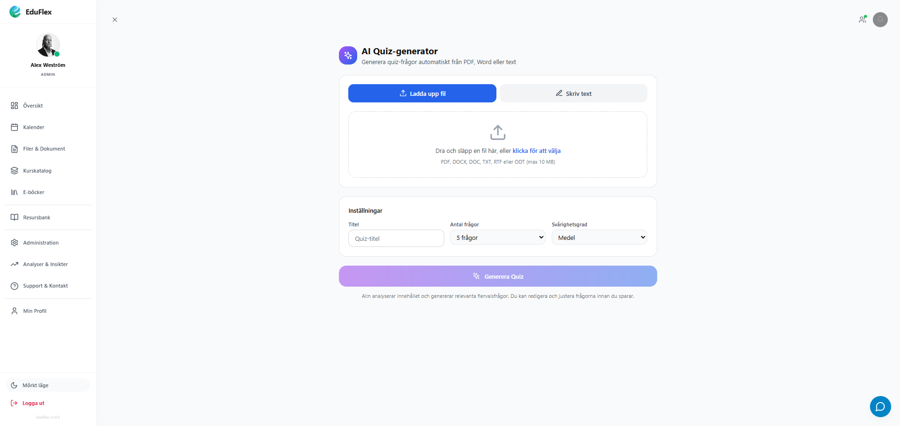
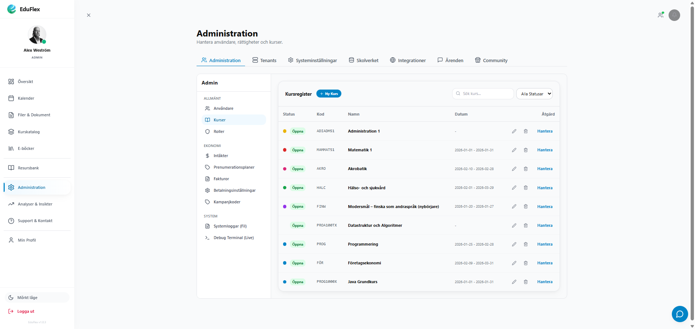
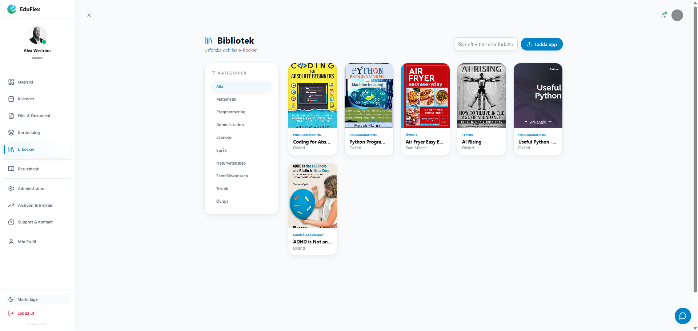
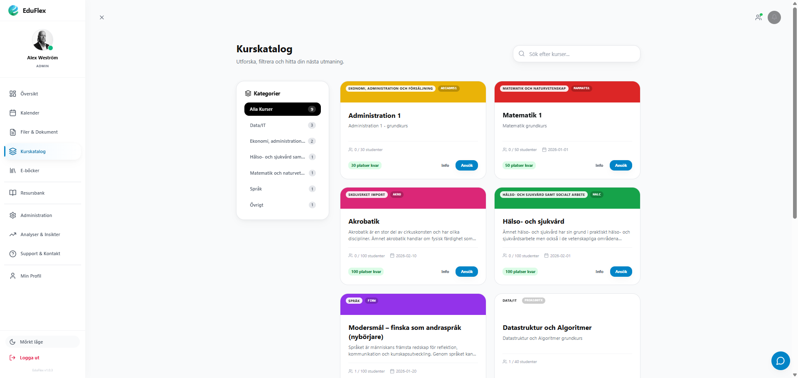
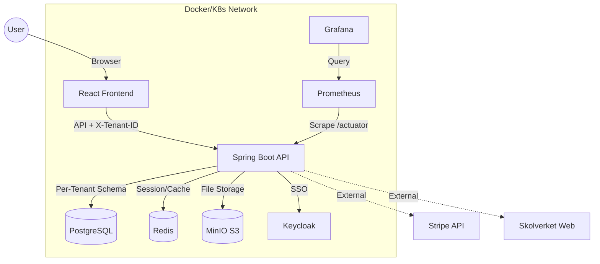
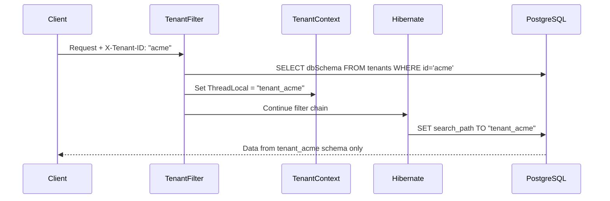

<p align="center">
  
</p>

<h1 align="center">🎓 EduFlex LMS 2.0</h1>

<p align="center">
  <em>The Complete Enterprise Learning Platform for Modern Education</em><br/>
  <em>Developed & maintained by <strong>Alex Weström / Fenrir Studio</strong></em>
</p>

<p align="center">
  <a href="#-svenska">🇸🇪 Svenska</a> &nbsp;&nbsp;&nbsp;|&nbsp;&nbsp;&nbsp; <a href="#-english">🇬🇧 English</a>
</p>

---

<p align="center">
  
  
  
  
  
  
  
  
  
  
  
  
  
</p>

---

<div id="-svenska"></div>

## 🇸🇪 Svenska

*   **🧠 Adaptive Learning (Fas 4) - Startskott (14 feb 2026):**
    *   **"Min Lärväg" Dashboard:** En ny vy för studenter som visualiserar deras unika inlärningsprofil (Stil, Takt, Fokusområden).
    *   **AI-Driven Analys:** Systemet analyserar prestationer i realtid och genererar personliga rekommendationer via Google Gemini.
    *   **Interaktiva Åtgärder:** Studenter kan markera rekommendationer som "Påbörjade" och se dem flyttas till "Pågående"-status.
    *   **Live Data:** Allt drivs av faktiska kursresultat och användardata – inga mockups.

*   **🛠️ Systemåterställning & Full Stabilitet (14 feb 2026):**
    *   **Full Service Stack:** Återaktiverat OnlyOffice (Dokument) och Jitsi (Video) efter omfattande stabilitetsarbete.
    *   **Docker-optimering:** Löste kritiska "Connection refused"-fel genom att separera backend-start från container-orkestrering.
    *   **502 Error Resolution:** Fixat "Bad Gateway" genom att åtgärda en API-mappningskonflikt i `GuardianController`.
    *   **E-hälsa Visibility:** Implementerat strikt rollbaserad åtkomst (Hälsoteam ser endast E-hälsa, Admin ser inga hälso-paneler) för ökad integritet.
    *   **Prestanda:** Systemet kör nu fullt ut med alla mikrotjänster aktiva och integrerade.

*   **📈 Systematiskt Kvalitetsarbete (SKA) Motor (13 feb 2026):**
    *   **SKA Dashboard:** Ny flik i Rektors-vyn för att definiera, följa upp och analysera kvalitetsmål.
    *   **Kvalitetsindikatorer:** Stöd för både automatiska (t.ex. närvaro, betyg) och manuella indikatorer med målvärden.
    *   **Årshjulet:** Visuell tidslinje (`YearCycleVisualization`) för läsårets kvalitetsavstämningar (Nulägesanalys, Målformulering, etc.).
    *   **Backend-stöd:** Nya `/api/ska` endpoints för fullständig CRUD-hantering av mål och indikatorer.

*   **🛠️ Systemstabilitet & AI-insikter (13 feb 2026 - Kväll):**
    *   **Backend-fix:** Åtgärdat kompileringsfel i `CourseController` genom att korrigera åtkomstnivåer i `CourseService`.
    *   **Vårdnadshavare AI:** Fixat bugg i student-lookup för AI-sammanfattningar och verifierat full funktionalitet.
    *   **Flyway-härdning:** Säkerställt att migrationsskrit (`V18`, `V32`) är idempotenta och tål avbrott vid uppstart.
    *   **Frontend-synk:** Automatiserat bygge och distribution av frontend direkt i backendens statiska resurser.

*   **📊 AI Management Reports (13 feb 2026):**
    *   **Rektorspaket (Mission Control):** Implementerat en dedikerad sidomeny-sektion för skolledningen.
    *   **Automatiserade Rapporter:** Integrerat AI-genererade ledningsrapporter med automatiska data-snapshots.
    *   **Felhantering:** Åtgärdat `PSQLException` vid sparning av JSONB-data genom Hibernate 6-anpassning.
    *   **UI/UX:** Ny status-indikator i dashboardens header och mer framträdande "Action"-knapp i AI-coachen.

*Tidigare releaser (Februari): Vårdnadshavarportal, Elevhälsa-enkäter, Sjukanmälan, Rektors Mission Control och LTI 1.3 Advantage.*
*   **📋 Health Survey & Notification System (12 feb 2026):**
    *   **Survey Notification Widget:** Nytt gränssnitt för elever, lärare och mentorer som visar väntande enkäter direkt på dashboarden.
    *   **Automatiska Påminnelser:** Integration med det interna meddelandesystemet för att säkerställa hög svarsfrekvens.
    *   **Dashboard Integration:** Sömlös inbäddning i `StudentDashboard`, `TeacherDashboard` och `MentorDashboard`.
*   **⭐ Guardian Mission Control – Föräldraportal & Hantering (11 feb 2026):**
    *   **Vårdnadshavardashboard:** En helt ny vy för föräldrar med realtidsdata för barnens närvaro, schema och resultat.
    *   **Admin-hantering:** Nytt gränssnitt för administratörer att lista vårdnadshavare och hantera kopplingar till elever.
    *   **100% Live Data:** Samtliga dashboards (Rektor & Vårdnadshavare) är nu helt drivna av live-data utan mockups.
*   **🎯 Principal Mission Control – Live Dashboard & Organisationshantering (11 feb 2026):**
    *   **Live Metrics:** Dashboarden för rektorer är nu helt befriad från mockups och drivs av realtidsdata för närvaro, incidenter och resultat.
    *   **System Intelligence:** Lagt till en ny header-bar som ger direkt insikt i totalt antal elever och aktiva varningsflaggor.
    *   **Skolstruktur & Mentorering:** Fullt stöd för att skapa och hantera avdelningar, program och klasser med ett intuitivt gränssnitt för mentorskoppling.
    *   **Stabilitetsfix:** Eliminerat samtliga 404-fel i konsolen relaterade till legacy-komponenter och flyttade filer.
*   **🎓 Rich Course Management – Skolverket-integration (10 feb 2026):**
    *   **Officiell data-synk:** Manuellt skapade kurser kan nu berikas med officiell data från Skolverket. Systemet hämtar automatiskt kursbeskrivningar, centralt innehåll och betygskriterier.
    *   **Skolverket Course Selector:** Integrerat en ny väljare i kurshanteringen för att enkelt koppla lokala kurser till Skolverkets databas.
    *   **Automatisk Berikning:** Backend-logik som automatisk synkroniserar och fyller i saknad information baserat på kurskod både vid skapande och import.
*   **📩 Kommunikation – Rektorsåtkomst till Meddelanden (10 feb 2026):**
    *   **Full Inbox-åtkomst:** Rektorsrollen har nu full tillgång till det interna meddelandesystemet via en dedikerad `/communication`-route.
    *   **Sidebar-integration:** Lagt till en direktlänk till "Kommunikation" i sidomenyn för alla rörda roller.
    *   **Global Route:** Implementerat en central route för `MessageCenter` som fungerar oberoende av dashboard-tabbar för ökad flexibilitet.
*   **💎 UI-Optimering – Sticky Sidebar & Single-Scroll (10 feb 2026):**
    *   **Sticky Navigation:** Sidomenyn är nu fixerad (`sticky`) i viewporten. Detta garanterar att Profil, Logout och Mörkt läge alltid är åtkomliga utan att man behöver scrolla upp.
    *   **Eliminerat interna scrollister:** Alla 8 temalayouter använder nu webbläsarens huvudscrollbar för hela sidan, vilket tar bort "iFrame-känslan".
    *   **Single-Scroll Experience:** Dynamisk höjd på `MessageCenter` och andra moduler gör att hela plattformen känns mer integrerad och modern.
*   **📐 Kompakt Sidomeny (10 feb 2026):**
    *   **Reducerat mellanrum:** Minskat vertikalt avstånd mellan ikoner och sektioner i sidomenyn för att rymma mer innehåll utan att behöva scrolla internt.
    *   **High-Density Design:** Optimerat `SidebarSection` och navigationscontainrar i samtliga 8 layouter för en mer effektiv informationsyta.
*   **🎯 Mission Control – Funktionella Moduler & Backend-fix (9 feb 2026):**
    *   **Incidenthantering:** Ny `IncidentManager`-komponent med CRUD-endpoints (`IncidentReportController`) för att rapportera, söka och uppdatera incidenter.
    *   **Bemanningskontroll:** Ny `StaffingControl`-komponent för hantering av sjukfrånvaro och vikariepooler.
    *   **Rapportbibliotek:** Ny `ReportLibrary`-komponent för åtkomst till och sökning bland skolrapporter och dokument.
    *   **Dashboard-koppling:** Quick Actions och KPI-drilldowns i Mission Control navigerar nu till de nya funktionella modulerna.
    *   **Backend-kompileringsfix:** Åtgärdat 5 kritiska kompileringsfel — trasig konstruktor i `PrincipalDashboardService`, saknad `getUserByUsername`-metod i `UserService`, saknat `grade`-fält i `CourseResult`, stubbad `User.getStaffStatus()` och `User.getClassGroup()`.
    *   **API-utbyggnad:** Nya endpoints i `api.js` för incident-, bemanning- och rapporthantering.
*   **🚀 Automatisk Dokumentgenerering & QR-Verifiering (9 feb 2026):**
    *   **Automatisk utfärdande:** Systemet genererar nu automatiskt kursintyg (PDF) när en student får status `PASSED`.
    *   **QR-Verifiering:** Varje intyg och betygsutdrag har en unik QR-kod för äkthetskontroll via en publik verifierings-endpoint.
    *   **Samlade Betyg:** Lagt till funktion för studenter att ladda ner ett konsoliderat betygsutdrag med alla avklarade kurser.
    *   **Förbättrad Dokumenthantering:** Nya flikar i studentvyn för "Mina Betyg", "Mina Intyg" och "Dokumentbank".
    *   **Systemhärdning:** Åtgärdat Hibernate-mappningsfel för autogenererade dokument vid uppstart.
*   **🚀 Rektorspaket (Principal Package) - Mission Control (9 feb 2026):**
    *   **Mission Control Dashboard:** Ny central "RektorLanding" med 8 realtids-KPIer (Närvaro, Incidenter, Manning, Ekonomi, Elevhälsa).
    *   **Skolledning:** Fullständig hierarki med Program, Klasser och Arbetslag.
    *   **Kvalitetsuppföljning:** Incidentrapportering, elevhälsa-ärenden och pedagogiska observationer.
    *   **Administrativa Verktyg:** Massmeddelande till årskurser/klasser och "Impersonate Mode" för support.
*   **🚀 CI/CD Pipeline Härdning & ESLint (9 feb 2026):**
    *   **Backend H2 Stabilisering:** Gjort `QuestService`, `ShopService` och `DataInitializer` profil-medvetna för att undvika fel vid databasinitiering under tester.
    *   **Multi-Tenancy Fix:** Exkluderat `test`-profilen från `TenantConfig` för att förhindra H2-kompatibilitetsproblem med schema-baserad tenant-separation.
    *   **Frontend Linting:** Fixat totalt **289 ESLint-fel** (no-undef, no-case-declarations, empty blocks) för en ren och stabil CI-miljö.
    *   **GitHub Actions Optimering:** Uppdaterat `ci.yml` med Redis-stöd, optimerad caching och `--legacy-peer-deps` för npm-installationer.
    *   **Test-Resiliens:** Alla backend-tester går nu igenom (Tests run: 1, Failures: 0, Errors: 0) med standardiserade H2-inställningar.
*   **💬 Social Learning Expansion (9 feb 2026):**
    *   **Contextual Comments:** Möjliggjort diskussioner direkt i kurs/lektionsvyn med trådade kommentarer och likes.
    *   **Real-time Interaction:** Integrerat STOMP/SockJS för omedelbara uppdateringar av sociala interaktioner.
    *   **Backend Hardening:** Fixat kritiska proxy- och säkerhetsinställningar för WebSocket-trafik (`/ws-social`).
    *   **Maven Sync:** Standardiserat `spring-boot-maven-plugin` för att säkerställa repeterbara byggen.
*   **🏗️ Februari 2026 - Vecka 5 & 6 (Systemhärdning, Gamification & LTI):**
    *   **LTI 1.3 Advantage:** Full E2E-verifiering av AGS (betyg) och NRPS (medlemmar).
    *   **Gamification 2.0:** Lanserat Shop, Inventarier, Streaks och Admin-verktyg för butiksföremål.
    *   **E-bok/PDF:** Auto-Cover extraction, smart metadata-parsing och Range-stöd för streaming.
    *   **Systemstabilitet:** Fixat "Split-Brain" MinIO, circuluära beroenden, och Flyway-migrationer för multi-tenant.
    *   **UX/UI:** Sidomeny-refaktorering (gruppering), AI-kursgenerator, och modernisering av Forum-UI.
*   **🚀 Januari 2026 - Projektstart & Grundläggande arkitektur:**
    *   **Core:** Implementering av schema-baserad Multi-Tenancy och Spring Boot-backend.
    *   **AI Study Pal:** Integration med Google Gemini för Quiz-generering och PDF-indexering.
    *   **Infrastruktur:** Docker-stack med PostgreSQL, Redis, MinIO och Keycloak.
    *   **Lokaliseing:** Stöd för 9 språk och grundläggande Skolverket-integration.

### 📖 Innehållsförteckning
- [Om Projektet](#-om-projektet)
- [Nyckelfunktioner](#-nyckelfunktioner)
- [Multi-Tenancy](#-multi-tenancy-sv)
- [Kom igång](#-kom-igång)
- [Konfiguration](#-konfiguration-sv)
- [Felsökning & Infrastruktur](docs/InfrastructureGuide.md)

---

### 🏫 Om Projektet

**EduFlex 2.0** är ett komplett, molnbaserat **Learning Management System (LMS)** designat för att skala från små utbildningsföretag till stora kommunala verksamheter. Systemet kombinerar modern pedagogik (Gamification, interaktiva element) med affärskritisk funktionalitet (fakturering, prenumerationer) i en säker, Docker-baserad arkitektur.

**Huvudsakliga fördelar:**
- 🏢 **Äkta Multi-Tenancy:** Schema-per-organisation för komplett dataisoleringen
- 🎮 **Inbyggd Gamification:** Poäng, utmärkelser, nivåer och topplistor
- 🇸🇪 **Skolverket-integration:** Direkt koppling till svenska läroplanen
- 💼 **SaaS-redo:** Prenumerationsnivåer, fakturering och betalningar
- 🎨 **White-label:** 8 designsystem med full visuell anpassning

---

### 🌟 Nyckelfunktioner

#### 🍎 Utbildning (Core)
- **Kurshantering:** Rika kurser med text, video, bilagor och quiz
- **AI Quiz & Lektioner:** Generera quiz, uppgifter och lektionsplaner automatiskt med Google Gemini
- **SCORM / xAPI / LTI 1.3 Advantage:** Fullt stöd för Articulate/Captivate-paket samt LMS-integration (Canvas/Moodle/Blackboard).
- **Uppgifter:** Filinlämningar med lärarbedömning
- **Certifikat:** Automatiska, spårbara PDF-diplom
- **E-boksbibliotek:** Fristående bibliotek för EPUB/PDF med kategorier
- **Resursbank:** Centraliserad hantering av allt utbildningsmaterial

#### 🎮 Gamification
- **Poäng & Nivåer:** XP genom aktivitet och framsteg
- **Utmärkelser:** Visuella badges för prestationer
- **Dagliga Utmaningar:** Roterande utmaningar med bonus-XP
- **Streaks:** Spåra konsekutiva inloggningsdagar med bonusar
- **Topplistor:** Frivilliga rankingar per klass/kurs
- **Achievement Toast:** Realtids-popup vid upplåsta prestationer

#### 🔔 Notifikationer
- **WebSocket Push:** Direkta notifikationer via STOMP/SockJS
- **Notifikationsklocka:** Header-komponent med oläst-räknare
- **Flera Typer:** Uppgifter, prestationer, system och sociala notiser

#### 👥 Sociala Funktioner
- **Online-vänner:** Se vilka som är online just nu
- **Snabbkontakt:** Enkla kontaktalternativ för lärare

#### 🏪 Community Marknadsplats
- **Innehållsdelning:** Publicera Quiz, Uppgifter och Lektioner till en delad marknadsplats
- **Moderation:** Admin-godkännande med väntande/publicerad/avvisad status
- **Frågebank-sync:** Quiz-frågor kopieras automatiskt till din Frågebank vid installation
- **20+ Ämnen:** Matematik, Svenska, Engelska, Fysik, Kemi och fler med anpassade ikoner

#### 🇸🇪 Skolverket-integration
- **Kurskoppling:** Direkt Skolverket-databaskoppling
- **Automatisk Import:** Python-verktyg för kurskoder
- **Kunskapskrav:** Betygsmatriser (E-A) direkt i kursvyn

#### 🏢 Multi-Tenancy
- **Schema-isolering:** Varje organisation i eget PostgreSQL-schema
- **v1.0.9** (2026-02-14): **System Restoration** (Full Service Stack). OnlyOffice & Jitsi re-enabled.
- **v1.0.8** (2026-02-13): **SKA Motor** (Quality Assurance). Goals, Indicators & AI Reports.
- **v1.0.7** (2026-02-13): **Role-Specific AI Coachers** (Phase 2 Implementerad). Specialiserat beslutsstöd för Rektorer och Mentorer.
- **v1.0.6** (2026-02-13): **Predictive AI Engine** (Fas 1 Roadmap 2026+). Deep pattern analysis och riskidentifiering.
- **Request-routing:** `X-Tenant-ID` header för organisation-val

---

### 🏢 Multi-Tenancy (Sv)

EduFlex implementerar **schema-baserad multi-tenancy** för komplett dataisolering.

#### Skapa ny Tenant
```bash
curl -X POST http://localhost:8080/api/tenants \
  -H "Content-Type: application/json" \
  -d '{
    "name": "Stockholms Tekniska Gymnasium",
    "domain": "stg.local",
    "dbSchema": "tenant_stg",
    "organizationKey": "stg",
    "adminEmail": "admin@stg.local",
    "adminPassword": "SäkertLösen123",
    "adminFirstName": "Anna",
    "adminLastName": "Andersson"
  }'
```

---

### Senaste Uppdateringar (v1.1.1 - 2026-02-14)
- **Wellbeing Center Fix:** Åtgärdade omdirigeringsproblem för administratörer.
- **Guardian UX:** Förbättrad meny för vårdnadshavare (döljer onödiga verktyg).
- **Säkerhet:** Utökad rollbaserad åtkomstkontroll för E-hälsa.
- **Adaptive Learning:** Startskott för Fas 4 (AI-driven adaptivitet).

#### Tidigare (v1.1.0)
- **System Restoration:** Full återställning av Jitsi/OnlyOffice och Cloudflare-tunnel.
- **SKA-Motor:** Lansering av systematiskt kvalitetsarbete för rektorer.

---

### 🚀 Kom igång

#### Förutsättningar
- **Docker Desktop** (senaste versionen)
- **Git**

#### Snabbstart

1. **Klona projektet**
   ```bash
   git clone https://github.com/alexwest1981/EduFlex.git
   cd EduFlex
   ```

2. **Starta systemet**
   ```bash
   docker compose up --build -d
   ```

3. **Öppna applikationen**
   | Tjänst | URL | Inloggning |
   |--------|-----|------------|
   | **LMS (Frontend)** | http://localhost:5173 | – |
   | **API Docs** | http://localhost:8080/swagger-ui.html | – |
   | **MinIO (Filer)** | http://localhost:9001 | minioadmin / minioadmin |

---

### ⚙️ Konfiguration (Sv)

#### Miljövariabler

| Tjänst | Variabel | Beskrivning | Standard |
|--------|----------|-------------|----------|
| **Backend** | `SPRING_DATASOURCE_URL` | Databaslänk | `jdbc:postgresql://db:5432/eduflex` |
| **Backend** | `EDUFLEX_AUTH_MODE` | Autentiseringsläge | `internal` |
| **Backend** | `GEMINI_API_KEY` | Google Gemini API-nyckel för AI Quiz | – |

---

<br/><br/>

<div id="-english"></div>

## 🇬🇧 English

### ⚡ Latest Updates (v1.0.5)
> **2026-02-14: System Restoration & SKA Integration**
*   **🛠️ Full Stability:** Resolved Docker connectivity issues and restored Jitsi/OnlyOffice services.
*   **📈 SKA Motor:** Released Systematic Quality Work engine with Goals, Indicators, and Year Cycle.
*   **🔄 Skolverket Sync 2.0:** Batch-sync capabilities for the entire catalog. Refactored service for maximum reliability.
*   **🎮 Gamification Expanded:** XP rewards for AI Tutor chat, lesson views, video playbacks, and downloads.
*   **🛡️ System Resilience:** Fixed activity logging (DB constraint fix) and AES-256 GCM encryption hardening.
*   **🔗 Dashboard Sync:** Resolved "Go to Grading" redirects and implemented smart tab-aware navigation.

*Previous February releases: Guardian Portal, Health Surveys, Sick Leave Management, Principal Mission Control, and LTI 1.3 Advantage.*
*   **📩 Communication – Principal Mailbox Access (Feb 10, 2026):**
    *   **Full Inbox Access:** The Principal (Rektor) role now has full access to the internal messaging system via a dedicated `/communication` route.
    *   **Sidebar Integration:** Added a direct "Communication" link in the sidebar for all relevant staff and administrative roles.
    *   **Global Route:** Implemented a centralized `MessageCenter` route that works independently of dashboard tabs for increased flexibility.
*   **🎯 Mission Control – Functional Modules & Backend Fix (Feb 9, 2026):**
    *   **Incident Management:** New `IncidentManager` component with full CRUD endpoints (`IncidentReportController`) for reporting, searching, and updating incidents.
    *   **Staffing Control:** New `StaffingControl` component for managing sick leave and substitute teacher pools.
    *   **Report Library:** New `ReportLibrary` component for accessing and searching school reports and documents.
    *   **Dashboard Wiring:** Quick Actions and KPI drilldowns in Mission Control now navigate to the new functional modules.
    *   **Backend Compilation Fix:** Resolved 5 critical compilation errors — broken constructor in `PrincipalDashboardService`, missing `getUserByUsername` method in `UserService`, missing `grade` field in `CourseResult`, stubbed non-existent `User.getStaffStatus()` and `User.getClassGroup()`.
    *   **API Expansion:** New endpoints in `api.js` for incident, staffing, and report management.
*   **🏗️ February 2026 - Week 5 & 6 (System Hardening, Gamification & LTI):**
    *   **LTI 1.3 Advantage:** Completed E2E verification for AGS (Grades) and NRPS (Names and Roles).
    *   **Gamification 2.0:** Launched Shop, Inventory, Streaks, and Authoring tools.
    *   **E-book/PDF:** Auto-Cover extraction, smart metadata parsing, and Range support for streaming.
    *   **System Stability:** Fixed MinIO configuration, circular dependencies, and Flyway multi-tenant migrations.
    *   **UX/UI:** Sidebar refactor (grouping), AI Course Generator, and Forum UI modernization.
*   **🚀 January 2026 - Project Kickoff & Core Architecture:**
    *   **Core:** Implementation of schema-based Multi-Tenancy and Spring Boot backend.
    *   **AI Study Pal:** Google Gemini integration for Quiz generation and PDF indexing.
    *   **Infrastructure:** Docker stack with PostgreSQL, Redis, MinIO, and Keycloak.
    *   **Localization:** Support for 9 languages and initial Skolverket curriculum integration.

### 📖 Table of Contents
- [About the Project](#-about-the-project)
- [Key Features](#-key-features)
- [System Architecture](#-system-architecture)
- [Technology Stack](#-technology-stack)
- [Multi-Tenancy](#-multi-tenancy)
- [Getting Started](#-getting-started-en)
- [Configuration](#-configuration-en)
- [Authentication Modes](#-authentication-modes)
- [API Reference](#-api-reference)
- [Modules Deep Dive](#-modules-deep-dive)
- [Monitoring & Observability](#-monitoring--observability)
- [Localization](#-localization)
- [Deployment Options](#-deployment-options)
- [Roadmap](#-roadmap)
- [License](#-license)

---

### 🏫 About the Project

**EduFlex 2.0** is a robust, cloud-native Learning Management System (LMS) engineered for scalability and user engagement. It bridges the gap between traditional enterprise LMS (often clunky and boring) and modern consumer apps (gamified, fast, and beautiful).

**Key Differentiators:**
- 🏢 **True Multi-Tenancy:** Schema-per-tenant isolation for complete data separation
- 🎮 **Gamification Built-in:** Points, badges, levels, and leaderboards
- 🇸🇪 **Skolverket Integration:** Direct integration with Swedish National Curriculum
- 💼 **SaaS Ready:** Subscription tiers, invoicing, and payment processing
- 🎨 **White-label Support:** 8 design systems with complete visual customization

---

### 🌟 Key Features

#### 🍎 Core Education
| Feature | Description |
|---------|-------------|
| **Course Management** | Rich courses with text, video, attachments, and quizzes |
| **Video Lessons** | Self-hosted video uploads with chapters, speed control, and analytics |
| **Live Classrooms** | Jitsi-powered video conferencing with scheduling and dashboard widget |
| **SCORM / xAPI / LTI 1.3 Advantage** | Import packages from Articulate/Adobe Captivate & LMS Integration |
| **Assignment Engine** | File submissions with teacher grading and feedback |
| **Certification** | Auto-generated verifiable PDF certificates |
| **Lesson Progress** | Track student progress through course materials |
| **Quiz System** | Multiple choice, open-ended, and true/false questions |
| **AI Quiz Generator** | Generate quizzes from documents using Google Gemini AI |
| **E-book Library** | Standalone library for EPUB/PDF with categorized browsing |

#### 🎮 Gamification & Engagement
| Feature | Description |
|---------|-------------|
| **Points & Levels** | XP for logins, lessons, and quiz scores |
| **Badges & Achievements** | Visual achievements with Lucide iconography and unlock conditions |
| **Daily Challenges** | Rotating challenges with bonus XP rewards |
| **Streaks** | Track consecutive login days with streak bonuses |
| **Leaderboards** | Optional class/course rankings |
| **Activity Tracking** | Detailed student activity logs |
| **Per-Tenant Config** | Admins can enable/disable gamification features per organization |
| **Achievement Toast** | Real-time popups when achievements are unlocked |
| **XP Boost Indicator** | Visual indicator for active XP multipliers |

#### 🇸🇪 Skolverket Integration
| Feature | Description |
|---------|-------------|
| **Curriculum Mapping** | Direct Skolverket database integration |
| **Automated Import** | Python tools for course codes and descriptions |
| **Grading Criteria** | "Kunskapskrav" (E-A) directly in course view |
| **CSN Reporting** | Attendance export for CSN compliance |

#### 💼 Revenue & Administration
| Feature | Description |
|---------|-------------|
| **Subscription Tiers** | Free, Pro, Enterprise licensing |
| **Invoicing** | Automatic PDF invoice generation |
| **Payment Integration** | Stripe/Swish abstraction layer |
| **User Management** | Profiles with MinIO-backed avatar uploads |
| **RBAC** | Fine-grained permissions per role |
| **Audit Logging** | Track all critical changes |

#### 🏢 Multi-Tenancy
| Feature | Description |
|---------|-------------|
| **Schema Isolation** | Each tenant in separate PostgreSQL schema |
| **Automatic Provisioning** | Schema + migrations + admin user on registration |
| **Request Routing** | `X-Tenant-ID` header for tenant selection |
| **Tenant API** | Full CRUD for tenant management |

#### 🔔 Real-time Notifications
| Feature | Description |
|---------|-------------|
| **WebSocket Push** | Instant notifications via STOMP/SockJS |
| **Notification Bell** | Header component with unread count badge |
| **Multiple Types** | Assignment, achievement, system, and social notifications |
| **Read/Unread State** | Track which notifications have been seen |
| **Notification History** | Persistent storage with pagination |

#### 👥 Social Features
| Feature | Description |
|---------|-------------|
| **Online Friends Panel** | See who's currently online |
| **Student Contact Modal** | Quick contact options for teachers |
| **Activity Feed** | Recent activity from connections |

#### 🏪 Community Marketplace
| Feature | Description |
|---------|-------------|
| **Content Sharing** | Teachers can publish Quiz, Assignments, and Lessons to a shared marketplace |
| **Moderation Flow** | Admin approval with pending/published/rejected states |
| **Question Bank Sync** | Quiz questions automatically copied to personal Question Bank on install |
| **Subject Categories** | 20+ subject categories with custom icons and colors |
| **Search & Filter** | Find content by subject, type, keywords, and ratings |
| **Ratings & Reviews** | 5-star rating system with user comments |
| **Download Tracking** | Track popular content with download counts |
| **Cross-Tenant** | Content accessible across all EduFlex tenants |

#### 🎨 Enterprise Themes & Whitelabel
Complete visual customization with 8 professional design systems:
- **EduFlex Classic** – Traditional sidebar layout
- **EduFlex Focus** – Minimalist with floating container
- **EduFlex Horizon** – Top navigation with beige gradient
- **EduFlex Nebula** – Glassmorphic purple/lavender
- **EduFlex Ember** – Card sidebar with orange accents
- **EduFlex Voltage** – Acid lime neon with dark sidebar
- **EduFlex Midnight** – Dark mode with mint accents
- **EduFlex Pulse** – Music player-inspired red theme

#### 📊 Analytics & Insights
| Feature | Description |
|---------|-------------|
| **Advanced Analytics Dashboard** | [x] **Advanced Analytics Dashboard** (Implemented Q1 2026)
  - Real-time user activity tracking
  - Course performance metrics
  - At-risk student identification
  - Admin/Teacher specific views |
| **Student Activity Logs** | Deep-dive into individual history |
| **Real-time Debug Terminal** | Matrix-style live log streaming |

#### 🌍 Localization
Fully translated UI supporting:
- 🇸🇪 Swedish (Primary)
- 🇬🇧 English
- 🇸🇦 Arabic
- 🇳🇴 Norwegian
- 🇩🇰 Danish
- 🇫🇮 Finnish
- 🇩🇪 German
- 🇫🇷 French
- 🇪🇸 Spanish

---

### 📸 Screenshots

|  |  |
|:---:|:---:|
| **Admin Dashboard** | **Teacher Dashboard** |

|  |  |
|:---:|:---:|
| **AI Quiz Generator** | **System Settings** |

|  |  |
|:---:|:---:|
| **Analytics & Insights** | **Live Debug Terminal** |

|  |  |
|:---:|:---:|
| **E-book Library** | **Course Catalog** |

|  | |
|:---:|:---:|
| **Resource Bank / Community** | |

---

### 🛠 System Architecture

EduFlex uses a containerized architecture managed by **Docker Compose** or **Kubernetes (Helm)**.



#### Multi-Tenancy Data Flow



---

### 💻 Technology Stack

#### Frontend Service (`eduflex-frontend`)
| Category | Technologies |
|----------|-------------|
| **Core** | React 19, Vite 5 |
| **State** | Zustand, React Context |
| **Styling** | Tailwind CSS v4, CSS Variables |
| **Icons** | Lucide React |
| **Charts** | Recharts |
| **Real-time** | SockJS + STOMP (WebSockets) |
| **i18n** | i18next (9 languages) |
| **Rich Text** | React-Quill-new |

#### Backend Service (`eduflex-backend`)
| Category | Technologies |
|----------|-------------|
| **Core** | Java 21, Spring Boot 3.4 |
| **Security** | Spring Security 6, JWT, OAuth2 |
| **Data** | Spring Data JPA, Hibernate 6.4 |
| **Database** | PostgreSQL 15 |
| **Caching** | Spring Data Redis |
| **Storage** | MinIO/S3 SDK |
| **PDF** | OpenPDF |
| **Migrations** | Flyway (programmatic per-tenant) |
| **API Docs** | Swagger / OpenAPI 3.0 |
| **Monitoring** | Micrometer + Actuator |

#### Infrastructure
| Component | Technology |
|-----------|------------|
| **Database** | PostgreSQL 15 (Alpine) |
| **Cache** | Redis 7 (Alpine) |
| **Object Storage** | MinIO (S3-compatible) |
| **SSO Provider** | Keycloak 24 |
| **Monitoring** | Prometheus + Grafana |
| **Backups** | Daily PostgreSQL dumps |
| **Container Runtime** | Docker 24+ |
| **Orchestration** | Docker Compose / Kubernetes |

---

### 🏢 Multi-Tenancy

EduFlex implements **schema-based multi-tenancy** for complete data isolation.

#### Architecture
```
┌─────────────────────────────────────────────────────────────┐
│                     PostgreSQL Database                      │
├─────────────────┬─────────────────┬─────────────────────────┤
│  public schema  │  tenant_acme    │  tenant_school2        │
│  ───────────────│  ───────────────│  ───────────────────── │
│  • tenants      │  • app_users    │  • app_users           │
│  (metadata)     │  • roles        │  • roles               │
│                 │  • courses      │  • courses             │
│                 │  • (40+ tables) │  • (40+ tables)        │
└─────────────────┴─────────────────┴─────────────────────────┘
```

#### Creating a Tenant

**Via API:**
```bash
curl -X POST http://localhost:8080/api/tenants \
  -H "Content-Type: application/json" \
  -d '{
    "name": "Acme School",
    "domain": "acme.local",
    "dbSchema": "tenant_acme",
    "organizationKey": "acme",
    "adminEmail": "admin@acme.local",
    "adminPassword": "SecurePass123",
    "adminFirstName": "John",
    "adminLastName": "Admin"
  }'
```

**What happens automatically:**
1. ✅ Tenant metadata saved to `public.tenants`
2. ✅ PostgreSQL schema `tenant_acme` created
3. ✅ All 40+ tables migrated via Flyway
4. ✅ ADMIN role created
5. ✅ Admin user created with encrypted password

#### Using X-Tenant-ID Header

All API requests must include the tenant header:
```http
X-Tenant-ID: acme
```

#### Key Components
| File | Purpose |
|------|---------|
| `TenantContext.java` | ThreadLocal tenant storage |
| `TenantFilter.java` | Extracts and validates X-Tenant-ID |
| `TenantIdentifierResolver.java` | Hibernate tenant resolution |
| `SchemaMultiTenantConnectionProvider.java` | Sets PostgreSQL search_path |

> 📖 **Full documentation:** [docs/TENANT_ADMIN_GUIDE.md](docs/TENANT_ADMIN_GUIDE.md)

---

<div id="-getting-started-en"></div>

### 🚀 Getting Started

#### Prerequisites
- **Docker Desktop** (latest version)
- **Git**
- **Java 21** (for local backend development)
- **Node.js 20+** (for local frontend development)

#### Quick Start with Docker

1. **Clone the Repository**
   ```bash
   git clone https://github.com/alexwest1981/EduFlex.git
   cd EduFlex
   ```

2. **Start Everything**
   ```bash
   docker compose up --build -d
   ```

3. **Access the Application**
   | Service | URL | Credentials |
   |---------|-----|-------------|
   | **Frontend (LMS)** | http://localhost:5173 | – |
   | **Backend API** | http://localhost:8080/api | – |
   | **Swagger Docs** | http://localhost:8080/swagger-ui.html | – |
   | **MinIO Console** | http://localhost:9001 | minioadmin / minioadmin |
   | **Grafana** | http://localhost:3000 | admin / admin |
   | **Keycloak** | http://localhost:8180 | admin / admin |
   | **Prometheus** | http://localhost:9090 | – |
## Phase 2: Role-Specific AI Coachers [x]
- [x] **Principal Coach**: KPI-driven priorities & Weekly Focus <!-- id: 105 -->
- [x] **Mentor Coach**: Development talk preparation & Guardian comms prep <!-- id: 106 -->
- [x] **EHT Coach**: Group-level pattern identification <!-- id: 107 -->
- [x] **Student Coach**: Study planning based on schedule/deadlines <!-- id: 108 -->

#### Local Development

**Backend (Spring Boot):**
```bash
cd eduflex
mvn spring-boot:run
```

**Frontend (Vite):**
```bash
cd frontend
npm install
npm run dev
```

---

<div id="-configuration-en"></div>

### ⚙️ Configuration

#### Environment Variables

| Service | Variable | Description | Default |
|---------|----------|-------------|---------|
| **Backend** | `SPRING_DATASOURCE_URL` | DB connection | `jdbc:postgresql://db:5432/eduflex` |
| **Backend** | `MINIO_URL` | S3 endpoint (internal) | `http://minio:9000` |
| **Backend** | `MINIO_PUBLIC_URL` | Public S3 URL (for clients) | `https://storage.eduflexlms.se` |
| **Backend** | `SPRING_REDIS_HOST` | Redis host | `redis` |
| **Backend** | `EDUFLEX_AUTH_MODE` | Auth mode | `internal` |
| **Backend** | `GEMINI_API_KEY` | Google Gemini API key for AI Quiz | – |
| **Frontend** | `VITE_API_BASE_URL` | API endpoint | `http://localhost:8080/api` |

---

### 🔐 Authentication Modes

EduFlex supports three authentication modes:

| Mode | Description | Use Case |
|------|-------------|----------|
| `internal` | JWT-based local authentication | Small deployments, development |
| `keycloak` | Full Keycloak SSO | Enterprise with existing IdP |
| `hybrid` | Both internal and Keycloak | Migration scenarios |

Configure via `eduflex.auth.mode` property.

---

### 📡 API Reference

**Base URL:** `http://localhost:8080/api`

All requests (except `/api/tenants`) require `X-Tenant-ID` header.

#### Key Endpoints

| Method | Endpoint | Description |
|--------|----------|-------------|
| `POST` | `/api/tenants` | Create new tenant |
| `POST` | `/api/auth/login` | Authenticate user |
| `GET` | `/api/courses` | List courses |
| `GET` | `/api/users/me` | Current user profile |
| `GET` | `/api/modules` | System modules |

#### Gamification Endpoints

| Method | Endpoint | Description |
|--------|----------|-------------|
| `GET` | `/api/gamification/achievements` | List all achievements |
| `GET` | `/api/gamification/achievements/user` | User's unlocked achievements |
| `GET` | `/api/gamification/streak` | Current user's streak info |
| `GET` | `/api/gamification/challenges/daily` | Today's daily challenges |
| `POST` | `/api/gamification/challenges/{id}/complete` | Mark challenge as complete |

> 📖 **Full API docs:** [docs/API.md](docs/API.md) or Swagger UI

---

### 🎛 Modules Deep Dive

EduFlex uses a **"Kernel + Extensions"** architecture. Features are toggleable:

| Module | Description | License |
|--------|-------------|---------|
| **SCORM** | Upload/play courseware | Enterprise |
| **REVENUE** | Subscriptions & invoicing | Pro+ |
| **GAMIFICATION** | XP, Badges, Leaderboards | Pro+ |
| **CHAT** | WebSocket messaging | Pro+ |
| **SSO** | Keycloak integration | Enterprise |
| **WHITELABEL** | Custom branding/themes | Enterprise |

---

### 📊 Monitoring & Observability

#### Prometheus Metrics
Backend exposes metrics at `/actuator/prometheus`:
- JVM memory, GC, threads
- HTTP request latency & counts
- Database connection pool stats
- Custom business metrics

#### Grafana Dashboards
Pre-configured dashboards for:
- System Overview
- JVM Performance
- HTTP Request Analysis
- Database Performance

#### Real-time Debug Terminal
Admin users can access live log streaming via the built-in "Matrix-style" debug terminal in the Admin UI.

---

### 🚢 Deployment Options

#### Option 1: Docker Compose (Recommended for Dev/Small)
```bash
docker compose up -d
```

#### Option 2: Kubernetes with Helm (Production)
```bash
helm install eduflex ./helm/eduflex \
  --namespace eduflex \
  --create-namespace \
  -f values-production.yaml
```

---

### 🗺 Roadmap

| Feature | Status |
|---------|--------|
| Multi-tenancy (Schema-per-tenant) | ✅ Implemented |
| Kubernetes Native (Helm Charts) | ✅ Implemented |
| Keycloak SSO Integration | ✅ Implemented |
| Prometheus/Grafana Monitoring | ✅ Implemented |
| Gamification Engine | ✅ Implemented |
| SCORM/xAPI Support | ✅ Implemented |
| Real-time Notifications (WebSocket) | ✅ Implemented |
| Daily Challenges & Streaks | ✅ Implemented |
| Achievement System | ✅ Implemented |
| Social Features (Online Friends) | ✅ Implemented |
| Support Ticket System | ✅ Implemented |
| HTTPS Storage (Cloudflare Tunnel) | ✅ Implemented |
| Enhanced Calendar (MiniCalendar, Events) | ✅ Implemented |
| Admin UI Redesign (Whitelabel) | ✅ Implemented |
| Video Lessons (Self-hosted, Chapters) | ✅ Implemented |
| Live Classrooms (Jitsi Integration) | ✅ Implemented |
| Community Marketplace | ✅ Implemented |
| Question Bank Integration | ✅ Implemented |
| AI-powered Quiz Generation (Gemini) | ✅ Implemented |
| Advanced Analytics Dashboard | ✅ Implemented |
| Microservices Split (Video/PDF) | 🔜 Q2 2026 |
| Event Bus (Kafka/RabbitMQ) | 🔜 Q3 2026 |
| Mobile App (React Native) | 🔜 Q4 2026 |
| Push Notifications (Mobile) | 🔜 Q4 2026 |

---

<div id="-license"></div>

### ❓ Troubleshooting

#### Common Issues

**1. "Port 8080 is already in use"**
```bash
# Find and kill process
netstat -ano | findstr :8080
taskkill /PID <PID> /F
```

**2. "Tenant not found" errors**
- Ensure `X-Tenant-ID` header is present
- Verify tenant exists: `curl http://localhost:8080/api/tenants`

---

## 📚 Documentation

| Document | Description |
|----------|-------------|
| [README.md](README.md) | This file - overview |
| [HELM_README.md](HELM_README.md) | Kubernetes/Helm deployment |
| [docs/API.md](docs/API.md) | REST API reference |
| [docs/ARCHITECTURE.md](docs/ARCHITECTURE.md) | System architecture |
| [docs/TENANT_ADMIN_GUIDE.md](docs/TENANT_ADMIN_GUIDE.md) | Multi-tenancy & Keycloak guide |
| [docs/ROADMAP_2026.md](docs/ROADMAP_2026.md) | Project Roadmap |

---

## ⚖️ License & Contact

**EduFlex™ © 2026 Alex Weström / Fenrir Studio**

**Proprietary Software.**
Unauthorized copying or distribution is strictly prohibited.

For inquiries: 📧 **alexwestrom81@gmail.com**

<p align="center"> 
   
</p>

---

*Last updated: 2026-02-01 (Full Language Separation, Course Evaluations & AI Analysis)*
