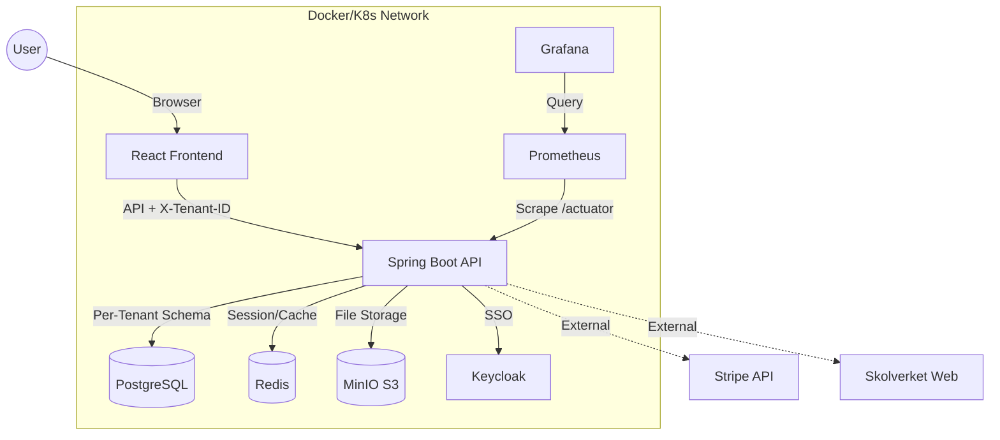
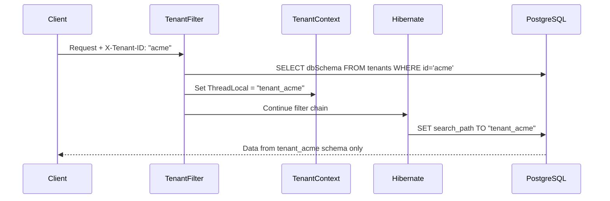

<p align="center">
  
</p>

<h1 align="center">🎓 EduFlex LMS v3.1.0</h1>

<p align="center">
  <em>The Complete Enterprise Learning Platform for Modern Education</em><br/>
  <em>Developed & maintained by <strong>Alex Weström / Fenrir Studio</strong></em>
</p>

<p align="center">
  <a href="#-svenska">🇸🇪 Svenska</a> &nbsp;&nbsp;&nbsp;|&nbsp;&nbsp;&nbsp; <a href="#-english">🇬🇧 English</a>
</p>

---

<p align="center">
  
  
  
  
  
  
  
  
  
  
  
  
  
</p>

---

<div id="-svenska"></div>

## 🚀 Planerat för nästa release (v3.3.0 – Scalability & AI Video)
*   **📡 Scalability Engine (Event Bus):**
    - Migration till en formell Event Bus-arkitektur för att hantera 100+ skolor synkront.
    - Förberett för Redis/RabbitMQ/Kafka för att eliminera flaskhalsar vid hög belastning.
*   **🎬 AI Video Tutor (v2.0):**
    - Automatisk generering av förklaringsvideor direkt från kursinnehåll.
    - AI-genererade script och automatiserad media-stitching med FFMPEG.

## 🚀 Senaste uppdateringarna (24 feb 2026 – Advanced SCORM & ISO 27001 Security)
*   **🎓 SCORM Persistence & xAPI (v3.2.0):**
    - **State API Integration**: SCORM-spelaren sparar och laddar nu automatiskt elevens framsteg (`suspend_data`, bokmärken) via det inbyggda xAPI State API:et.
    - **Progress tracking**: Skickar automatiskt xAPI-statements (`completed`, `passed`) till LRS när modulen signalerar slutförande.
    - **LRS-stöd**: Utökad `LrsController` och frontend `api.js` med stöd för State API.

*   **🛡️ ISO 27001 – PII Kryptering vid vila:**
    - **AES-256 GCM**: Känslig persondata (SSN, namn, adress, telefon) krypteras nu transparent innan den lagras i databasen via Hibernate `AttributeConverter`.
    - **Migrationsverktyg**: Ny administrativ endpoint `POST /api/admin/security/migrate-pii` för att kryptera befintlig data i systemet.
    - **MFA-inloggning**: Verifierad inloggningsprocess för administrativa konton med Multi-Factor Authentication (TOTP).

## 🚀 Senaste uppdateringarna (24 feb 2026 – Security & Data Integrity)
*   **🛡️ Säker Personnummer-visning (SSN):**
    *   Personnummer (SSN) i användarprofilen är nu maskerat som standard (`••••••••••••`).
    *   Infört en "öga"-ikon som triggar en säker lösenordsverifiering innan känslig data visas.
    *   **Frontend**: Ny `PasswordConfirmModal`-komponent för återautentisering.
    *   **Backend**: Ny endpoint `/api/auth/verify-password` för att validera användarens identitet vid känsliga operationer.

*   **🗄️ V88 – Schema-synkronisering (Keycloak & MFA):**
    *   Ny Flyway-migration som lägger till saknade kolumner i `app_users`: `keycloak_user_id`, `mfa_secret`, `mfa_enabled` samt sociala medier-länkar.
    *   Löser 500-fel vid backend-start relaterat till saknad `keycloak_user_id` kolumn i demo-datagenereringen.

## 🚀 Senaste uppdateringarna (24 feb 2026 – v3.1.0)

*   **🏛️ Konsoliderat Admin-portal:**
    *   All admin-funktionalitet – **AI Compliance Portal, Integration Hub, Audit Log, Deploy-panel och Globala dokument** – är nu samlade i ett enda `AdministrationPanel`. Den gamla `AdminPanel`-komponenten är helt borttagen och routing är renodlad.
    *   Standalone-routes för `/admin/ai-audit` och `/admin/integrations` är borttagna.

*   **🤖 Komplett AI Audit Logging (GeminiService):**
    *   Alla 6 publika metoder i `GeminiService` loggar nu varje AI-anrop till `ai_audit_log` via ett try/catch/finally-mönster:
        `generateCourseStructure`, `generateQuizQuestionsFromTopic`, `generateQuizQuestions`, `generateResponse`, `analyzeStudentPerformance`, `generateJsonContent`.
    *   **AI Compliance Portal** – Nytt admin-gränssnitt för att inspektera varje AI-beslut: prompt, svar, modell, användar-ID, felorsak och tidpunkt. Fullt GDPR-spårbart.

*   **🔧 AI Resource Generation – Robusthet:**
    *   `AIResourceService` hanterar nu Gemini-svar som returneras som JSON-array (`[{…}]`) istället för enskilt objekt (`{…}`) via automatisk uppackning. Eliminerar 500-fel med `JsonToken.START_ARRAY`.
    *   Typsäker deserialisering via `TypeReference<Map<String, Object>>`. Förstärkt system-prompt.

*   **🗄️ V87 – Databasrensning (Integration Hub):**
    *   Ny Flyway-migration tar bort föräldralösa `integration_config`-rader med `display_name = NULL` (arv från rader som föregick V86-seeden). Integration Hub visar nu korrekt exakt 6 konfigurerade integrationer.

---

## 🚀 Senaste uppdateringarna (24 feb 2026 – v3.0.0)

*   **🔗 Integration Hub Pro (v3.0.0):**
    *   **Integration Hub Dashboard:** Nytt admin-gränssnitt (`/admin/integrations`) med kortvyer, on/off toggles, konfigurationspaneler och anslutningstester för alla integrationer.
    *   **LTI 1.3 (AGS/NRPS):** Befintlig mogen implementation med `postScore`, `syncGrade` och `getMemberships` – nu med statusövervakning i Integration Hub.
    *   **Zoom Meetings:** Ny `MeetingIntegrationService` – skapa och hantera videomöten via Zoom OAuth2 API direkt från kursvyn.
    *   **Microsoft Teams:** Ny integration för Teams-möten via Microsoft Graph API med tenant/client-konfiguration.
    *   **Skolverket Kursplaner:** Utökad `SkolverketApiClientService` med `batchImportSubjects()` – hämtar alla ämnen och betygskriterier automatiskt.
    *   **SIS Import (CSV):** Ny `SisImportService` – bulk-importera elever via CSV (förnamn, efternamn, email, personnummer) med dubbletthantering och felrapportering.
    *   **Bibliotekssökning:** Ny `LibrarySearchService` – sök böcker via Open Library API (gratis, ingen API-nyckel) med bokomslag och ISBN-detaljer.
    *   **Databas:** Flyway migration `V85` – `integration_configs` tabell med seed-data för alla 6 integrationstyper.

*   **📋 CSN Rapportering Pro (v3.0.0):**
    *   **Utökat CSN-DTO:** `CsnAttendanceDto` innehåller nu `lastLogin`, `lastActive`, `activeMinutes`, `courseCode` och `courseResult` (PENDING/PASSED/FAILED) – komplett datablad per elev.
    *   **Bulk-export:** Ny `POST /api/reports/csn/attendance/bulk` endpoint för att generera rapporter för flera kurser samtidigt.
    *   **Excel-export:** Ny `GET /api/reports/csn/attendance/{courseId}/excel` endpoint med Apache POI – genererar `.xlsx`-filer med svenska kolumnrubriker.
    *   **GDPR Registerutdrag (Art. 15):** Ny `GET /api/reports/gdpr/student/{studentId}` endpoint som returnerar all lagrad persondata och loggar åtkomst via `GdprAuditService`.
    *   **Läraråtkomst:** Lärare har nu tillgång till CSN-rapporter för sina egna kurser via sidebar-länk och rollbaserad behörighet.
    *   **Frontend – ReportGeneratorModal:** Flervals-kurslista med checkboxar, "Välj alla", exportformat-väljare (Tabell/CSV vs Excel .xlsx), förfyllda datum (senaste 30 dagarna).
    *   **Frontend – ReportLibrary:** CSN-tabell med 8 kolumner (elev, personnr, kurs, närvaro%, lektioner, senaste inlogg, aktiva min, resultat). GDPR-flik med audit-loggar och registerutdrag-sökning per student-ID. CSV-export med BOM-encoding för korrekt svenska i Excel.
    *   **GDPR Audit:** Nya `logDataDeletionRequest()` och `logRegisterExtract()` metoder i `GdprAuditService` för fullständig spårbarhet.

*   **🧠 Role-Specific AI Coaches (v3.0.0):**
    *   **Student AI Coach:** Personal motivational tips and study recommendations based on VAK profiles, XP leagues, and identified learning gaps.
    *   **Teacher AI Coach:** Actionable class-level insights, pedagogical tips for upcoming lessons, and automated intervention suggestions for students in the "Risk Zone".
    *   **Principal AI Coach:** Strategic "School Health" summaries, anomaly detection in attendance/incidents, and executive advice for school leadership.
    *   **Unified AI Interface:** New premium `AiCoachWidget` with glassmorphic design and `framer-motion` animations integrated across all primary dashboards.

*   **🛡️ Exam Integrity Pro (v3.0.0):**
    *   **Realtidsövervakning:** Integrerad LiveKit-videoövervakning direkt i tentamensvyn.
    *   **Video Integrity Enforcement:** Automatiskt blockerande av bakgrundsoskärpa och videoeffekter för att säkerställa en tydlig vy för tentamensvakten.
    *   **Integrity Dashboard:** Ny dedikerad vy i lärarens dashboard ("Tentamensvakt Pro") för att övervaka hela klassen i realtid.
    *   **Realtidslarm:** WebSocket-baserade notiser när en student tappar fokus, byter flik eller försöker fuska under tentamen.
    *   **Granulär Behörighet:** LiveKit-tokens med begränsade rättigheter (Student kan endast publicera, Lärare kan styra och prenumerera).

*   **📊 Student Activity Tracking (CSN-förberedelse, v3.0.0):**
    *   **Aktivitetsdata i DTO:** Utökat `UserSummaryDTO` med fälten `lastLogin`, `lastActive` och `activeMinutes` för att korrekt visa studenters senaste aktivitet.
    *   **CSN-redo:** Lärarens dashboard visar nu korrekt "Dagar sedan inloggning" och "Risknivå" baserat på live-data – avgörande för CSN-rapportering.
    *   **Backend-mappning:** Uppdaterat `CourseService.convertToDTO()` för att mappa aktivitetsdata från `User`-entiteten till frontend.

*   **🛠️ Stabilitet & Bugfixar (v3.0.0):**
    *   **Databasfix (`V83`):** Lagt till saknad `difficulty`-kolumn i `quiz_questions` för att lösa 500-fel vid hämtning av quiz.
    *   **Databasfix (`V84`):** Lagt till saknade kolumner `teacher_feedback` och `answer_feedback_json` i `quiz_results` för att lösa 500-fel i studentanalysen.
    *   **API-fix:** Implementerat den saknade `/api/quizzes/{id}/results`-endpointen i `QuizController` för att lösa 500-fel vid hämtning av tentamensresultat.
    *   **UI-kraschfix:** Åtgärdat `ReferenceError: useState is not defined` i `UpcomingExamAlert.jsx` genom att lägga till saknade React-imports.
    *   **Navigationsfix:** Korrigerat felaktig dubbelmarkering i sidomenyn (`SidebarSection.jsx`) genom förbättrad URL-matchningslogik med hantering av query parameters.
    *   **Dashboard-synk:** Implementerat synkronisering av aktiv flik med URL-parametrar i `TeacherDashboard.jsx` för konsekvent navigation.

*   **📝 Support Content CMS (v3.0.0):**
    *   **Ny backend-entitet:** `SupportArticle` – admin-hanterade FAQ-artiklar och videoguider i en separat, isolerad tabell (`V76` Flyway-migration).
    *   **CRUD-API:** REST-endpoints på `/api/support/articles` – publicerade visas publikt, CRUD kräver ADMIN-roll.
    *   **Admin-CMS-panel:** Ny flik **"Support Innehåll"** i admin-navigeringen (`AdminNavbar`) med `SupportArticleManager.jsx` för att skapa, redigera, publicera/avpublicera och ta bort artiklar.
    *   **Rich Text Editor:** Svarstext och beskrivningar stödjer nu full rich text (fetstil, listor, länkar m.m.) via `react-quill-new`.
    *   **Live data i Help Center:** `SupportPage.jsx` hämtar nu artiklar live från API istället för hårdkodad data. HTML renderas säkert via `dangerouslySetInnerHTML`.

*   **🚀 Pilot Kit Onboarding Wizard (v3.0.0):**
    *   **Ny Wizard-komponent:** `PilotKitWizard.jsx` – multi-stegs onboarding för nya tenants.
    *   **Välkomstbanner:** Dynamisk banner i admingränssnittet för nya tenants.
    *   **AI-konfiguration & Tema-val:** Administratören kan aktivera AI-funktioner och välja designtema direkt i wizarden.

*   **🔔 Utökat Notis-system (v3.0.0):**
    *   **Multi-Channel stöd:** Backend-integration för E-post (SMTP), SMS-provider API och Web Push (PWA).
    *   **Globala Inställningar:** Ny flik **"Notissystem"** under Systeminställningar för att aktivera/inaktivera kanaler globalt och hantera VAPID-nycklar.
    *   **Användarpreferenser:** Ny flik **"Notiser & Kanaler"** i användarprofilen där varje användare individuellt kan ställa in sina kanaler.
    *   **PWA Push:** Stöd för webbläsarnotiser via Service Worker och VAPID-signering.
    *   **Granulära Inställningar:** Användare kan nu styra kanaler individuellt för kategorierna **Chatt, Interna meddelanden, Kalenderpåminnelser och Feedback**.

*   **🛠 Admin UI & Pilot Kit (v3.0.0):**
    *   **UI Återställning:** Återställt admingränssnittet till `AdminAdministrationPage.jsx` för att säkerställa full tillgång till alla administrativa verktyg.
    *   **Pilot Kit Synlighet:** Integrerat "Pilot Kit" direkt i `AdminNavbar` med en framträdande raket-ikon och stöd för temafärger för att öka tillgängligheten för nya administratörer.

*   **🎨 Help Center 2.0 – Premium UI (v2.9.9):**
    *   Glassmorphic hero-sektion, kontrastfix, SLA-dashboard med mjukare gradienter.

Här är en sammanfattning av fixarna för Tenant-resolution, Master-isolering och Modul-kontroll:

*   **🛠️- **Master Module Control**: Master admin can now whitelist specific modules for each tenant and edit their license tier (BASIC, PRO, ENTERPRISE) directly from the Tenant Management UI. This ensures sub-accounts only see features they are licensed for.
    *   **Licensstyrd Menyvisning:** "Tenants"-menyn är nu strikt begränsad till Master-konton med PRO eller ENTERPRISE-licens.
    *   **Granulär Provisionering:** Nya tenants kan nu konfigureras med ett urval av tillåtna moduler direkt vid skapandet.

*   **🌐 Förbättrad Tenant-resolution (Multi-Tenancy):**
    *   **Referer Fallback:** Åtgärdat problem där proxade anrop (via Cloudflare/Nginx) till `api.eduflexlms.se` inte kände igen subdomänen. Systemet extraherar nu Tenant-ID även från `Referer` och `Origin` headers för att garantera rätt schema-mappning.
    *   **Demo-vyn:** Verifierat att `demo.eduflexlms.se` nu landar 100% korrekt i `tenant_demo`-schemat med dess specifika demodata.

*   **🔒 Master/Sub-Account Isolering (v2.9.5):**
    *   **Meny-synlighet:** Uppdaterat `SystemSettings.jsx` så att "Tenants"-menyn enbart visas om Master-kontot har en PRO eller ENTERPRISE-licens.
    *   **Backend-spärr:** `TenantController` blockerar nu alla anrop från sub-tenants med `403 Forbidden`.
    *   **Modul-Kontroll:** Implementerat stöd för explicit whitelisting av moduler per organisation, vilket ger administratören total kontroll över funktionsutbudet.

*   **💳 Kommersiell Tiering & Feature Locking (v2.9.0):**
    *   **Prenumerationsnivåer:** Introducerat stöd för per-tenant licensnivåer (BASIC, PRO, ENTERPRISE). Systemet kan nu styra funktionalitet och användargränser styrt av kundens plan.
    *   **App Store-spärrar:** Moduler i systeminställningarna låses nu automatiskt baserat på licensnivå. BASIC-kunder kan t.ex. inte aktivera AI-Tutor eller SCORM-stöd utan att uppgradera.
    *   **Centraliserad Licenskontroll:** Refaktorerat `LicenseService` till en tenant-smart motor som fungerar som "Source of Truth" för hela backend-stacken.
    *   **UI-feedback:** Lagt till hänglås-ikoner och dynamiska förklaringar i administrationen för att uppmuntra till uppgraderingar (Upsell).

*   **🧠 Help Center & Support Portal (v2.9.8):**
    *   **Premium Knowledge Base:** Sökbar FAQ med realtidsfiltrering för snabb självhjälp.
    *   **Videoguider:** Bibliotek med instruktionsfilmer för onboarding och AI-funktioner.
    *   **SLA Dashboard:** Dynamisk visning av supportnivå och svarstider baserat på `licenseTier` (Standard/Priority/Enterprise).
    *   **Midnight Design:** Fullständig UI-omvandling med glassmorphism och snygga animationer.

*   **🧠 AI Credit Enforcement & Tier Control (v2.9.7):**
    *   **Tier-Aware Access:** Implementerat strikt blockering av AI-funktioner för BASIC-konton (403 Forbidden). 
    *   **Pro-Provisioning:** PRO-licenser krediteras automatiskt med 1000 AI-credits vid första användning.
    *   **Enterprise Unlimited:** Obegränsad AI-användning för Enterprise-organisationer utan credit-avdrag.
    *   **Frontend-skydd:** Dolt AI-widgets, sidomenyer och knappar ("Indexera för AI") för BASIC-kunder.
    *   **Route Guards:** Säkerställt att direktnavigering till AI-hubben blockeras för olicensierade användare.

*   **🛠️ Systemhärdning & Fixar:**
    *   **App.jsx Patch:** Åtgärdat ReferenceError vid destrukturering av `licenseTier`.
    *   **Deprecated API Fix:** Uppdaterat `TenantFilter` till moderna Java 21-metoder för URL-hantering.
    *   **CORS & CSP:** Utökat Content Security Policy för att inkludera subdomäner (`*.eduflexlms.se`) för sömlös interaktion mellan portal och API.

## 🚀 Senaste uppdateringarna (22 feb 2026)
Här är en sammanfattning av dagens stora uppdateringar för att öka engagemanget och stödja studenter:

*   **🏆 Social Gamification (Ligor & Klassmål):**
    *   **Ligasystem:** Introducerat ett icke-kompetitivt progressionssystem med 5 ligor (Brons till Rubin) baserat på elevens totala XP.
    *   **Klass-Stolthet:** Implementerat ett kollektivt mål-system där klassen arbetar tillsammans mot gemensamma belöningar (t.ex. klassfika), vilket stärker gemenskapen.
    *   **Anonymitet by Design:** Systemet är byggt för att aldrig visa individuella rankningar eller jämförelser mellan elever, vilket motverkar mobbning och fokus på prestation över lärande.
    *   **Premium UI:** Två nya glassmorphiska widgets (`LeagueStatusWidget` & `ClassPrideWidget`) med mjuka animationer för student-dashboarden.

*   **🔮 Prediktiv AI-analys (At-Risk Early Warning):**
    *   **AI-driven riskbedömning:** Implementerat en motor i `TeacherAnalyticsService` som kombinerar akademisk data (Mastery Score) med beteende (senaste aktivitet, quiz-trender).
    *   **Gemini Engine:** Integrerat Google Gemini för att analysera komplexa mönster och ge lärare en konkret förklaring till varför en student flaggas som "Hög" eller "Medel" risk.
    *   **Real-time Dashboard:** Uppdaterat lärarens Mission Control med en ny "Tidig Varning"-sektion som visualiserar risker grafiskt med färgkodning och AI-kommentarer.
    *   **Automatiskt Failover:** Inbyggt stöd för manuell tröskelbedömning om AI-tjänsten tillfälligt är otillgänglig, vilket garanterar att inga studenter "faller mellan stolarna".

*   **🔌 Slack Integration Fix (Slash Commands):**
    *   **Dynamisk Kurslista:** Åtgärdat `/eduflex kurser` så att den nu hämtar faktiska öppna kurser från databasen istället för mockup-data.
    *   **Security Whitelist:** Lagt till `/api/webhooks/**` i säkerhetskonfigurationen så att Slack kan kommunicera med systemet utan autentiseringskrav.
    *   **Repository Fix:** Implementerat `findByIsOpenTrue()` i `CourseRepository` för att korrekt filtrera aktiva kurser.
    *   **Stabilitet:** Verifierat endpoint-stabilitet efter backend-omstart via den lokala kör-scriptet.

*   **⚙️ Arkitektur-refaktorering (Gamification Administration):**
    *   **Flytt av Inställningar:** Relokerat detaljerad konfiguration för XP-multiplikatorer, AI Credits och funktions-toggles från allmänna systeminställningar till Gamification-panelen.
    *   **Backend-förstärkning:** Implementerat nya säkra endpoints i `GamificationAdminController` för hantering av globala konfigurationsvärden via `SystemSettingRepository`.
    *   **UX-fokus:** Rensat `SystemSettings.jsx` för att undvika dubbel lagring och säkerställa att administratören hittar rätt inställningar på rätt plats.

## 🧭 Roadmap mot v4.0 (Q2–Q4 2026)
Vi rör oss nu in i en fas av Enterprise-skalning och mobilisering. v3.1 är produktionsredo för svenska kommuner och friskolor.

## 🚀 Senaste uppdateringarna (21 feb 2026)
Här är en sammanfattning av det stora arbetet med att ena plattformens intelligens-funktioner under **EduAI Hub**:

*   **📈 ROI Reporting Engine (Business Correlation):**
    *   Implementerade en motor för att korrelera studenternas Kunskapsnivå (Mastery) med faktiska affärsresultat (KPI:er).
    *   Nytt **ROI Center** med scatter-plot visualisering och AI-genererade ROI-insikter via Gemini.
    *   Stöd för **Multi-format export** (JSON, CSV, XML, Excel) av ROI-data för ledningsrapportering.

*   **🧠 EduAI Hub Integration (Intelligence Center):**
    *   Slog ihop gamla "EduAI" och nya "Hub" till ett enhetligt center. 
    *   Flyttade **Min Lärväg (Adaptivt lärande)** till en egen flik i Huben för bättre tillgänglighet.
    *   Ersatte statiska widgets på dashboarden med dynamiska **Dagens Uppdrag (Quests)** som länkar direkt till uppgifter och spel.

*   **⚡ Interaktiva AI-sessioner:**
    *   Byggde en ny interaktiv **5-stegs wizard** där studenter kan generera skräddarsydda studiepass (Sammanfattning, Övningar, Tentaplugg) via Gemini.
    *   Implementerade **Permanent databaslagring** av sessionsresultat för att möjliggöra historisk uppföljning.

*   **📊 Live Radar & Mastery Progress:**
    *   Automatisk synkronisering av quiz-resultat till studentens **Live Kunskapsradar**.
    *   Fixade beräkningen av **Total Mastery** så att den väger in alla axlar (Teori, Praktik, Focus, Analys).

*   **🎮 Spel & Ekonomi:**
    *   Återställde funktionella spel (Memory Match & Time Attack) kopplade till live-blixtkort.
    *   Enade ekonomin genom att fasa ut "AI Credits" – allt drivs nu av **XP** som studenten tjänar genom att vara aktiv.

*   **🤖 AI Recommendations:**
    *   Implementerat en intelligent motor som analyserar studentens Live Radar och proaktivt föreslår nästa studiepass för att maximera lärandet.

*   **✨ Premium Landing Page:**
    *   Designat om startsidans **Hero-sektion** för att framhäva EduAI Hub med modern glassmorphism och flådiga animationer.

---

## 🇸🇪 Svenska

*   **🧠 AI Session & Live Radar (21 feb 2026):**
    *   **Generativa Studiepass:** Infört en AI-driven 5-stegs wizard för att generera skräddarsydda teoripass och övningsprov (Sammanfattning, Övningar, Tentaplugg) via Google Gemini.
    *   **Interaktiva Markdown Quizzes:** Inbyggt stöd för syntax-highlighting i AI-genererade frågor och omedelbar färgkodad feedback vid svarsval.
    *   **Live Radar Integration:** Resultaten från AI-sessionerna matas nu automatiskt in i studentens Live Radar, vilket ger en 100% dynamisk överblick över Teori, Praktik, Focus och Analys.
    *   **Historik & Mastery Score:** Alla resultat lagras permanent i en ny databastabell. "Total Mastery" beräknas nu direkt baserat på alla 4 inlärningsparametrar.

*   **🎮 EduAI Hub Spel & XP Ekonomi (20 feb 2026):**
    *   **Restaurerade Mini-spel:** Återställt de konfigurerade och fungerande spelen (Memory Match & Time Attack) till EduAI Hub och tagit bort icke-funktionella mockups.
    *   **XP Integration:** Kopplat spelmotorn till det globala XP/poäng-systemet så att studenter omedelbart belönas efter spelade omgångar.
    *   **Live Sync i Butiken:** Löst en bugg där XP-saldo i ShopView inte uppdaterades. Implementerat en global event-lyssnare i `AppContext` och säkrat API-anropen med JWT och Tenant-ID.

*   **🧠 EduAI Hub v2.1 (Modular Center) (20 feb 2026):**
    *   **Intelligence Bar:** Nytt gränssnitt som visualiserar studentens "Kunskaps-kö", XP-multiplikator och Mastery Score i realtid.
    *   **AI Credit System:** Implementerat ett helt nytt valutasystem för AI-tjänster. Studenter tjänar credits genom högpresterande repetitioner.
    *   **Daily Review Deck:** Glassmorphisk kortvy för Spaced Repetition (SM-2) som gör daglig repetition engagerande och visuell.
    *   **Kunskaps-radar:** Dynamisk visualisering av studentens kompetensspridning (Teori, Praktik, Focus, Analys).
    *   **Admin Sync:** Slutförd integration av centrala AI-inställningar (XP-ratio, earn-rates, proaktivitet) i systemets administrationsvy.
    *   **Backend Stabilitet:** Åtgärdat kritiska kompilerings- och lint-fel i `LiveLessonController`, `SystemSettingController` och `EduAiHubController`.

*   **📄 OnlyOffice & Collaborative Editing (20 feb 2026):**
    *   **Fullständig Integration:** Åtgärdat kritiska SSL- och JWT-fel som tidigare hindrade dokumentredigering.
    *   **Storage Resilience:** Implementerat "Path-Stripping" i `MinioStorageService` för att sömlöst hantera dokument från både MinIO och lokala sökningar.
    *   **HTTPS Protocol Fix:** Tvingat HTTPS-protokoll via proxy-headers (X-Forwarded-Proto) för att eliminera "Mixed Content"-varningar i OnlyOffice.
    *   **Prestanda:** Ökat minnesgränsen för OnlyOffice-containern till 4GB för att hantera stora dokument och flera samtidiga redigerare.

*   **🎬 Premium Video & LiveKit Integration (19 feb 2026):**
    *   **LiveKit Engine:** Migrerat från Jitsi till en högpresterande LiveKit-motor för stabilare och säkrare videomöten.
    *   **Background Blur:** Implementerat Zoom-liknande bakgrundsoskärpa direkt i webbläsaren via `@livekit/track-processors`.
    *   **Glassmorphiskt UI:** Helt ny mötesvy med premium-känsla, interaktiva sidopaneler för chatt och deltagare, samt fixerade kontroller.
    *   **Säkerhet:** Fullständig separation av mötesrum via server-side token-generering.

*   **📊 Skills Gap Analysis Engine - Live (21 feb 2026):**
    *   **Nuvarande vs Mål:** Motorn beräknar nu glappet live genom att jämföra studentens faktiska färdigheter (`student_skill_levels`) med kursens målkrav (`course_skill_mapping`).
    *   **Kompetensprofil (Radar):** Ny dynamisk visualisering för studenter som visar deras live-styrkor och utvecklingsområden via ett radar-diagram.
    *   **AI-Coach Tips:** Integrerat Google Gemini för att analysera specifika ”gaps” och ge personliga, pedagogiska råd för att nå målen, baserat på realtidsdata.
    *   **Lärare – Klassöversikt:** Heatmap-vy för lärare som visar hela klassens genomsnittliga kunskapsnivå per kompetens.
    *   **Event-drivet Lärande:** Kompetensförbättringar registreras nu automatiskt när studenter genomför AI-sessioner eller klarar Quizzes.

*   **⭐ Guardian Dashboard 2.0 – Live & AI-Powered (16 feb 2026):**
    *   **Live AI Summaries:** Integrerat Google Gemini för att generera personliga statusrapporter till vårdnadshavare baserat på barnets aktuella närvaro och schema.
    *   **Sjukanmälan:** Implementerat ett skarpt gränssnitt för att anmäla frånvaro direkt från dashboarden, kopplat till backendens `SickLeaveService`.
    *   **Dashboard-härdning:** Refaktorerat `GuardianController` och frontend-API för att hantera live-data utan mockups, med strikt behörighetskontroll för barn-kopplingar.
    *   **UI/UX:** Ny premium-design för vårdnadshavarvyn med interaktiva grafer, schema-widgets och snabbåtgärder.

*   **🛠️ Systemstabilitet & AI-loggning (15 feb 2026):**
    *   **Rich Text Editor:** Implementerat en avancerad textredigerare (React Quill) för lektionsinnehåll, med stöd för länkar, punktlistor och textformatering.
    *   **Storage API Fix:** Åtgärdat persistenta 500-fel vid åtkomst till `/api/storage/` genom en fullständig refaktorering av `FileController` till standardiserad `@PathVariable`-routing. Detta eliminerar routing-ambiguitet och säkerställer korrekt felhantering (404 istället för 500).
    *   **Databasstabilitet:** Flyttat `ai_audit_log` till `public`-schemat för att säkerställa högsta driftsäkerhet och undvika schemakollisioner.
    *   **Verifierad Media:** Bekräftat att logotyper, favicons och dokumentleverans fungerar felfritt via MinIO.

*   **🏥 E-hälsa Motor & Bokningssystem (14 feb 2026 - Kväll):**
    *   **Fullständig Bokningsmotor:** Implementerat backend-logik för bokningar mellan elev och hälsoteam med strikt behörighetskontroll.
    *   **Journalsystem:** Refaktorerat journalhantering till dedikerade controllers för ökad säkerhet och prestanda.
    *   **Säkerhetsfix:** Åtgärdat kritisk bugg där `User Principal` inte mappades korrekt vid autentisering, vilket löste 500-fel i Elevhälsa-modulen.
    *   **Landing Page 2.0:** Uppdaterat Hero-sektionen med nytt engagerande copy ("Det kompletta systemet...") för ökad konvertering.
    *   **Frontend API:** Standardiserat API-anrop för journaler och bokningar i `api.js`.

*   **🧠 Adaptive Learning (Fas 4) - Live (14 feb 2026):**
    *   **"Min Lärväg" Dashboard:** En ny vy för studenter som visualiserar deras unika inlärningsprofil (Stil, Takt, Fokusområden) med interaktiva grafer.
    *   **AI-Driven Analys:** Systemet analyserar prestationer i realtid och genererar personliga rekommendationer via Google Gemini.
    *   **Interaktiva Åtgärder:** Studenter kan markera rekommendationer som "Påbörjade" och se dem flyttas till "Pågående"-status.
    *   **Live Data:** Allt drivs av faktiska kursresultat och användardata – 100% verifierat i produktion.

*   **🛠️ Systemåterställning & Full Stabilitet (14 feb 2026):**
    *   **Full Service Stack:** Återaktiverat OnlyOffice (Dokument) och Jitsi (Video) efter omfattande stabilitetsarbete.
    *   **Docker-optimering:** Löste kritiska "Connection refused"-fel genom att separera backend-start från container-orkestrering.
    *   **502 Error Resolution:** Fixat "Bad Gateway" genom att åtgärda en API-mappningskonflikt i `GuardianController`.
    *   **E-hälsa Visibility:** Implementerat strikt rollbaserad åtkomst (Hälsoteam ser endast E-hälsa, Admin ser inga hälso-paneler) för ökad integritet.
    *   **Prestanda:** Systemet kör nu fullt ut med alla mikrotjänster aktiva och integrerade.

*   **📈 Systematiskt Kvalitetsarbete (SKA) Motor (13 feb 2026):**
    *   **SKA Dashboard:** Ny flik i Rektors-vyn för att definiera, följa upp och analysera kvalitetsmål.
    *   **Kvalitetsindikatorer:** Stöd för både automatiska (t.ex. närvaro, betyg) och manuella indikatorer med målvärden.
    *   **Årshjulet:** Visuell tidslinje (`YearCycleVisualization`) för läsårets kvalitetsavstämningar (Nulägesanalys, Målformulering, etc.).
    *   **Backend-stöd:** Nya `/api/ska` endpoints för fullständig CRUD-hantering av mål och indikatorer.

*   **🛠️ Systemstabilitet & AI-insikter (13 feb 2026 - Kväll):**
    *   **Backend-fix:** Åtgärdat kompileringsfel i `CourseController` genom att korrigera åtkomstnivåer i `CourseService`.
    *   **Vårdnadshavare AI:** Fixat bugg i student-lookup för AI-sammanfattningar och verifierat full funktionalitet.
    *   **Flyway-härdning:** Säkerställt att migrationsskrit (`V18`, `V32`) är idempotenta och tål avbrott vid uppstart.
    *   **Frontend-synk:** Automatiserat bygge och distribution av frontend direkt i backendens statiska resurser.

*   **📊 AI Management Reports (13 feb 2026):**
    *   **Rektorspaket (Mission Control):** Implementerat en dedikerad sidomeny-sektion för skolledningen.
    *   **Automatiserade Rapporter:** Integrerat AI-genererade ledningsrapporter med automatiska data-snapshots.
    *   **Felhantering:** Åtgärdat `PSQLException` vid sparning av JSONB-data genom Hibernate 6-anpassning.
    *   **UI/UX:** Ny status-indikator i dashboardens header och mer framträdande "Action"-knapp i AI-coachen.

*Tidigare releaser (Februari): Vårdnadshavarportal, Elevhälsa-enkäter, Sjukanmälan, Rektors Mission Control och LTI 1.3 Advantage.*
*   **📋 Health Survey & Notification System (12 feb 2026):**
    *   **Survey Notification Widget:** Nytt gränssnitt för elever, lärare och mentorer som visar väntande enkäter direkt på dashboarden.
    *   **Automatiska Påminnelser:** Integration med det interna meddelandesystemet för att säkerställa hög svarsfrekvens.
    *   **Dashboard Integration:** Sömlös inbäddning i `StudentDashboard`, `TeacherDashboard` och `MentorDashboard`.
*   **⭐ Guardian Mission Control – Föräldraportal & Hantering (11 feb 2026):**
    *   **Vårdnadshavardashboard:** En helt ny vy för föräldrar med realtidsdata för barnens närvaro, schema och resultat.
    *   **Admin-hantering:** Nytt gränssnitt för administratörer att lista vårdnadshavare och hantera kopplingar till elever.
    *   **100% Live Data:** Samtliga dashboards (Rektor & Vårdnadshavare) är nu helt drivna av live-data utan mockups.
*   **🎯 Principal Mission Control – Live Dashboard & Organisationshantering (11 feb 2026):**
    *   **Live Metrics:** Dashboarden för rektorer är nu helt befriad från mockups och drivs av realtidsdata för närvaro, incidenter och resultat.
    *   **System Intelligence:** Lagt till en ny header-bar som ger direkt insikt i totalt antal elever och aktiva varningsflaggor.
    *   **Skolstruktur & Mentorering:** Fullt stöd för att skapa och hantera avdelningar, program och klasser med ett intuitivt gränssnitt för mentorskoppling.
    *   **Stabilitetsfix:** Eliminerat samtliga 404-fel i konsolen relaterade till legacy-komponenter och flyttade filer.
*   **🎓 Rich Course Management – Skolverket-integration (10 feb 2026):**
    *   **Officiell data-synk:** Manuellt skapade kurser kan nu berikas med officiell data från Skolverket. Systemet hämtar automatiskt kursbeskrivningar, centralt innehåll och betygskriterier.
    *   **Skolverket Course Selector:** Integrerat en ny väljare i kurshanteringen för att enkelt koppla lokala kurser till Skolverkets databas.
    *   **Automatisk Berikning:** Backend-logik som automatisk synkroniserar och fyller i saknad information baserat på kurskod både vid skapande och import.
*   **📩 Kommunikation – Rektorsåtkomst till Meddelanden (10 feb 2026):**
    *   **Full Inbox-åtkomst:** Rektorsrollen har nu full tillgång till det interna meddelandesystemet via en dedikerad `/communication`-route.
    *   **Sidebar-integration:** Lagt till en direktlänk till "Kommunikation" i sidomenyn för alla rörda roller.
    *   **Global Route:** Implementerat en central route för `MessageCenter` som fungerar oberoende av dashboard-tabbar för ökad flexibilitet.
*   **💎 UI-Optimering – Sticky Sidebar & Single-Scroll (10 feb 2026):**
    *   **Sticky Navigation:** Sidomenyn är nu fixerad (`sticky`) i viewporten. Detta garanterar att Profil, Logout och Mörkt läge alltid är åtkomliga utan att man behöver scrolla upp.
    *   **Eliminerat interna scrollister:** Alla 8 temalayouter använder nu webbläsarens huvudscrollbar för hela sidan, vilket tar bort "iFrame-känslan".
    *   **Single-Scroll Experience:** Dynamisk höjd på `MessageCenter` och andra moduler gör att hela plattformen känns mer integrerad och modern.
*   **📐 Kompakt Sidomeny (10 feb 2026):**
    *   **Reducerat mellanrum:** Minskat vertikalt avstånd mellan ikoner och sektioner i sidomenyn för att rymma mer innehåll utan att behöva scrolla internt.
    *   **High-Density Design:** Optimerat `SidebarSection` och navigationscontainrar i samtliga 8 layouter för en mer effektiv informationsyta.
*   **🎯 Mission Control – Funktionella Moduler & Backend-fix (9 feb 2026):**
    *   **Incidenthantering:** Ny `IncidentManager`-komponent med CRUD-endpoints (`IncidentReportController`) för att rapportera, söka och uppdatera incidenter.
    *   **Bemanningskontroll:** Ny `StaffingControl`-komponent för hantering av sjukfrånvaro och vikariepooler.
    *   **Rapportbibliotek:** Ny `ReportLibrary`-komponent för åtkomst till och sökning bland skolrapporter och dokument.
    *   **Dashboard-koppling:** Quick Actions och KPI-drilldowns i Mission Control navigerar nu till de nya funktionella modulerna.
    *   **Backend-kompileringsfix:** Åtgärdat 5 kritiska kompileringsfel — trasig konstruktor i `PrincipalDashboardService`, saknad `getUserByUsername`-metod i `UserService`, saknat `grade`-fält i `CourseResult`, stubbad `User.getStaffStatus()` och `User.getClassGroup()`.
    *   **API-utbyggnad:** Nya endpoints i `api.js` för incident-, bemanning- och rapporthantering.
*   **🚀 Automatisk Dokumentgenerering & QR-Verifiering (9 feb 2026):**
    *   **Automatisk utfärdande:** Systemet genererar nu automatiskt kursintyg (PDF) när en student får status `PASSED`.
    *   **QR-Verifiering:** Varje intyg och betygsutdrag har en unik QR-kod för äkthetskontroll via en publik verifierings-endpoint.
    *   **Samlade Betyg:** Lagt till funktion för studenter att ladda ner ett konsoliderat betygsutdrag med alla avklarade kurser.
    *   **Förbättrad Dokumenthantering:** Nya flikar i studentvyn för "Mina Betyg", "Mina Intyg" och "Dokumentbank".
    *   **Systemhärdning:** Åtgärdat Hibernate-mappningsfel för autogenererade dokument vid uppstart.
*   **🚀 Rektorspaket (Principal Package) - Mission Control (9 feb 2026):**
    *   **Mission Control Dashboard:** Ny central "RektorLanding" med 8 realtids-KPIer (Närvaro, Incidenter, Manning, Ekonomi, Elevhälsa).
    *   **Skolledning:** Fullständig hierarki med Program, Klasser och Arbetslag.
    *   **Kvalitetsuppföljning:** Incidentrapportering, elevhälsa-ärenden och pedagogiska observationer.
    *   **Administrativa Verktyg:** Massmeddelande till årskurser/klasser och "Impersonate Mode" för support.
*   **🚀 CI/CD Pipeline Härdning & ESLint (9 feb 2026):**
    *   **Backend H2 Stabilisering:** Gjort `QuestService`, `ShopService` och `DataInitializer` profil-medvetna för att undvika fel vid databasinitiering under tester.
    *   **Multi-Tenancy Fix:** Exkluderat `test`-profilen från `TenantConfig` för att förhindra H2-kompatibilitetsproblem med schema-baserad tenant-separation.
    *   **Frontend Linting:** Fixat totalt **289 ESLint-fel** (no-undef, no-case-declarations, empty blocks) för en ren och stabil CI-miljö.
    *   **GitHub Actions Optimering:** Uppdaterat `ci.yml` med Redis-stöd, optimerad caching och `--legacy-peer-deps` för npm-installationer.
    *   **Test-Resiliens:** Alla backend-tester går nu igenom (Tests run: 1, Failures: 0, Errors: 0) med standardiserade H2-inställningar.
*   **💬 Social Learning Expansion (9 feb 2026):**
    *   **Contextual Comments:** Möjliggjort diskussioner direkt i kurs/lektionsvyn med trådade kommentarer och likes.
    *   **Real-time Interaction:** Integrerat STOMP/SockJS för omedelbara uppdateringar av sociala interaktioner.
    *   **Backend Hardening:** Fixat kritiska proxy- och säkerhetsinställningar för WebSocket-trafik (`/ws-social`).
    *   **Maven Sync:** Standardiserat `spring-boot-maven-plugin` för att säkerställa repeterbara byggen.
*   **🏗️ Februari 2026 - Vecka 5 & 6 (Systemhärdning, Gamification & LTI):**
    *   **LTI 1.3 Advantage:** Full E2E-verifiering av AGS (betyg) och NRPS (medlemmar).
    *   **Gamification 2.0:** Lanserat Shop, Inventarier, Streaks och Admin-verktyg för butiksföremål.
    *   **E-bok/PDF:** Auto-Cover extraction, smart metadata-parsing och Range-stöd för streaming.
    *   **Systemstabilitet:** Fixat "Split-Brain" MinIO, circuluära beroenden, och Flyway-migrationer för multi-tenant.
    *   **UX/UI:** Sidomeny-refaktorering (gruppering), AI-kursgenerator, och modernisering av Forum-UI.
*   **🚀 Januari 2026 - Projektstart & Grundläggande arkitektur:**
    *   **Core:** Implementering av schema-baserad Multi-Tenancy och Spring Boot-backend.
    *   **AI Study Pal:** Integration med Google Gemini för Quiz-generering och PDF-indexering.
    *   **Infrastruktur:** Docker-stack med PostgreSQL, Redis, MinIO och Keycloak.
    *   **Lokaliseing:** Stöd för 9 språk och grundläggande Skolverket-integration.

### 📖 Innehållsförteckning
- [Om Projektet](#-om-projektet)
- [Nyckelfunktioner](#-nyckelfunktioner)
- [Multi-Tenancy](#-multi-tenancy-sv)
- [Kom igång](#-kom-igång)
- [Konfiguration](#-konfiguration-sv)
- [Felsökning & Infrastruktur](docs/InfrastructureGuide.md)

---
### 👤 Vem är du? (Snabbguider)

Hitta rätt dokumentation snabbare baserat på din roll i organisationen:

*   **🎓 För Rektorer & Skolledare:**
    *   [Mission Control Dashboard](docs/reference/PrincipalLanding_Specification.md) – Realtids-KPIer och ledningsstöd.
    *   [SKA-motorn](docs/ROADMAP.md) – Systematiskt kvalitetsarbete och målrapportering.
    *   [AI Management Reports](docs/reference/AI_Reports.md) – Automatiserade beslutsunderlag.

*   **🍎 För Lärare & Mentorer:**
    *   [AI-assistenten](docs/reference/AI_Tutor_Guide.md) – Skapa quiz, lektioner och uppgifter på sekunder.
    *   [Kurshantering](docs/reference/CourseManagement.md) – Betygsmatriser, Skolverket-synk och inlämningar.
    *   [Vårdnadshavarkontakt](docs/docs/GuardianDashboard_Specification.md) – Sjukanmälan och statusuppdateringar.

*   **💻 För IT-drift & Tekniker:**
    *   [Infrastrukturguide](docs/InfrastructureGuide.md) – Docker, MinIO, Redis och PostgreSQL.
    *   [Multi-Tenancy Setup](docs/TENANT_ADMIN_GUIDE.md) – Schema-baserad isolering och organisationer.
    *   [API-referens](docs/api/README.md) – Swagger och integrationer (LTI 1.3, xAPI).
    *   [AI Compliance](docs/compliance/AI_Audit.md) – Loggning och transparens (AI Audit Log).

---

### Senaste Uppdateringar
*   **🎮 EduAI Hub Spel & XP Ekonomi - 20 feb 2026:**
    *   **Restaurerade Mini-spel:** Återställt funktionella spel (Memory Match & Time Attack) samt relaterade 3D-UI-komponenter till EduAI Hub.
    *   **Real-time Economy Sync:** Kopplat spelets XP till den globala butiken via `AppContext` listeners och robusta API-middlewares.

*   **📄 OnlyOffice & Collaborative Editing - 20 feb 2026:**
    *   **Production Ready:** Fixed critical SSL/JWT errors and Forced HTTPS via proxy headers to enable seamless document editing in production.
    *   **Deep Storage Sync:** Enhanced `MinioStorageService` to recover missing documents via aggressive path-stripping and recursive folder search.
    *   **Performance:** Boosted OnlyOffice resources and resolved "Download Failed" (Code -4) errors.

*   **🎬 LiveKit Premium Video - 19 feb 2026:**
    *   **Premium Infrastructure:** Full integration av LiveKit för live-lektioner med stöd för tusentals samtidiga användare.
    *   **Suddig bakgrund:** Ny premium-funktion för att dölja distraherande bakgrunder under möten.
    *   **Realtidsinteraktion:** Optimerad chatt och deltagarlista integrerad direkt i den nya mötesvyn.
    *   **Fix:** Åtgärdat layout-buggar där kontrollknappar tidigare kunde täckas över.

*   **🛠️ EduFlex Control Center v4.0 (Mission Control) - 17 feb 2026 (Kväll):**
    *   **Service Manager (Fas 4):** Fullständig kontrollpanel för samtliga tjänster (Backend, Frontend, Databas, OnlyOffice, Cloudflare). Status-polling var 5:e sekund och mass-åtgärder (Start/Stop All).
    *   **Log Viewer (Fas 3):** Avancerad realtidsströmning av loggar med sökfunktion, färgkodning (ERROR/WARN) och auto-scroll.
    *   **Database Manager (Fas 2):** Inbyggd SQL-editor för snabba frågor och förenklad backup/restore-hantering.
    *   **Modern Dashboard (Fas 1):** Grafisk översikt av systemets hälsa med interaktiva Recharts-grafer och moderna ikoner.
    *   **Sidomeny-optimering:** Flyttat teknik-kontroller till den nya panelen för en renare och mer fokuserad arbetsyta.

*   **🎨 Whitelabel 2.0 & PWA Synergy (v2.0.18) - 17 feb 2026:**
    *   **Texter & Meddelanden:** Full implementation av en dedikerad flik för central hantering av varumärkesnamn, välkomstmeddelanden och footer-texter.
    *   **Avancerad CSS Editor:** Ny live-editor för custom CSS som tillåter djupgående visuell anpassning direkt i webbläsaren med CSS-variabelstöd.
    *   **PWA & Mobil-app:** Konsoliderat PWA och mobilinställningar till en unifierad flik för enklare administration.
    *   **Smart Image Resizing:** Implementerat automatisk klientsidubearbetning av PWA-ikoner (192x192, 512x512) för att garantera perfekt skalning och proportioner.
    *   **Version Update:** Synkroniserat versionsnummer till **v2.0.18** i samtliga sidomenyer, layouter och administrationsgränssnitt för en enhetlig upplevelse.
    *   **Resilience:** Datadriven manifest-servering via MinIO med defensiv JSON-hantering och utökad loggning för PWA-integrationen.

*   **📱 PWA Stabilitet & Branding (v1.3.1) - 16 feb 2026:**
    *   **PWA Build Fix:** Löst kritisk krasch i `vite-plugin-pwa` orsakad av att 210MB+ gamification-mappen scannades av Workbox. Optimerade glob-mönster och exkluderingar för stabil service worker-generering (12 entries, ~3.9KB).
    *   **Korrekt Branding:** Alla PWA-ikoner (192x192, 512x512, apple-touch-icon) och favicon använder nu den officiella EduFlex-logotypen.
    *   **Manifest Fix:** Eliminerat "Manifest Syntax Error" genom att ta bort dubblerad `<link rel="manifest">` som kolliderade med vite-plugin-pwa's automatiska injektion.
    *   **React 19 Hook Fix:** Åtgärdat krasch i `usePwaInstall.js` orsakad av null default export i React 19 — migrerat till namngivna importer.
    *   **Dev Mode PWA:** Aktiverat `devOptions.enabled: true` för att testa PWA-installation lokalt under utveckling.
*   **⭐ Guardian Universe & Storage Resilience (v1.3.0) - 16 feb 2026:**
    *   **Guardian Dashboard 3.0:** Fullständig lansering av vårdnadshavarens kontrollpanel med AI-drivna statusrapporter och direkt sjukanmälan.
    *   **Storage "Lazy Sync":** Implementerat en automatisk läkningsmekanism för saknade filer (404-recovery) mellan lokala uploads och MinIO S3-lagring.
    *   **Favicon & Branding Fix:** Åtgärdat persistenta 404-fel i konsolen genom att rensa trasiga databasreferenser och standardisera fallback-ikoner.
    *   **Controller Merging:** Optimerat backend-prestanda genom att slå samman redundanta API-endpoints för vårdnadshavare.
*   **PWA & Mobile (v1.1.5) - 15 feb 2026:**
    *   **v1.1.5 (PWA-stöd):** EduFlex är nu en installerbar app med offline-stöd och hemskärms-ikoner (iOS/Android/Desktop). 📱
*   **v1.2.0 (AI Transparency):** Implementerat AI Audit Log och "Varför?"-funktionalitet för full transparens i adaptivt lärande (XAI). 🧠
    *   **Offline-redo:** Cachar statiska resurser för snabbare laddning och nätverkstålighet.
    *   **Användarupplevelse:** "Installera"-knapp i sidomenyn och automatisk prompt.

*   **Säkerhet, Onboarding & Prestanda (v1.1.4) - 15 feb 2026:**
    *   **Säkerhetshärdning:** Implementerat strikta säkerhetsheaders (CSP, X-Frame-Options) och säkrad felhantering i backend för att skydda mot informationsläckage.
    *   **Användar-Onboarding:** Ny interaktiv rundtur (`driver.js`) som välkomnar nya studenter och guidar dem genom dashboardens nyckelfunktioner (Min Lärväg, Utmaningar).
    *   **Prestandaoptimering:** Aktiverat Redis-caching för tunga kurshämtningar och optimerat SKA-motorns databasfrågor (bytte in-memory filtering mot `COUNT`-queries), vilket drastiskt minskade laddtiderna för skolledningen.

*   **AI Compliance & Mobile Polish (v1.1.3) - 15 feb 2026:**
    *   **AI Audit Portal:** Nytt verktyg för administratörer (`/admin/ai-audit`) för att granska AI-genererade beslut, inklusive prompts, JSON-svar och resonemangskedjor ("Reasoning Trace").
    *   **Mobilanpassning:** Kraftigt förbättrad responsivitet för grafer i "Min Lärväg" och Impact Dashboard, säkerställer att ingen data klipps på små skärmar.
    *   **Verifierad backend:** Utökade tester (`verify_ai_audit_dashboard.js`) garanterar att loggning sker utan att påverka användarens upplevelse (Async/Isolated Transactions).

### [v1.1.2] - 2026-02-14
- **New Feature**: **AI Audit Log** - Full traceability of all AI decisions (Analysis & Recommendations) for compliance and debugging.
- **Stability**: **Transaction Isolation** - Refactored audit logging to use `REQUIRES_NEW`, preventing analysis failures from rolling back audit data.
- **Database**: **Schema Repair** - Fixed `ai_audit_log` vs `ai_audit_logs` naming conflict and purged legacy constraints on recommendations.
- **Improvement**: **Robust AI Parsing** - Enhanced `AdaptiveLearningService` to handle variable JSON output formats from Gemini.
- **New Feature**: **Impact Dashboard** - Implemented "Outcome-Focused" analytics for School Leaders.
    - **Grade Trends**: Correlates intervention dates with grade improvements.
    - **Success Metrics**: Visualization of Elevhälsa effectiveness.
    - **AI ROI**: Tracks academic performance of AI-assisted students vs non-users.

### [v1.1.2] - 2026-02-14)
- **Adaptive Learning:** "Min Lärväg" med AI-analys och VAK-profilering är live.
- **E-hälsa Motor:** Komplett backend för bokningar och journaler.
- **Säkerhet:** Fixat User Principal bugg i Auth-filtret.
- **Content:** Ny Hero-copy för Landing Page.

#### Tidigare (v1.1.1)
- **Wellbeing Center Fix:** Åtgärdade omdirigeringsproblem för administratörer.
- **Guardian UX:** Förbättrad meny för vårdnadshavare (döljer onödiga verktyg).
- **Säkerhet:** Utökad rollbaserad åtkomstkontroll för E-hälsa.
- **Adaptive Learning:** Startskott för Fas 4 (AI-driven adaptivitet).

#### Tidigare (v1.1.0)
- **System Restoration:** Full återställning av Jitsi/OnlyOffice och Cloudflare-tunnel.
- **SKA-Motor:** Lansering av systematiskt kvalitetsarbete för rektorer.

---

### 🚀 Kom igång

#### Förutsättningar
- **Docker Desktop** (senaste versionen)
- **Git**

#### Snabbstart

1. **Klona projektet**
   ```bash
   git clone https://github.com/alexwest1981/EduFlex.git
   cd EduFlex
   ```

2. **Starta systemet**
   ```bash
   docker compose up --build -d
   ```

3. **Öppna applikationen**
   | Tjänst | URL | Inloggning |
   |--------|-----|------------|
   | **LMS (Frontend)** | http://localhost:5173 | – |
   | **API Docs** | http://localhost:8080/swagger-ui.html | – |
   | **MinIO (Filer)** | http://localhost:9001 | minioadmin / minioadmin |

---

### ⚙️ Konfiguration (Sv)

#### Miljövariabler

| Tjänst | Variabel | Beskrivning | Standard |
|--------|----------|-------------|----------|
| **Backend** | `SPRING_DATASOURCE_URL` | Databaslänk | `jdbc:postgresql://db:5432/eduflex` |
| **Backend** | `EDUFLEX_AUTH_MODE` | Autentiseringsläge | `internal` |
| **Backend** | `GEMINI_API_KEY` | Google Gemini API-nyckel för AI Quiz | – |

---

<br/><br/>

<div id="-english"></div>

## 🇬🇧 English

### ⚡ Latest Updates (v1.0.5)
### ⚡ Latest Updates (v1.0.6)
> **2026-02-20: OnlyOffice Fix & Collaborative Editing**
*   **📄 OnlyOffice integration:** Resolved complex SSL/Mixed Content issues and JWT signature errors.
*   **📂 Storage Path Fix:** Implemented smart path-stripping for MinIO retrieval.
*   **🚀 Version Update:** Synchronized version to **v2.0.22**.

> **2026-02-19: LiveKit Premium Video & UI Refactor**
*   **🎬 LiveKit Migration:** Deprecated Jitsi in favor of LiveKit for superior stability and scalability.
*   **✨ Background Blur:** Zoom-style background blur feature as a premium addon for live lessons.
*   **💎 Glassmorphic Meeting UI:** Brand new meeting interface with functional side panels and optimized layout.
*   **🔒 Secure Tokens:** Backend-driven token generation for enterprise-grade security.

> **2026-02-15: AI Audit Portal & Mobile Polish**
*   **🤖 AI Audit Dashboard:** New dedicated admin view (`/admin/ai-audit`) to inspect raw AI interactions, including Prompts, Responses, and Reasoning Traces.
*   **📱 Mobile Optimization:** Enhanced responsiveness for `RadarChart` (Learning Profile) and `ImpactDashboard` charts on mobile devices.
*   **✅ Verified Reliability:** Backend now uses `REQUIRES_NEW` transactions for audit logs to ensure logging resilience even during analysis failures.

> **2026-02-14: E-Health Motor & Booking System**
*   **🏥 Booking Engine Implemented:** Full backend logic for student-counselor bookings with strict RBAC.
*   **Journal System Refactor:** Decoupled journal management into dedicated secure controllers.
*   **Security Patch:** Fixed critical User Principal mapping bug preventing access to health modules.
*   **Hero Refresh:** Updated Landing Page copy for better engagement.

> **2026-02-14: System Restoration & SKA Integration**
*   **🛠️ Full Stability:** Resolved Docker connectivity issues and restored Jitsi/OnlyOffice services.
*   **📈 SKA Motor:** Released Systematic Quality Work engine with Goals, Indicators, and Year Cycle.
*   **🔄 Skolverket Sync 2.0:** Batch-sync capabilities for the entire catalog. Refactored service for maximum reliability.
*   **🎮 Gamification Expanded:** XP rewards for AI Tutor chat, lesson views, video playbacks, and downloads.
*   **🛡️ System Resilience:** Fixed activity logging (DB constraint fix) and AES-256 GCM encryption hardening.
*   **🔗 Dashboard Sync:** Resolved "Go to Grading" redirects and implemented smart tab-aware navigation.

*Previous February releases: Guardian Portal, Health Surveys, Sick Leave Management, Principal Mission Control, and LTI 1.3 Advantage.*
*   **📩 Communication – Principal Mailbox Access (Feb 10, 2026):**
    *   **Full Inbox Access:** The Principal (Rektor) role now has full access to the internal messaging system via a dedicated `/communication` route.
    *   **Sidebar Integration:** Added a direct "Communication" link in the sidebar for all relevant staff and administrative roles.
    *   **Global Route:** Implemented a centralized `MessageCenter` route that works independently of dashboard tabs for increased flexibility.
*   **🎯 Mission Control – Functional Modules & Backend Fix (Feb 9, 2026):**
    *   **Incident Management:** New `IncidentManager` component with full CRUD endpoints (`IncidentReportController`) for reporting, searching, and updating incidents.
    *   **Staffing Control:** New `StaffingControl` component for managing sick leave and substitute teacher pools.
    *   **Report Library:** New `ReportLibrary` component for accessing and searching school reports and documents.
    *   **Dashboard Wiring:** Quick Actions and KPI drilldowns in Mission Control now navigate to the new functional modules.
    *   **Backend Compilation Fix:** Resolved 5 critical compilation errors — broken constructor in `PrincipalDashboardService`, missing `getUserByUsername` method in `UserService`, missing `grade` field in `CourseResult`, stubbed non-existent `User.getStaffStatus()` and `User.getClassGroup()`.
    *   **API Expansion:** New endpoints in `api.js` for incident, staffing, and report management.
*   **🏗️ February 2026 - Week 5 & 6 (System Hardening, Gamification & LTI):**
    *   **LTI 1.3 Advantage:** Completed E2E verification for AGS (Grades) and NRPS (Names and Roles).
    *   **Gamification 2.0:** Launched Shop, Inventory, Streaks, and Authoring tools.
    *   **E-book/PDF:** Auto-Cover extraction, smart metadata parsing, and Range support for streaming.
    *   **System Stability:** Fixed MinIO configuration, circular dependencies, and Flyway multi-tenant migrations.
    *   **UX/UI:** Sidebar refactor (grouping), AI Course Generator, and Forum UI modernization.
*   **🚀 January 2026 - Project Kickoff & Core Architecture:**
    *   **Core:** Implementation of schema-based Multi-Tenancy and Spring Boot backend.
    *   **AI Study Pal:** Google Gemini integration for Quiz generation and PDF indexing.
    *   **Infrastructure:** Docker stack with PostgreSQL, Redis, MinIO, and Keycloak.
    *   **Localization:** Support for 9 languages and initial Skolverket curriculum integration.

### 📖 Table of Contents
- [About the Project](#-about-the-project)
- [Key Features](#-key-features)
- [System Architecture](#-system-architecture)
- [Technology Stack](#-technology-stack)
- [Multi-Tenancy](#-multi-tenancy)
- [Getting Started](#-getting-started-en)
- [Configuration](#-configuration-en)
- [Authentication Modes](#-authentication-modes)
- [API Reference](#-api-reference)
- [Modules Deep Dive](#-modules-deep-dive)
- [Monitoring & Observability](#-monitoring--observability)
- [Localization](#-localization)
- [Deployment Options](#-deployment-options)
- [Roadmap](#-roadmap)
- [License](#-license)

---

### 🏫 About the Project

**EduFlex 2.0** is a robust, cloud-native Learning Management System (LMS) engineered for scalability and user engagement. It bridges the gap between traditional enterprise LMS (often clunky and boring) and modern consumer apps (gamified, fast, and beautiful).

**Key Differentiators:**
- 🏢 **True Multi-Tenancy:** Schema-per-tenant isolation for complete data separation
- 🎮 **Gamification Built-in:** Points, badges, levels, and leaderboards
- 🇸🇪 **Skolverket Integration:** Direct integration with Swedish National Curriculum
- 💼 **SaaS Ready:** Subscription tiers, invoicing, and payment processing
- 🎨 **White-label Support:** 8 design systems with complete visual customization

---

### 🌟 Key Features

#### 🍎 Core Education
| Feature | Description |
|---------|-------------|
| **Course Management** | Rich courses with text, video, attachments, and quizzes |
| **Video Lessons** | Self-hosted video uploads with chapters, speed control, and analytics |
| **Live Classrooms** | LiveKit-powered video conferencing with scheduling, background blur, and premium UI |
| **SCORM / xAPI / LTI 1.3 Advantage** | Import packages from Articulate/Adobe Captivate & LMS Integration |
| **Assignment Engine** | File submissions with teacher grading and feedback |
| **Certification** | Auto-generated verifiable PDF certificates |
| **Lesson Progress** | Track student progress through course materials |
| **Quiz System** | Multiple choice, open-ended, and true/false questions |
| **AI Quiz Generator** | Generate quizzes from documents using Google Gemini AI |
| **E-book Library** | Standalone library for EPUB/PDF with categorized browsing |

#### 🎮 Gamification & Engagement
| Feature | Description |
|---------|-------------|
| **Points & Levels** | XP for logins, lessons, and quiz scores |
| **Badges & Achievements** | Visual achievements with Lucide iconography and unlock conditions |
| **Daily Challenges** | Rotating challenges with bonus XP rewards |
| **Streaks** | Track consecutive login days with streak bonuses |
| **Leaderboards** | Optional class/course rankings |
| **Activity Tracking** | Detailed student activity logs |
| **Per-Tenant Config** | Admins can enable/disable gamification features per organization |
| **EduAI Center v2.0** | AI-driven studiehub (Spaced Repetition, AI Coach, Mini-Games). | ✅ **Klar** | **v2.1.0** |
| **Gamification Admin Relocation** | Flytt av detaljerade inställningar till admin-panelen. | ✅ **Klar** | **v2.8.5** |
| **Workflow Integration** | Utbildning direkt i Slack/Teams/Salesforce ("Headless LMS"). | ✅ **Stabil / Verifierad** |

#### 🇸🇪 Skolverket Integration
| Feature | Description |
|---------|-------------|
| **Curriculum Mapping** | Direct Skolverket database integration |
| **Automated Import** | Python tools for course codes and descriptions |
| **Grading Criteria** | "Kunskapskrav" (E-A) directly in course view |
| **CSN Reporting** | Attendance export for CSN compliance |

#### 💼 Revenue & Administration
| Feature | Description |
|---------|-------------|
| **Subscription Tiers** | Free, Pro, Enterprise licensing |
| **Invoicing** | Automatic PDF invoice generation |
| **Payment Integration** | Stripe/Swish abstraction layer |
| **User Management** | Profiles with MinIO-backed avatar uploads |
| **RBAC** | Fine-grained permissions per role |
| **Audit Logging** | Track all critical changes |

#### 🏢 Multi-Tenancy
| Feature | Description |
|---------|-------------|
| **Schema Isolation** | Each tenant in separate PostgreSQL schema |
| **Automatic Provisioning** | Schema + migrations + admin user on registration |
| **Request Routing** | `X-Tenant-ID` header for tenant selection |
| **Tenant API** | Full CRUD for tenant management |

#### 🔔 Real-time Notifications
| Feature | Description |
|---------|-------------|
| **WebSocket Push** | Instant notifications via STOMP/SockJS |
| **Notification Bell** | Header component with unread count badge |
| **Multiple Types** | Assignment, achievement, system, and social notifications |
| **Read/Unread State** | Track which notifications have been seen |
| **Notification History** | Persistent storage with pagination |

#### 👥 Social Features
| Feature | Description |
|---------|-------------|
| **Online Friends Panel** | See who's currently online |
| **Student Contact Modal** | Quick contact options for teachers |
| **Activity Feed** | Recent activity from connections |

#### 🏪 Community Marketplace
| Feature | Description |
|---------|-------------|
| **Content Sharing** | Teachers can publish Quiz, Assignments, and Lessons to a shared marketplace |
| **Moderation Flow** | Admin approval with pending/published/rejected states |
| **Question Bank Sync** | Quiz questions automatically copied to personal Question Bank on install |
| **Subject Categories** | 20+ subject categories with custom icons and colors |
| **Search & Filter** | Find content by subject, type, keywords, and ratings |
| **Ratings & Reviews** | 5-star rating system with user comments |
| **Download Tracking** | Track popular content with download counts |
| **Cross-Tenant** | Content accessible across all EduFlex tenants |

#### 🎨 Enterprise Themes & Whitelabel
Complete visual customization with 8 professional design systems:
- **EduFlex Classic** – Traditional sidebar layout
- **EduFlex Focus** – Minimalist with floating container
- **EduFlex Horizon** – Top navigation with beige gradient
- **EduFlex Nebula** – Glassmorphic purple/lavender
- **EduFlex Ember** – Card sidebar with orange accents
- **EduFlex Voltage** – Acid lime neon with dark sidebar
- **EduFlex Midnight** – Dark mode with mint accents
- **EduFlex Pulse** – Music player-inspired red theme

#### 📊 Analytics & Insights
| Feature | Description |
|---------|-------------|
| **Advanced Analytics Dashboard** | [x] **Advanced Analytics Dashboard** (Implemented Q1 2026)
  - Real-time user activity tracking
  - Course performance metrics
  - At-risk student identification
  - Admin/Teacher specific views |
| **Student Activity Logs** | Deep-dive into individual history |
| **Real-time Debug Terminal** | Matrix-style live log streaming |

#### 🌍 Localization
Fully translated UI supporting:
- 🇸🇪 Swedish (Primary)
- 🇬🇧 English
- 🇸🇦 Arabic
- 🇳🇴 Norwegian
- 🇩🇰 Danish
- 🇫🇮 Finnish
- 🇩🇪 German
- 🇫🇷 French
- 🇪🇸 Spanish

---

### 📸 Screenshots

|  |  |
|:---:|:---:|
| **Admin Dashboard** | **Teacher Dashboard** |

|  |  |
|:---:|:---:|
| **AI Quiz Generator** | **System Settings** |

|  |  |
|:---:|:---:|
| **Analytics & Insights** | **Live Debug Terminal** |

|  |  |
|:---:|:---:|
| **E-book Library** | **Course Catalog** |

|  | |
|:---:|:---:|
| **Resource Bank / Community** | |

---

### 🛠 System Architecture

EduFlex uses a containerized architecture managed by **Docker Compose** or **Kubernetes (Helm)**.



#### Multi-Tenancy Data Flow



---

### 💻 Technology Stack

#### Frontend Service (`eduflex-frontend`)
| Category | Technologies |
|----------|-------------|
| **Core** | React 19, Vite 5 |
| **State** | Zustand, React Context |
| **Styling** | Tailwind CSS v4, CSS Variables |
| **Icons** | Lucide React |
| **Charts** | Recharts |
| **Real-time** | SockJS + STOMP (WebSockets) |
| **i18n** | i18next (9 languages) |
| **Rich Text** | React-Quill-new |

#### Backend Service (`eduflex-backend`)
| Category | Technologies |
|----------|-------------|
| **Core** | Java 21, Spring Boot 3.4 |
| **Security** | Spring Security 6, JWT, OAuth2 |
| **Data** | Spring Data JPA, Hibernate 6.4 |
| **Database** | PostgreSQL 15 |
| **Caching** | Spring Data Redis |
| **Storage** | MinIO/S3 SDK |
| **PDF** | OpenPDF |
| **Migrations** | Flyway (programmatic per-tenant) |
| **API Docs** | Swagger / OpenAPI 3.0 |
| **Monitoring** | Micrometer + Actuator |

#### Infrastructure
| Component | Technology |
|-----------|------------|
| **Database** | PostgreSQL 15 (Alpine) |
| **Cache** | Redis 7 (Alpine) |
| **Object Storage** | MinIO (S3-compatible) |
| **SSO Provider** | Keycloak 24 |
| **Monitoring** | Prometheus + Grafana |
| **Backups** | Daily PostgreSQL dumps |
| **Container Runtime** | Docker 24+ |
| **Orchestration** | Docker Compose / Kubernetes |

---

### 🏢 Multi-Tenancy

EduFlex implements **schema-based multi-tenancy** for complete data isolation.

#### Architecture
```
┌─────────────────────────────────────────────────────────────┐
│                     PostgreSQL Database                      │
├─────────────────┬─────────────────┬─────────────────────────┤
│  public schema  │  tenant_acme    │  tenant_school2        │
│  ───────────────│  ───────────────│  ───────────────────── │
│  • tenants      │  • app_users    │  • app_users           │
│  (metadata)     │  • roles        │  • roles               │
│                 │  • courses      │  • courses             │
│                 │  • (40+ tables) │  • (40+ tables)        │
└─────────────────┴─────────────────┴─────────────────────────┘
```

#### Creating a Tenant

**Via API:**
```bash
curl -X POST http://localhost:8080/api/tenants \
  -H "Content-Type: application/json" \
  -d '{
    "name": "Acme School",
    "domain": "acme.local",
    "dbSchema": "tenant_acme",
    "organizationKey": "acme",
    "adminEmail": "admin@acme.local",
    "adminPassword": "SecurePass123",
    "adminFirstName": "John",
    "adminLastName": "Admin"
  }'
```

**What happens automatically:**
1. ✅ Tenant metadata saved to `public.tenants`
2. ✅ PostgreSQL schema `tenant_acme` created
3. ✅ All 40+ tables migrated via Flyway
4. ✅ ADMIN role created
5. ✅ Admin user created with encrypted password

#### Using X-Tenant-ID Header

All API requests must include the tenant header:
```http
X-Tenant-ID: acme
```

#### Key Components
| File | Purpose |
|------|---------|
| `TenantContext.java` | ThreadLocal tenant storage |
| `TenantFilter.java` | Extracts and validates X-Tenant-ID |
| `TenantIdentifierResolver.java` | Hibernate tenant resolution |
| `SchemaMultiTenantConnectionProvider.java` | Sets PostgreSQL search_path |

> 📖 **Full documentation:** [docs/TENANT_ADMIN_GUIDE.md](docs/TENANT_ADMIN_GUIDE.md)

---

<div id="-getting-started-en"></div>

### 🚀 Getting Started

#### Prerequisites
- **Docker Desktop** (latest version)
- **Git**
- **Java 21** (for local backend development)
- **Node.js 20+** (for local frontend development)

#### Quick Start with Docker

1. **Clone the Repository**
   ```bash
   git clone https://github.com/alexwest1981/EduFlex.git
   cd EduFlex
   ```

2. **Start Everything**
   ```bash
   docker compose up --build -d
   ```

3. **Access the Application**
   | Service | URL | Credentials |
   |---------|-----|-------------|
   | **Frontend (LMS)** | http://localhost:5173 | – |
   | **Backend API** | http://localhost:8080/api | – |
   | **Swagger Docs** | http://localhost:8080/swagger-ui.html | – |
   | **MinIO Console** | http://localhost:9001 | minioadmin / minioadmin |
   | **Grafana** | http://localhost:3000 | admin / admin |
   | **Keycloak** | http://localhost:8180 | admin / admin |
   | **Prometheus** | http://localhost:9090 | – |
#### Local Development

**Backend (Spring Boot):**
```bash
cd eduflex
mvn spring-boot:run
```

**Frontend (Vite):**
```bash
cd frontend
npm install
npm run dev
```

---

<div id="-configuration-en"></div>

### ⚙️ Configuration

#### Environment Variables

| Service | Variable | Description | Default |
|---------|----------|-------------|---------|
| **Backend** | `SPRING_DATASOURCE_URL` | DB connection | `jdbc:postgresql://db:5432/eduflex` |
| **Backend** | `MINIO_URL` | S3 endpoint (internal) | `http://minio:9000` |
| **Backend** | `MINIO_PUBLIC_URL` | Public S3 URL (for clients) | `https://storage.eduflexlms.se` |
| **Backend** | `SPRING_REDIS_HOST` | Redis host | `redis` |
| **Backend** | `EDUFLEX_AUTH_MODE` | Auth mode | `internal` |
| **Backend** | `GEMINI_API_KEY` | Google Gemini API key for AI Quiz | – |
| **Frontend** | `VITE_API_BASE_URL` | API endpoint | `http://localhost:8080/api` |

---

### 🔐 Authentication Modes

EduFlex supports three authentication modes:

| Mode | Description | Use Case |
|------|-------------|----------|
| `internal` | JWT-based local authentication | Small deployments, development |
| `keycloak` | Full Keycloak SSO | Enterprise with existing IdP |
| `hybrid` | Both internal and Keycloak | Migration scenarios |

Configure via `eduflex.auth.mode` property.

---

### 📡 API Reference

**Base URL:** `http://localhost:8080/api`

All requests (except `/api/tenants`) require `X-Tenant-ID` header.

#### Key Endpoints

| Method | Endpoint | Description |
|--------|----------|-------------|
| `POST` | `/api/tenants` | Create new tenant |
| `POST` | `/api/auth/login` | Authenticate user |
| `GET` | `/api/courses` | List courses |
| `GET` | `/api/users/me` | Current user profile |
| `GET` | `/api/modules` | System modules |

#### Gamification Endpoints

| Method | Endpoint | Description |
|--------|----------|-------------|
| `GET` | `/api/gamification/achievements` | List all achievements |
| `GET` | `/api/gamification/achievements/user` | User's unlocked achievements |
| `GET` | `/api/gamification/streak` | Current user's streak info |
| `GET` | `/api/gamification/challenges/daily` | Today's daily challenges |
| `POST` | `/api/gamification/challenges/{id}/complete` | Mark challenge as complete |

> 📖 **Full API docs:** [docs/API.md](docs/API.md) or Swagger UI

---

### 🎛 Modules Deep Dive

EduFlex uses a **"Kernel + Extensions"** architecture. Features are toggleable:

| Module | Description | License |
|--------|-------------|---------|
| **SCORM** | Upload/play courseware | Enterprise |
| **REVENUE** | Subscriptions & invoicing | Pro+ |
| **GAMIFICATION** | XP, Badges, Leaderboards | Pro+ |
| **CHAT** | WebSocket messaging | Pro+ |
| **SSO** | Keycloak integration | Enterprise |
| **WHITELABEL** | Custom branding/themes | Enterprise |

---

### 📊 Monitoring & Observability

#### Prometheus Metrics
Backend exposes metrics at `/actuator/prometheus`:
- JVM memory, GC, threads
- HTTP request latency & counts
- Database connection pool stats
- Custom business metrics

#### Grafana Dashboards
Pre-configured dashboards for:
- System Overview
- JVM Performance
- HTTP Request Analysis
- Database Performance

#### Real-time Debug Terminal
Admin users can access live log streaming via the built-in "Matrix-style" debug terminal in the Admin UI.

---

### 🚢 Deployment Options

#### Option 1: Docker Compose (Recommended for Dev/Small)
```bash
docker compose up -d
```

#### Option 2: Kubernetes with Helm (Production)
```bash
helm install eduflex ./helm/eduflex \
  --namespace eduflex \
  --create-namespace \
  -f values-production.yaml
```

---

### 🗺 Roadmap

| Feature | Status |
|---------|--------|
| Multi-tenancy (Schema-per-tenant) | ✅ Implemented |
| Kubernetes Native (Helm Charts) | ✅ Implemented |
| Keycloak SSO Integration | ✅ Implemented |
| Prometheus/Grafana Monitoring | ✅ Implemented |
| Gamification Engine | ✅ Implemented |
| SCORM/xAPI Support | ✅ Implemented |
| Real-time Notifications (WebSocket) | ✅ Implemented |
| Daily Challenges & Streaks | ✅ Implemented |
| Achievement System | ✅ Implemented |
| Social Features (Online Friends) | ✅ Implemented |
| Support Ticket System | ✅ Implemented |
| HTTPS Storage (Cloudflare Tunnel) | ✅ Implemented |
| Enhanced Calendar (MiniCalendar, Events) | ✅ Implemented |
| Admin UI Redesign (Whitelabel) | ✅ Implemented |
| Video Lessons (Self-hosted, Chapters) | ✅ Implemented |
| Live Classrooms (Jitsi Integration) | ✅ Implemented |
| Community Marketplace | ✅ Implemented |
| Question Bank Integration | ✅ Implemented |
| AI-powered Quiz Generation (Gemini) | ✅ Implemented |
| Advanced Analytics Dashboard | ✅ Implemented |
| PWA (Installable App & Offline Support) | ✅ Implemented |
| Integration Hub Pro (LTI, Zoom, Teams, SIS, Skolverket, Bibliotek) | ✅ Implemented |
| CSN Rapportering Pro (Excel, Bulk-export, GDPR Art. 15) | ✅ Implemented |
| Exam Integrity Pro (LiveKit Proctoring & AI-larm) | ✅ Implemented |
| Rollspecifika AI-coacher (Student / Lärare / Rektor) | ✅ Implemented |
| AI Compliance Portal (Full audit trail för alla AI-anrop) | ✅ Implemented |
| Social Gamification (Ligor & Klassmål) | ✅ Implemented |
| Prediktiv AI-analys (At-Risk Early Warning) | ✅ Implemented |
| Adaptivt Lärande Engine (VAK-profilering + Gemini) | ✅ Implemented |
| Guardian Portal 2.0 (AI-status & digital sjukanmälan) | ✅ Implemented |
| Principal Mission Control (Live KPI Dashboard) | ✅ Implemented |
| Support Content CMS (Admin-hanterade FAQ & guider) | ✅ Implemented |
| SKA-motor (Systematiskt Kvalitetsarbete) | ✅ Implemented |
| Multi-Channel Notifikationer (Email / SMS / Push) | ✅ Implemented |
| Pilot Kit Onboarding Wizard | ✅ Implemented |
| AI Resource Generator (Quiz, Lektion, Uppgift via Gemini) | ✅ Implemented |
| Microservices Split (Video/PDF) | 🔜 Q2 2026 |
| ISO 27001 Prep & Security Hardening | 🔜 Q2 2026 |
| Event Bus (Kafka/RabbitMQ) | 🔜 Q3 2026 |
| Mobile App (React Native) | 🔜 Q3 2026 |
| Push Notifications (Mobile) | 🔜 Q3 2026 |

---

<div id="-license"></div>

### ❓ Troubleshooting

#### Common Issues

**1. "Port 8080 is already in use"**
```bash
# Find and kill process
netstat -ano | findstr :8080
taskkill /PID <PID> /F
```

**2. "Tenant not found" errors**
- Ensure `X-Tenant-ID` header is present
- Verify tenant exists: `curl http://localhost:8080/api/tenants`

---

## 📚 Documentation

| Document | Description |
|----------|-------------|
| [README.md](README.md) | This file - overview |
| [HELM_README.md](HELM_README.md) | Kubernetes/Helm deployment |
| [docs/API.md](docs/API.md) | REST API reference |
| [docs/ARCHITECTURE.md](docs/ARCHITECTURE.md) | System architecture |
| [docs/TENANT_ADMIN_GUIDE.md](docs/TENANT_ADMIN_GUIDE.md) | Multi-tenancy & Keycloak guide |
| [docs/ROADMAP_2026.md](docs/ROADMAP_2026.md) | Project Roadmap |

---

## ⚖️ License & Contact

**EduFlex™ © 2026 Alex Weström / Fenrir Studio**

**Proprietary Software.**
Unauthorized copying or distribution is strictly prohibited.

For inquiries: 📧 **alexwestrom81@gmail.com**

<p align="center"> 
   
</p>

---

*Last updated: 2026-02-24 (Integration Hub Pro, AI Compliance Portal, Admin Consolidation - v3.1.0)*
