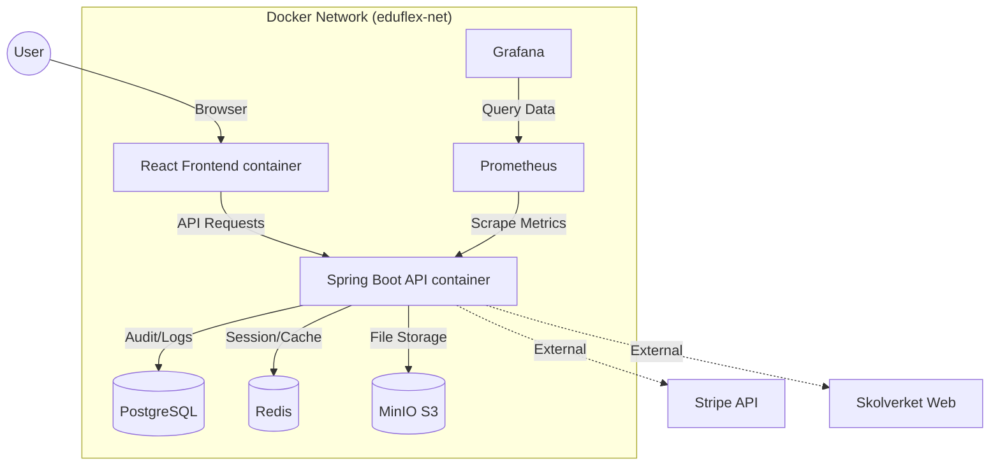

<p align="center">
  
</p>

<h1 align="center">🎓 EduFlex LMS 2.0</h1>

<p align="center">
  <em>The Complete Enterprise Learning Platform for Modern Education</em><br/>
  <em>Developed & maintained by <strong>Alex Weström / Fenrir Studio</strong></em>
</p>

---

<p align="center">
  
  
  
  
  
  
  
  
</p>

---

## 📖 Table of Contents
- [About the Project](#-about-the-project)
- [Key Features](#-key-features)
- [System Architecture](#-system-architecture)
- [Technology Stack](#-technology-stack)
- [Getting Started](#-getting-started)
- [Configuration](#-configuration)
- [Modules Deep Dive](#-modules-deep-dive)
- [Localization](#-localization)
- [Roadmap](#-roadmap)
- [License](#-license)

---

## 🏫 About the Project

**EduFlex 2.0** is a robust, cloud-native Learning Management System (LMS) engineered for scalability and user engagement. It bridges the gap between traditional enterprise LMS (often clunky and boring) and modern consumer apps (gamified, fast, and beautiful).

Whether you are a single educator, a private school, or a municipal education board, EduFlex scales to meet your needs using a microservices-ready architecture orchestrating storage, caching, and compute.

---

## 🌟 Key Features

### 🍎 Core Education
- **Course Management:** Create comprehensive courses with rich text, video, attachments and quizzes.
- **SCORM / xAPI Support:** Import interactive course packages from Articulate/Adobe Captivate.
- **Assignment Engine:** Students submit files, teachers grade with feedback.
- **Certification:** Automatically generating verifiable PDF certificates upon course completion.

### 🎮 Gamification & Engagement
- **Points & Levels:** Users earn XP for logging in, completing lessons, and acing quizzes.
- **Badges:** Visual achievements using Lucide iconography.
- **Leaderboards:** Foster healthy competition (toggleable per course).

### 🇸🇪 Skolverket Integration (New!)
- **Curriculum Mapping:** Direct integration with Swedish National Agency for Education (Skolverket).
- **Automated Import:** Python-based scrapers to fetch course codes, descriptions, and grading criteria.
- **Detailed Views:** View "Kunskapskrav" (Grading Criteria) directly within the course interface.

### 💼 Revenue & Administration
- **SaaS Ready:** Built-in subscription tiers (Free, Pro, Enterprise).
- **Invoicing:** Automatic PDF invoice generation for recurring payments.
- **User Management:** Detailed profiles with avatar uploads (MinIO backed).
- **Role-Based Access Control (RBAC):** Granular permissions for Super Admin, Admin, Teacher, and Student.

### 🌍 Localization
- **Multi-language Support:** Fully translated UI for minimal friction.
- **Supported Languages:** Swedish (Primary), English, Arabic, Norwegian, Danish, Finnish, German, French, Spanish.

---

## 🛠 System Architecture

EduFlex utilizes a containerized architecture managed by **Docker Compose**. This ensures identical environments from development to production.



### Security Measures
- **JWT Authentication:** Stateless, secure API access.
- **Password Hashing:** BCrypt encryption for user credentials.
- **MinIO Policies:** Public-read buckets configured programmatically for profile assets; private buckets for course materials.
- **CORS & CSRF:** Configured for strict frontend-backend communication.

---

## 💻 Technology Stack

### Frontend Service (`eduflex-frontend`)
- **Core:** React 19, Vite (Build Tool)
- **State:** Zustand (Global State), React Context
- **Styling:** Tailwind CSS v4, Lucide React (Icons)
- **Internationalization:** i18next
- **Data Viz:** Recharts (Analytics)

### Backend Service (`eduflex-backend`)
- **Core:** Java 21, Spring Boot 3.4
- **Security:** Spring Security 6
- **Data:** Spring Data JPA (Hibernate), PostgreSQL Driver
- **Caching:** Spring Data Redis
- **Docs:** Swagger / OpenAPI 3.0

### Infrastructure
- **Database:** PostgreSQL 15 (Alpine)
- **Object Storage:** MinIO (S3 compatible)
- **Cache:** Redis 7 (Alpine)
- **Monitoring:** Prometheus & Grafana
- **Backups:** Automatic daily PostgreSQL dumps

---

## 🚀 Getting Started

### Prerequisites
- **Docker Desktop** (latest version)
- **Git**

### Installation

1.  **Clone the Repository**
    ```bash
    git clone https://github.com/alexwest1981/EduFlex.git
    cd EduFlex
    ```

2.  **Start the System**
    This command builds the images and spins up all 7 containers (DB, Redis, MinIO, Backend, Frontend, Prometheus, Grafana).
    ```bash
    docker compose up --build -d
    ```

3.  **Access the Application**
    - **Frontend (LMS):** [http://localhost:5173](http://localhost:5173)
    - **Backend API:** [http://localhost:8080/api](http://localhost:8080/api)
    - **MinIO Console:** [http://localhost:9001](http://localhost:9001) (User: `minioadmin` / Pass: `minioadmin`)
    - **Grafana Dashboards:** [http://localhost:3000](http://localhost:3000) (User: `admin` / Pass: `admin` - Skip password change)

4.  **License Key**
    The system requires a signed license key (`eduflex.license`) to unlock Pro/Enterprise features.
    > *For evaluation purposes or to request a developer license, please contact **alexwestrom81@gmail.com**.*

---

## ⚙️ Configuration

### Environment Variables
The system is pre-configured via `docker-compose.yml`. Key variables include:

| Service | Variable | Description | Default |
|:---|:---|:---|:---|
| **Backend** | `SPRING_DATASOURCE_URL` | DB Connection string | `jdbc:postgresql://db:5432/eduflex` |
| **Backend** | `MINIO_URL` | Internal S3 endpoint | `http://minio:9000` |
| **Frontend** | `VITE_API_BASE_URL` | API Endpoint | `http://localhost:8080/api` |
| **Grafana** | `GF_AUTH_ANONYMOUS_ENABLED` | Allow viewing without login | `true` |

### Database Management
To access the running database directly:
```bash
docker exec -it eduflex-db psql -U postgres -d eduflex
```

### Backups
Backups are automatically taken daily and stored in the `./backups` directory on the host machine.
To force a backup:
```bash
docker restart eduflex-backup
```

---

## 🧩 Modules Deep Dive

### Skolverket Integration
EduFlex includes a powerful integration for Swedish education providers.
- **Scraper Scripts:** Located in `scripts/` (Excluded from git), these Python scripts scrape course data from Skolverket.
- **Admin UI:** Manually enter or edit course data via `Admin > Administration > Skolverket`.
- **Data Model:** Stores Course Codes, Points, Subjects, and a JSON-structure for Grading Criteria (Kunskapskrav).

### Analytics & Reporting
Access real-time insights via the **Analytics Dashboard**:
- **MRR / ARR:** Track financial health.
- **Churn Rate:** Monitor student retention.
- **Infrastructure:** View CPU/Memory usage and verified Docker container health status.

---

## 🇸🇪 Localization

The platform automatically detects the user's preferred language but can be manually overridden in **My Profile**.

**Adding a new language:**
1. Create `frontend/src/locales/{code}/translation.json`.
2. Register the language in `frontend/src/i18n.js`.
3. Add the option to `UserProfile.jsx` dropdown.

---

## 📆 Roadmap

### ✅ Completed
- [x] **Core Foundation:** Auth, User Profiles, Course CRUD.
- [x] **Gamification:** Engine implementation.
- [x] **MinIO Integration:** S3 storage for avatars/files.
- [x] **Skolverket Integration:** Full scrape & display support.
- [x] **Localization:** 100% Swedish translation.

### 🚧 In Progress
- [ ] **Mobile App:** React Native / PWA implementation.
- [ ] **AI Tutor:** Chat interface for assignment help.
- [ ] **Multi-Tenancy:** Single instance, multiple schools (SaaS).

---

## ⚖️ License

**EduFlex™ © 2026 Alex Weström / Fenrir Studio**

**Proprietary Software.**
Unauthorized copying, modification, distribution, or use of this software without a valid license is strict prohibited.
This source code is provided for authorized development and maintenance purposes only.

For Enterprise inquiries:
📧 **alexwestrom81@gmail.com**

<p align="center"> 
   
</p>
