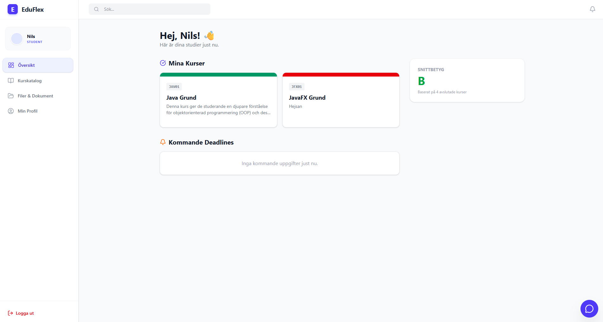

  

<h1 align="center">🎓 EduFlex LMS</h1>

  <em>Developed & maintained by <strong>Alex Weström / Fenrir Studio</strong></em>

---

---

## 🏫 Om Projektet

**EduFlex** är ett modernt, rollbaserat **Learning Management System (LMS)** designat för både utbildningsinstitutioner och företag.  
Systemet erbjuder **realtidskommunikation**, **automatiserad administration** och **prestandaoptimerade dashboards** med 100% live-data.  
Utvecklat med fokus på säkerhet, skalbarhet och exceptionell användarupplevelse.

---

## 🚀 Funktioner

### 👤 För Alla Användare
- **Säker JWT-autentisering** med rollbaserad åtkomstkontroll
- **Personlig Dashboard** med roll-specifika widgets och live-data
- **Profilhantering** (avatar, adress, lösenord) med persistent state
- **Dokumentarkiv** med lokal persistens och säkerhetskontroller
- **Kalender** med kursdeadlines och händelser
- **Notifieringar** (bell-icon) för chatt, inlämningar och systemhändelser

### 🎓 För Studenter
- **Kurskatalog** med self-enrollment
- **Kursmaterial** (video, rich text, filer, externa länkar)
- **Uppgifter & Inlämningar** med statusspårning
- **QuizRunner** – interaktiva quiz med omedelbar feedback
- **Kursutvärderingar** direkt från dashboard

### 🍎 För Lärare
- **Kurshantering** (CRUD) med start/slut-datum och status
- **Materialuppladdning** med React-Quill rich text editor
- **Rättningssystem** med betyg (IG/G/VG) och feedback
- **Elevhantering** med manuell tilldelning
- **QuizBuilder** – skapa och konfigurera quiz per kurs
- **Teacher Dashboard** med at-risk student-analys

### 🛡️ För Administratörer
- **Admin Dashboard** med KPI:er, användarloggar och systemöversikt
- **Användarhantering** med säkerhetsvarningar
- **Kursredigering** via modal (inkl. widget-färger)
- **Licenshantering** med validering och åtkomstbegränsningar
- **Global filåtkomst** och systemarkiv

### 💬 Realtidsfunktioner
- **ChatOverlay** med historik, användarlistor och bildstöd
- **Live-notifieringar** via WebSocket (STOMP/SockJS)
- **Whenvaro** med CourseEvent-tracking

---

## 📸 Skärmdumpar

### 🎯 Rollbaserade Dashboards
  
*Personlig översikt med kurser, deadlines och notifieringar.*

  
*Pedagogisk analys med at-risk students och kursöversikt.*

  
*KPI:er, loggar och systemstatus för administratörer.*

### 🔑 Licens & Profil
  
*Licensvalidering med åtkomstbegränsningar.*

  
*Avatar, personuppgifter och dokumenthantering.*

### 🧪 Quiz & Chatt
  
*QuizBuilder (lärare) och QuizRunner (student).*

  
*Realtidschatt med notifieringsbadges.*

---

## 🛠️ Teknisk Stack

### Frontend
- **React 19** + Vite (build tool)
- **Tailwind CSS v4** + Lucide React (ikoner)
- **React-Quill** (rich text editor)
- **WebSocket** (SockJS/STOMP för chatt/notifications)
- **Custom SPA-routing** med state persistence

### Backend
- **Spring Boot 3.x** + Java 21+
- **Spring Security** (JWT + WebSocket auth)
- **JPA/Hibernate** med `@EntityGraph` (N+1 optimering)
- **MySQL** (prod) / H2 (dev)
- **REST API** + WebSocket endpoints

### Prestanda & Säkerhet
- **N+1 problem löst** via EntityGraph i repositories
- **Säker CORS** med `allowedOriginPatterns` + credentials
- **100% live-data** – ingen mock-data kvar
- **Optimiserade DTOs** för Course, User, Submission

---

## 🧩 Systemarkitektur

             ┌─────────────────────────────┐
             │        Frontend             │
             │  (React 19 + Vite)          │
             ├─────────────────────────────┤
             │ Dashboard (Rollbaserat)     │
             │ QuizBuilder/QuizRunner      │
             │ ChatOverlay                 │
             │ AttendanceView              │
             │ License/Profile             │
             └─────────────┬───────────────┘
                           │ REST + WebSocket
                           ▼
          ┌──────────────────────────────┐
          │     Spring Boot API          │
          ├──────────────────────────────┤
          │ Auth (JWT)                   │
          │ Course + Quiz                │
          │ Chat (STOMP/SockJS)          │
          │ Notifications                │
          │ License Validation           │
          │ Attendance + Events          │
          └─────────────┬────────────────┘
                        │ JPA/Hibernate
                        ▼
                  ┌──────────────┐
                  │ MySQL / H2   │
                  └──────────────┘

### 🔄 Modulkommunikation

| **Modul**        | **Syfte**                                      | **Kommunikation**   | **Beroenden**                    |
|-------------------|------------------------------------------------|---------------------|----------------------------------|
| **Auth**         | JWT + rollbaserad åtkomst                      | REST                | UserRepository                   |
| **License**      | Licensvalidering och funktionellås              | REST                | User + LicenseRepository         |
| **Dashboard**    | Roll-specifika vyer med live KPIs              | REST + WebSocket    | User, Course, Assessment         |
| **Course**       | CRUD + material med färgkodning                | REST                | CourseRepository (@EntityGraph)  |
| **Quiz**         | Skapa/köra quiz i kurskontext                 | REST                | Course + QuizRepository          |
| **Chat**         | Realtidskommunikation                          | WebSocket (STOMP)   | UserSessionRegistry              |
| **Attendance**   | Närvaroregistrering per CourseEvent            | REST                | CourseEvent + User               |
| **Assessment**   | Betyg, feedback, submissions                   | REST                | Course + Submission              |
| **Documents**    | Filhantering med lokal persistens              | REST + LocalState   | User + FileStorage               |

---

## ⚙️ Installation & Setup

### Förutsättningar
Node.js ≥ 20.x npm install
Java 21+ + Maven Spring Boot 3.x
MySQL 8.x (eller H2 dev)

### Steg-för-steg

1. **Frontend**

git clone https://github.com/alexwest81/eduflex-frontend.git 
cd eduflex-frontend 
npm install --legacy-peer-deps 
npm run dev # http://localhost:5173 

2. **Backend** (separat repo)
mvn spring-boot:run # http://localhost:8080/api 

3. **Verifiera**
- API: `GET http://127.0.0.1:8080/api/courses` 
- WS: `/ws/eduflex` (SockJS endpoint) 

---

## 📈 Prestanda & Kvalitet

✅ **N+1 Query Problem** – Löst med `@EntityGraph`  
✅ **Mock-data borttagen** – 100% live-data implementation  
✅ **CORS Security** – Strikt konfiguration med credentials  
✅ **State Persistence** – Profilbilder/dokument över refresh  
✅ **DTO Optimering** – CourseDTO med `color` field  

---

## 📆 Roadmap

### ✅ **Fas 1-3** (Klar)
- [x] JWT-auth, rollstyrning, kurs-CRUD
- [x] Realtidschatt, notifieringar, licenshantering
- [x] Närvaro, assessment, dokumenthantering
- [x] **Rollbaserade dashboards** (Admin/Teacher/Student)
- [x] **Quizsystem** (Builder/Runner)

### 🚀 **Fas 4** (Nästa)
- [ ] Statistikdashboard (betyg, närvaro, quiz-analys)
- [ ] Dark Mode + PWA-support
- [ ] E-postnotifieringar
- [ ] Mobilapp (React Native)

---

## ⚖️ Licens & Äganderätt

**EduFlex™** © 2025 **Alex Weström / Fenrir Studio**  
Skyddat enligt **Upphovsrättslagen (1960:729)** och internationella konventioner.

**Privat licens** – Ingen reproduktion/distribution utan skriftligt tillstånd.

### Kontakt för licens/samarbete:
> **Alex Weström**  
> 📧 [alexwestrom81@gmail.com](mailto:alexwestrom81@gmail.com)  
> 📍 Svenljunga, Sverige

**Framtida:** Apache 2.0/MIT vid publik release (v3.0)

---

   
  Made with ❤️ by <strong>Fenrir Studio</strong> 
  *Where innovation meets precision.*

