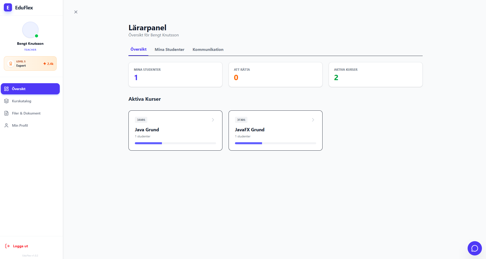
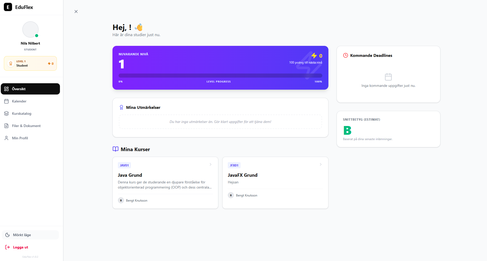
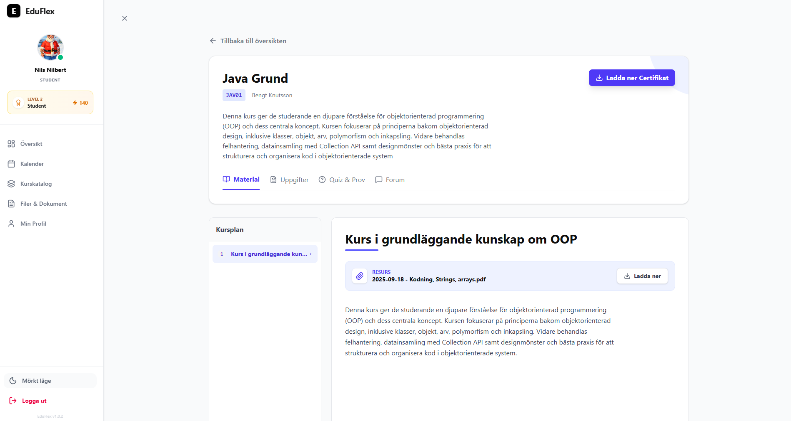

<p align="center">
  
</p>

<h1 align="center">🎓 EduFlex LMS</h1>

<p align="center">
  <em>Developed & maintained by <strong>Alex Weström / Fenrir Studio</strong></em>
</p>

---

<p align="center">
  
  
  
  
  
  
  
  
</p>

---

## 🏫 Om Projektet

**EduFlex** är ett modernt, rollbaserat **Learning Management System (LMS)** för skolor, utbildningsföretag och intern utbildning.  
Systemet kombinerar **realtidskommunikation**, **gamification**, **automatiserad administration** och **PDF-certifikat** – byggt med fokus på säkerhet, skalbarhet och en exceptionell användarupplevelse.


---

## 🚀 Kärnfunktioner

### 👤 Gemensamt för alla användare
- Säker **JWT-autentisering** med rollbaserad åtkomst (Admin, Teacher, Student)  
- **Modulär Dashboard** med rollspecifika widgets  
- **Profilhantering** med avatar och lösenordsbyte  
- **Dokumentarkiv** med persistens och felhantering  
- **Kalender** med kursdeadlines och händelser  
- **Notifieringscenter** med systemaviseringar  
- **Gamification-widgets** (poäng, badges, nivåer)

### 🎓 Studenter
- **Kurskatalog** med self-enrollment och status  
- **CourseDetail** med Content, Assignments, Quiz, Forum, Participants  
- **Uppgifter & inlämningar** med feedbackhantering  
- **QuizRunner** för interaktiva prov  
- **Kursforum** med tråddiskussioner  
- **PDF-certifikat** vid kursavslut

### 🍎 Lärare
- **Kurshantering (CRUD)** med status, datum och färgteman  
- **Materialhantering** med rich text-editor  
- **Rättningssystem** med betyg (IG/G/VG)  
- **AttendanceView** för närvaro  
- **AssessmentView** för elevöversikt  
- **QuizBuilder** och **ParticipantsView** med gamification-data

### 🛡️ Administratörer
- **Admin Dashboard** med KPI:er och loggar  
- **Användarhantering** och **säkerhetsvarningar**  
- **Licenshantering** med validering  
- **System Settings** för namn, moduler och funktioner  
- **Modules-flik** för att aktivera/avaktivera Chat, Gamification, Dark Mode  

---

## 🧩 Gamification Engine

EduFlex inkluderar en dedikerad **Gamification Engine** som ökar engagemanget genom poäng, märken och nivåer.

**Funktioner:**
- Backend-entiteter för poäng, badges och levels  
- Dynamisk poängberäkning via tjänster  
- Interaktiva widgets i Dashboard och CourseDetail  
- Modulstyrning via System Settings  

---

## 📜 PDF-certifikat

Certifikat genereras dynamiskt med **OpenPDF**:
- Innehåller elevnamn, kurs, datum och skolnamn  
- Backendgenerering baserad på System Settings  
- Nedladdningsbart från dashboard eller kursvy  
- Används för kursavslut och gamification-belöningar  

---

## 💬 Kommunikation

### 💭 Realtidschatt
- WebSocket (SockJS/STOMP)  
- Historik, användarlistor och bildstöd  
- Modulbaserad aktivering  

### 💬 Kursforum
- Kategorier och trådar per kurs  
- Full JSON-säkerhet utan recursion-problem  

---

## 🧪 Rich Text Editor

- **react-quill-new** (React 19-kompatibel)  
- Egen `RichTextEditor`-komponent med memoiserad config  
- Används i material, uppgifter och forum  

---

## 📸 Skärmdumpar

### Rollbaserade Dashboards
| Student | Teacher | Admin |
|:--:|:--:|:--:|
|  |  |  |

### Gamification & Certifikat
| Widgets | Certifikat |
|:--:|:--:|
|  |  |

### CourseDetail


---

## 🛠️ Teknisk Stack

### Frontend
- React 19 + Vite + Tailwind CSS v4  
- WebSocket (SockJS/STOMP)  
- React-Quill-new, Lucide React  
- Modulär Dashboard och CourseDetail  

### Backend
- Spring Boot 3.x (Java LTS)  
- Spring Security (JWT + WebSocket)  
- Spring Data JPA / Hibernate (@EntityGraph mot N+1)  
- OpenPDF för certifikat  
- SystemSettings-modul för dynamiska inställningar  
- Databaser: MySQL (prod) / H2 (dev)  

### Prestanda & Kvalitet
- Eliminering av N+1-problem  
- JSON-recursion fixad  
- Full dependency injection  
- I18n och språkstöd  

---

## 🧩 Systemarkitektur

```plaintext
┌─────────────────────────────┐
│           Frontend          │
│    React 19 + Vite          │
├─────────────────────────────┤
│ Modular Dashboard (Role)    │
│ CourseDetail (5 modules)    │
│ Gamification Widgets        │
│ ChatOverlay / Certificates  │
└─────────────┬───────────────┘
              │ REST + WebSocket
              ▼
     ┌──────────────────────────────┐
     │        Spring Boot API       │
     ├──────────────────────────────┤
     │ Auth / License / Courses     │
     │ Quiz / Forum / Gamification  │
     │ Certificate / Settings       │
     └─────────────┬───────────────┘
                   │ JPA / Hibernate
                   ▼
             ┌──────────────┐
             │  MySQL / H2  │
             └──────────────┘
### Modulkommunikation
| Modul          | Syfte                               | Kommunikation        | Beroenden                 |
| -------------- | ----------------------------------- | -------------------- | ------------------------- |
| Auth           | JWT-autentisering                   | REST                 | UserRepository            |
| License        | Licensvalidering                    | REST                 | LicenseEntity             |
| Dashboard      | Rollspecifika vyer, gamification    | REST + WS            | User, Course              |
| CourseDetail   | Kurskomponenter (5)                 | REST                 | CourseRepository          |
| Gamification   | Poäng, badges, levels               | REST                 | GamificationService, User |
| Certificate    | PDF-generering                      | REST (file download) | OpenPDF, CourseCompletion |
| Chat           | Realtidschatt                       | WebSocket            | UserSession               |
| SystemSettings | Dynamiska moduler och inställningar | REST                 | SettingsRepository        |
```

### Installation och Setup
# Krav
- Node.js 20+ & npm

- Java LTS & Maven

- MySQL 8.x / H2 (dev)

# Frontend
``` bash
git clone https://github.com/alexwest1981/eduflex-frontend.git</br>
cd eduflex-frontend</br>
npm install --legacy-peer-deps</br>
npm run dev   # http://localhost:5173</br>
```

# Backend
``` bash
mvn spring-boot:run   # http://127.0.0.1:8080/api
```

### 📆 Roadmap
# ✅ Färdigställt

- Rollbaserade dashboards

- Kurs-CRUD, realtid, licens

- Quizsystem, forum, närvaro

- Gamification Engine + PDF-certifikat

- System Settings och modulhantering

### 🚀 Nästa steg

- E-postnotifieringar & PWA

- Mobilapp (React Native)

- Öppen licens (v3.0)

---
## ⚖️ Licens & Äganderätt
### EduFlex™ © 2026 Alex Weström / Fenrir Studio
Privat licens — kontakta för samarbetsmöjligheter.
### 📧 alexwestrom81@gmail.com
<p align="center"> <br/> <strong>Made with ❤️ by Fenrir Studio</strong><br/> <sub>Where innovation meets precision.</sub> </p> 
