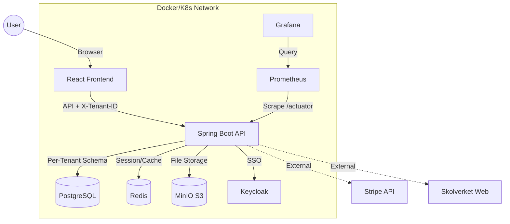
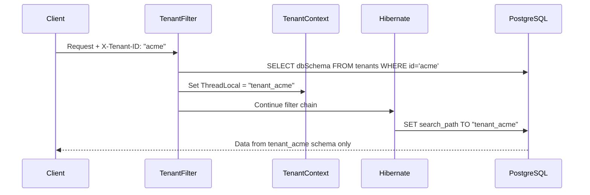

<p align="center">
  
</p>

<h1 align="center">🎓 EduFlex LMS 2.0</h1>

<p align="center">
  <em>The Complete Enterprise Learning Platform for Modern Education</em><br/>
  <em>Developed & maintained by <strong>Alex Weström / Fenrir Studio</strong></em>
</p>

<p align="center">
  <a href="#-svenska">🇸🇪 Svenska</a> &nbsp;&nbsp;&nbsp;|&nbsp;&nbsp;&nbsp; <a href="#-english">🇬🇧 English</a>
</p>

---

<p align="center">
  
  
  
  
  
  
  
  
  
  
  
  
  
</p>

---

<div id="-svenska"></div>

## 🇸🇪 Svenska

### ⚡ Senaste Uppdateringarna
*   **📦 Lagringskvoter & Avancerad Filhantering (3 feb 2026):**
    *   **Lagringskvoter per användare:** Implementerat ett system för att begränsa hur mycket data varje användare kan ladda upp (standard 1GB).
    *   **Kvothantering:** Administratörer kan nu styra enskilda användares lagringsutrymme direkt via adminpanelen.
    *   **Realtidsstatistik:** Ny sidomeny-del som visar användarens aktuella lagring mot deras kvot med en visuell progress bar.
    *   **System-övergripande lagringsstats:** En ny dedikerad sektion i administrationspanelen visar totalt använt utrymme, antal filer och användarstatistik i hela systemet.
    *   **Förbättrad Säkerhet & Routning:** Separerat admin-statistik till en egen kontroller (`AdminStatsController`) för säkrare hantering av administrativa data.

*   **🎮 Gamification V2.0 & Privat Video-infra (2 feb 2026):**
    *   **EduGame Engine (V2.0):** Lanserat en komplett backend-motor för `Streaks`, `Quests` och `Friendships`. Systemet automatgenererar nu dagliga uppdrag och spårar social interaktion.
    *   **Customization Shop:** Implementerat en butik där användare kan köpa profilarmer, bakgrunder och unika titlar med intjänad XP/poäng.
    *   **Dynamic UI Rendering:** Profiler och avatars renderar nu utrustade ramar och bakgrunder i realtid med högsta visuella kvalitet.
    *   **Privat Jitsi Server:** Migrerat till en helt självhostad Jitsi-stack via Docker för obegränsade videomöten utan tidsgräns.
    *   **Infrastructure & Docker:** Stabiliserat Docker-miljön på Windows genom att flytta VHDX-lagring och lösa portkonflikter mellan containrar och lokala tjänster.
    *   **Avatar-fix:** Löste kritiska 400 Bad Request-fel vid uppladdning genom att stabilisera MinIO-konfigurationen.

*   **🧩 Sidomeny-refaktorering & Gruppering (1 feb 2026):**
    *   **Kategoriserad Navigation:** Sidomenyn har byggts om från grunden för att minska visuell stress, särskilt för administratörer. Menyval är nu logiskt grupperade i sektioner (Huvudmeny, Utbildning, Verktyg, Administration).
    *   **Utfällbara Sektioner:** Ny `SidebarSection`-komponent som tillåter att grupper fälls in/ut för att spara vertikalt utrymme.
    *   **Modern Profil-area:** Profilsektionen har flyttats till botten för en mer premium "v2.0"-känsla, med snabbåtkomst till inställningar och logga ut.
    *   **Tema-konsistens:** Synkroniserat navigationslogiken över alla fem teman (`Standard`, `Ember`, `Voltage`, `Midnight`, `Nebula`) för en enhetlig upplevelse.
    *   **Desktop Focus (v2.1):** Allt "mobil-tema"-logik (bottom-nav, mobila headers) har tagits bort från desktop-teman för att ge fullt fokus på den kommande Native React-mobilappen.

*   **📊 Kursutvärderingar & AI-analys (1 feb 2026):**
    *   **Komplett Utvärderingssystem:** Nytt system för att skapa, hantera och analysera kursutvärderingar. Redesignat gränssnitt för både lärare och studenter.
    *   **Studentgränssnitt & Notiser:** Mobilvänligt, anonymiserat formulär. Automatiska systemnotiser vid aktivering samt en ny Dashboard-widget ("Din röst är viktig!") för smidig åtkomst.
    *   **AI-Feedback Analys:** Integrerat med Google Gemini för att automatiskt sammanfatta fritextsvar och identifiera förbättringsområden.
    *   **Lärarverktyg:** Dashboard för att hantera mallar, aktivera utvärderingar för specifika kurser och se AI-genererade sammanfattningar i realtid.
    *   **Anonymitet & Säkerhet:** Avancerad hash-teknik för student-ID. Fixat kritiska serialiseringsfel (500 error) och uppdaterat `SecurityConfig` för säker åtkomst till analytics.

*   **⚡ Cloudflare & Automation - Cold Start (1 feb 2026):**
    *   **Cold Start Script:** Nytt `cold_start.ps1`-skript som automatiserar allt från processrensning och Docker-start till att starta Backend/Frontend/Tunnel i separata fönster.
    *   **Cloudflare Source of Truth:** Standardiserat på `logs/cloudflared-config.yml` för fullt stöd för WebSockets (Forum), MinIO och OnlyOffice.
    *   **Cleanup Utility:** Integrerad automatisk avslutning av hängande Java-, Node- och Cloudflared-processer för att förhindra portkonflikter.

*   **💬 Modernisering av Forum-UI (1 feb 2026):**
    *   **Slut på Browser Prompts:** Eliminerat alla `window.prompt` och `window.confirm` i forum-modulen.
    *   **Moderna Modaler:** Implementerat snygga React-modaler (`NewThreadModal`, `NewCategoryModal`) med Lucide-ikoner, validering och full EduFlex-styling.

*   **🤖 Generative Course Creation - AI-kursgenerator (31 jan 2026):**
    *   **One-Click Course Creation:** Ladda upp en studiehandledning (PDF) och låt AI generera moduler, lektioner, sammanfattningar och quiz med ett klick.
    *   **Automatisk Datumläsning:** AI:n identifierar och extraherar nu automatiskt kursens start- och slutdatum från det uppladdade materialet.
    *   **Redigerbar Förhandsvisning:** Granska och justera AI-genererad titel, beskrivning och datum i realtid innan kursen skapas.
    *   **Smartare Kurskoder:** Genererar automatiskt kortfattade förkortningar (t.ex. "DBT") baserat på kursnamnet istället för slumpmässiga AI-id:n.
    *   **Synlighetskontroll:** Ny global kontroll för "Öppen för studenter" direkt i kursadministrationen för enkel hantering av kursstatus.
    *   **Databasstabilitet (Flyway V7):** Implementerat en permanent migration som säkrar att alla skolscheman har rätt struktur för AI-genererat innehåll.
    *   **Kaskadradering:** Möjliggjort säker radering av kurser genom att automatiskt städa bort alla tillhörande material och lektioner.
    *   **Miljörensning:** Rensat bort gamla test-schemas för en stabilare och snabbare utvecklingsmiljö.

*   **🚀 Prestanda & E-boksförbättringar (30 jan 2026):**
    *   **Permanent Cachning:** Aktiverat 1-års cachning (`immutable`) för bokomslag och media, vilket gör biblioteket blixtsnabbt.
    *   **MinIO Proxy:** Smart proxy i `StorageController` som servar gamla `/uploads/`-länkar direkt från MinIO utan databasändringar.
    *   **PDF-motor:** Ny backend-tjänst som extraherar innehållsförteckning och renderar PDF-sidor som bilder för den interaktiva läraren.

*   **📡 Cloudflare Tunnel & OnlyOffice Stabilitet (30 jan 2026):**
    *   **Infrastrukturstabilitet:** Åtgärdat `500 Internal Server Error` och `401 Unauthorized` genom att uppdaterat `SecurityConfig` och `AuthTokenFilter`.
    *   **WebSocket-stöd:** Aktiverat routing för `/ws` och `/ws-log` via Cloudflare Tunnel för fungerande chatt och realtidsloggar.
    *   **OnlyOffice-fix:** Löst "Nedladdning misslyckades (Code -4)" genom att korrigera nätverkskommunikation (`extra_hosts`) och interna sökvägar.
    *   **Lokal Dev-optimering:** Uppdaterat `run_backend_local.ps1` med Windows-kompatibla sökvägar och korrekta publika MinIO-URL:er.

*   **🤖 AI Study Pal & Databasstabilitet (30 jan 2026):**
    *   **PDF Indexering Fixad:** Åtgärdat versionskonflikt mellan Tika och PDFBox (nedgraderat till 2.0.31). AI Study Pal kan nu extrahera text från PDF korrekt.
    *   **Robustare Migrationer:** Uppdaterat Flyway-skript (V5, V6) med `DO`-block för att säkert hantera multi-tenant-miljöer utan krascher.
    *   **Automatiserad Migration:** Implementerat `GlobalMigrationRunner` som automatiskt migrerar ALLA kundscheman vid uppstart.
    *   **Renare Loggar:** Refaktorerat `AiStudyPalService` med svensk, mänsklig ton i loggningen för bättre monitorering.

*   **📚 PDF-stöd i E-boksbiblioteket (30 jan 2026):**
    *   **Interaktiv PDF-läsare:** Ny dedikerad läsare för PDF-dokument med innehållsförteckning.
    *   **Backend-rendering:** Integrerat Apache PDFBox 2.0.31 för rendering av sidor och extraktion av metadata på serversidan.
    *   **Kapitelnavigering:** Automatisk extraktion av PDF-bokmärken för en strukturerad läsupplevelse.

*   **🌍 Frontend-lokalisering & Lärarpanel (28 jan 2026):**
    *   **Lärarpanel:** Fullständig översättning av alla widgets, tabeller och modaler för lärare till svenska och engelska.
    *   **Elevpanel:** Fullständig översättning av alla widgets (Närvaro, Schema, Gamification, Framsteg) till svenska och engelska.

### 📖 Innehållsförteckning
- [Om Projektet](#-om-projektet)
- [Nyckelfunktioner](#-nyckelfunktioner)
- [Multi-Tenancy](#-multi-tenancy-sv)
- [Kom igång](#-kom-igång)
- [Konfiguration](#-konfiguration-sv)
- [Felsökning & Infrastruktur](docs/InfrastructureGuide.md)

---

### 🏫 Om Projektet

**EduFlex 2.0** är ett komplett, molnbaserat **Learning Management System (LMS)** designat för att skala från små utbildningsföretag till stora kommunala verksamheter. Systemet kombinerar modern pedagogik (Gamification, interaktiva element) med affärskritisk funktionalitet (fakturering, prenumerationer) i en säker, Docker-baserad arkitektur.

**Huvudsakliga fördelar:**
- 🏢 **Äkta Multi-Tenancy:** Schema-per-organisation för komplett dataisoleringen
- 🎮 **Inbyggd Gamification:** Poäng, utmärkelser, nivåer och topplistor
- 🇸🇪 **Skolverket-integration:** Direkt koppling till svenska läroplanen
- 💼 **SaaS-redo:** Prenumerationsnivåer, fakturering och betalningar
- 🎨 **White-label:** 8 designsystem med full visuell anpassning

---

### 🌟 Nyckelfunktioner

#### 🍎 Utbildning (Core)
- **Kurshantering:** Rika kurser med text, video, bilagor och quiz
- **AI Quiz-generering:** Generera quiz automatiskt från dokument med Google Gemini
- **SCORM / xAPI:** Stöd för Articulate/Captivate-paket
- **Uppgifter:** Filinlämningar med lärarbedömning
- **Certifikat:** Automatiska, spårbara PDF-diplom
- **E-boksbibliotek:** Fristående bibliotek för EPUB/PDF med kategorier

#### 🎮 Gamification
- **Poäng & Nivåer:** XP genom aktivitet och framsteg
- **Utmärkelser:** Visuella badges för prestationer
- **Dagliga Utmaningar:** Roterande utmaningar med bonus-XP
- **Streaks:** Spåra konsekutiva inloggningsdagar med bonusar
- **Topplistor:** Frivilliga rankingar per klass/kurs
- **Achievement Toast:** Realtids-popup vid upplåsta prestationer

#### 🔔 Notifikationer
- **WebSocket Push:** Direkta notifikationer via STOMP/SockJS
- **Notifikationsklocka:** Header-komponent med oläst-räknare
- **Flera Typer:** Uppgifter, prestationer, system och sociala notiser

#### 👥 Sociala Funktioner
- **Online-vänner:** Se vilka som är online just nu
- **Snabbkontakt:** Enkla kontaktalternativ för lärare

#### 🏪 Community Marknadsplats
- **Innehållsdelning:** Publicera Quiz, Uppgifter och Lektioner till en delad marknadsplats
- **Moderation:** Admin-godkännande med väntande/publicerad/avvisad status
- **Frågebank-sync:** Quiz-frågor kopieras automatiskt till din Frågebank vid installation
- **20+ Ämnen:** Matematik, Svenska, Engelska, Fysik, Kemi och fler med anpassade ikoner

#### 🇸🇪 Skolverket-integration
- **Kurskoppling:** Direkt Skolverket-databaskoppling
- **Automatisk Import:** Python-verktyg för kurskoder
- **Kunskapskrav:** Betygsmatriser (E-A) direkt i kursvyn

#### 🏢 Multi-Tenancy
- **Schema-isolering:** Varje organisation i eget PostgreSQL-schema
- **Automatisk Provisionering:** Schema + migrationer + admin vid registrering
- **Request-routing:** `X-Tenant-ID` header för organisation-val

---

### 🏢 Multi-Tenancy (Sv)

EduFlex implementerar **schema-baserad multi-tenancy** för komplett dataisolering.

#### Skapa ny Tenant
```bash
curl -X POST http://localhost:8080/api/tenants \
  -H "Content-Type: application/json" \
  -d '{
    "name": "Stockholms Tekniska Gymnasium",
    "domain": "stg.local",
    "dbSchema": "tenant_stg",
    "organizationKey": "stg",
    "adminEmail": "admin@stg.local",
    "adminPassword": "SäkertLösen123",
    "adminFirstName": "Anna",
    "adminLastName": "Andersson"
  }'
```

---

### Senaste Uppdateringar (2026-01-27)
- **Advanced Analytics Dashboard:**
  - Implementerat en omfattande analyspanel för Admins och Lärare.
  - Innehåller grafer för användaraktivitet, kursgenomströmning och betygsfördelning.
  - Automatisk identifiering av "At-Risk" studenter.
  - Backend-stöd via nya endpoints i `AnalyticsController`.

- **OnlyOffice Integration:**
  - Löste startup-problem med Docker-containern (`eduflex-onlyoffice`).
  - Verifierade att API:et svarar korrekt (200 OK) och att integrationen är stabil.

---

### 🚀 Kom igång

#### Förutsättningar
- **Docker Desktop** (senaste versionen)
- **Git**

#### Snabbstart

1. **Klona projektet**
   ```bash
   git clone https://github.com/alexwest1981/EduFlex.git
   cd EduFlex
   ```

2. **Starta systemet**
   ```bash
   docker compose up --build -d
   ```

3. **Öppna applikationen**
   | Tjänst | URL | Inloggning |
   |--------|-----|------------|
   | **LMS (Frontend)** | http://localhost:5173 | – |
   | **API Docs** | http://localhost:8080/swagger-ui.html | – |
   | **MinIO (Filer)** | http://localhost:9001 | minioadmin / minioadmin |

---

### ⚙️ Konfiguration (Sv)

#### Miljövariabler

| Tjänst | Variabel | Beskrivning | Standard |
|--------|----------|-------------|----------|
| **Backend** | `SPRING_DATASOURCE_URL` | Databaslänk | `jdbc:postgresql://db:5432/eduflex` |
| **Backend** | `EDUFLEX_AUTH_MODE` | Autentiseringsläge | `internal` |
| **Backend** | `GEMINI_API_KEY` | Google Gemini API-nyckel för AI Quiz | – |

---

<br/><br/>

<div id="-english"></div>

## 🇬🇧 English

### ⚡ Latest Updates
*   **📦 Storage Quotas & Advanced File Management (Feb 3, 2026):**
    *   **Per-User Storage Quotas:** Implemented a system to limit data uploads for each user (default 1GB).
    *   **Quota Management:** Administrators can now control individual user storage limits directly from the admin panel.
    *   **Real-time Usage Stats:** New sidebar widget displaying user-specific storage usage against their quota with a visual progress bar.
    *   **System-wide Storage Statistics:** A new dedicated administration section shows total used storage, file counts, and system-wide user stats.
    *   **Improved Security & Routing:** Isolated administrative statistics to a dedicated controller (`AdminStatsController`) for enhanced security and routing clarity.

*   **🧩 Sidebar Refactor & Grouping (Feb 1, 2026):**
    *   **Categorized Navigation:** The sidebar has been rebuilt from scratch to reduce visual clutter, especially for administrators. Navigation items are now logically grouped into sections (Main Menu, Education, Tools, Administration).
    *   **Collapsible Sections:** New `SidebarSection` component that allows groups to be collapsed/expanded to save vertical space.
    *   **Modern Profile Area:** The profile section has been moved to the bottom for a more premium "v2.0" feel, with quick access to settings and logout.
    *   **Theme Consistency:** Synchronized navigation logic across all five themes (`Standard`, `Ember`, `Voltage`, `Midnight`, `Nebula`) for a unified experience.
    *   **Desktop Focus (v2.1):** All "mobile theme" logic (bottom-nav, mobile headers) has been removed from desktop themes to maintain full focus on the upcoming Native React mobile app.

*   **📊 Course Evaluations & AI Analysis (Feb 1, 2026):**
    *   **Complete Evaluation System:** New system for creating, managing, and analyzing course evaluations. Redesigned interface for both teachers and students.
    *   **Student Interface & Notifications:** Mobile-friendly, anonymized form. Automatic system notifications upon activation and a new Dashboard widget ("Your voice matters!") for easy access.
    *   **AI-Feedback Analysis:** Integrated with Google Gemini to automatically summarize text answers and identify areas for improvement.
    *   **Security & Stability:** Fixed critical serialization issues (500 error) and hardened access controls.

*   **⚡ Cloudflare & Automation - Cold Start (Feb 1, 2026):**
    *   **Cold Start Script:** New `cold_start.ps1` script automating process cleanup and full stack startup.
    *   **Infrastructure:** Standardized on `logs/cloudflared-config.yml` for reliable WebSocket (Forum) and OnlyOffice support.

*   **💬 Forum UI Modernization (Feb 1, 2026):**
    *   **Native Modals:** Replaced browser prompts with modern React modals for a seamless UX.

### 📖 Table of Contents
- [About the Project](#-about-the-project)
- [Key Features](#-key-features)
- [System Architecture](#-system-architecture)
- [Technology Stack](#-technology-stack)
- [Multi-Tenancy](#-multi-tenancy)
- [Getting Started](#-getting-started-en)
- [Configuration](#-configuration-en)
- [Authentication Modes](#-authentication-modes)
- [API Reference](#-api-reference)
- [Modules Deep Dive](#-modules-deep-dive)
- [Monitoring & Observability](#-monitoring--observability)
- [Localization](#-localization)
- [Deployment Options](#-deployment-options)
- [Roadmap](#-roadmap)
- [License](#-license)

---

### 🏫 About the Project

**EduFlex 2.0** is a robust, cloud-native Learning Management System (LMS) engineered for scalability and user engagement. It bridges the gap between traditional enterprise LMS (often clunky and boring) and modern consumer apps (gamified, fast, and beautiful).

**Key Differentiators:**
- 🏢 **True Multi-Tenancy:** Schema-per-tenant isolation for complete data separation
- 🎮 **Gamification Built-in:** Points, badges, levels, and leaderboards
- 🇸🇪 **Skolverket Integration:** Direct integration with Swedish National Curriculum
- 💼 **SaaS Ready:** Subscription tiers, invoicing, and payment processing
- 🎨 **White-label Support:** 8 design systems with complete visual customization

---

### 🌟 Key Features

#### 🍎 Core Education
| Feature | Description |
|---------|-------------|
| **Course Management** | Rich courses with text, video, attachments, and quizzes |
| **Video Lessons** | Self-hosted video uploads with chapters, speed control, and analytics |
| **Live Classrooms** | Jitsi-powered video conferencing with scheduling and dashboard widget |
| **SCORM / xAPI Support** | Import packages from Articulate/Adobe Captivate |
| **Assignment Engine** | File submissions with teacher grading and feedback |
| **Certification** | Auto-generated verifiable PDF certificates |
| **Lesson Progress** | Track student progress through course materials |
| **Quiz System** | Multiple choice, open-ended, and true/false questions |
| **AI Quiz Generator** | Generate quizzes from documents using Google Gemini AI |
| **E-book Library** | Standalone library for EPUB/PDF with categorized browsing |

#### 🎮 Gamification & Engagement
| Feature | Description |
|---------|-------------|
| **Points & Levels** | XP for logins, lessons, and quiz scores |
| **Badges & Achievements** | Visual achievements with Lucide iconography and unlock conditions |
| **Daily Challenges** | Rotating challenges with bonus XP rewards |
| **Streaks** | Track consecutive login days with streak bonuses |
| **Leaderboards** | Optional class/course rankings |
| **Activity Tracking** | Detailed student activity logs |
| **Per-Tenant Config** | Admins can enable/disable gamification features per organization |
| **Achievement Toast** | Real-time popups when achievements are unlocked |
| **XP Boost Indicator** | Visual indicator for active XP multipliers |

#### 🇸🇪 Skolverket Integration
| Feature | Description |
|---------|-------------|
| **Curriculum Mapping** | Direct Skolverket database integration |
| **Automated Import** | Python tools for course codes and descriptions |
| **Grading Criteria** | "Kunskapskrav" (E-A) directly in course view |
| **CSN Reporting** | Attendance export for CSN compliance |

#### 💼 Revenue & Administration
| Feature | Description |
|---------|-------------|
| **Subscription Tiers** | Free, Pro, Enterprise licensing |
| **Invoicing** | Automatic PDF invoice generation |
| **Payment Integration** | Stripe/Swish abstraction layer |
| **User Management** | Profiles with MinIO-backed avatar uploads |
| **RBAC** | Fine-grained permissions per role |
| **Audit Logging** | Track all critical changes |

#### 🏢 Multi-Tenancy
| Feature | Description |
|---------|-------------|
| **Schema Isolation** | Each tenant in separate PostgreSQL schema |
| **Automatic Provisioning** | Schema + migrations + admin user on registration |
| **Request Routing** | `X-Tenant-ID` header for tenant selection |
| **Tenant API** | Full CRUD for tenant management |

#### 🔔 Real-time Notifications
| Feature | Description |
|---------|-------------|
| **WebSocket Push** | Instant notifications via STOMP/SockJS |
| **Notification Bell** | Header component with unread count badge |
| **Multiple Types** | Assignment, achievement, system, and social notifications |
| **Read/Unread State** | Track which notifications have been seen |
| **Notification History** | Persistent storage with pagination |

#### 👥 Social Features
| Feature | Description |
|---------|-------------|
| **Online Friends Panel** | See who's currently online |
| **Student Contact Modal** | Quick contact options for teachers |
| **Activity Feed** | Recent activity from connections |

#### 🏪 Community Marketplace
| Feature | Description |
|---------|-------------|
| **Content Sharing** | Teachers can publish Quiz, Assignments, and Lessons to a shared marketplace |
| **Moderation Flow** | Admin approval with pending/published/rejected states |
| **Question Bank Sync** | Quiz questions automatically copied to personal Question Bank on install |
| **Subject Categories** | 20+ subject categories with custom icons and colors |
| **Search & Filter** | Find content by subject, type, keywords, and ratings |
| **Ratings & Reviews** | 5-star rating system with user comments |
| **Download Tracking** | Track popular content with download counts |
| **Cross-Tenant** | Content accessible across all EduFlex tenants |

#### 🎨 Enterprise Themes & Whitelabel
Complete visual customization with 8 professional design systems:
- **EduFlex Classic** – Traditional sidebar layout
- **EduFlex Focus** – Minimalist with floating container
- **EduFlex Horizon** – Top navigation with beige gradient
- **EduFlex Nebula** – Glassmorphic purple/lavender
- **EduFlex Ember** – Card sidebar with orange accents
- **EduFlex Voltage** – Acid lime neon with dark sidebar
- **EduFlex Midnight** – Dark mode with mint accents
- **EduFlex Pulse** – Music player-inspired red theme

#### 📊 Analytics & Insights
| Feature | Description |
|---------|-------------|
| **Advanced Analytics Dashboard** | [x] **Advanced Analytics Dashboard** (Implemented Q1 2026)
  - Real-time user activity tracking
  - Course performance metrics
  - At-risk student identification
  - Admin/Teacher specific views |
| **Student Activity Logs** | Deep-dive into individual history |
| **Real-time Debug Terminal** | Matrix-style live log streaming |

#### 🌍 Localization
Fully translated UI supporting:
- 🇸🇪 Swedish (Primary)
- 🇬🇧 English
- 🇸🇦 Arabic
- 🇳🇴 Norwegian
- 🇩🇰 Danish
- 🇫🇮 Finnish
- 🇩🇪 German
- 🇫🇷 French
- 🇪🇸 Spanish

---

### 📸 Screenshots

|  |  |
|:---:|:---:|
| **Admin Dashboard** | **Teacher Dashboard** |

|  |  |
|:---:|:---:|
| **AI Quiz Generator** | **System Settings** |

|  |  |
|:---:|:---:|
| **Analytics & Insights** | **Live Debug Terminal** |

|  |  |
|:---:|:---:|
| **E-book Library** | **Course Catalog** |

|  | |
|:---:|:---:|
| **Resource Bank / Community** | |

---

### 🛠 System Architecture

EduFlex uses a containerized architecture managed by **Docker Compose** or **Kubernetes (Helm)**.



#### Multi-Tenancy Data Flow



---

### 💻 Technology Stack

#### Frontend Service (`eduflex-frontend`)
| Category | Technologies |
|----------|-------------|
| **Core** | React 19, Vite 5 |
| **State** | Zustand, React Context |
| **Styling** | Tailwind CSS v4, CSS Variables |
| **Icons** | Lucide React |
| **Charts** | Recharts |
| **Real-time** | SockJS + STOMP (WebSockets) |
| **i18n** | i18next (9 languages) |
| **Rich Text** | React-Quill-new |

#### Backend Service (`eduflex-backend`)
| Category | Technologies |
|----------|-------------|
| **Core** | Java 21, Spring Boot 3.4 |
| **Security** | Spring Security 6, JWT, OAuth2 |
| **Data** | Spring Data JPA, Hibernate 6.4 |
| **Database** | PostgreSQL 15 |
| **Caching** | Spring Data Redis |
| **Storage** | MinIO/S3 SDK |
| **PDF** | OpenPDF |
| **Migrations** | Flyway (programmatic per-tenant) |
| **API Docs** | Swagger / OpenAPI 3.0 |
| **Monitoring** | Micrometer + Actuator |

#### Infrastructure
| Component | Technology |
|-----------|------------|
| **Database** | PostgreSQL 15 (Alpine) |
| **Cache** | Redis 7 (Alpine) |
| **Object Storage** | MinIO (S3-compatible) |
| **SSO Provider** | Keycloak 24 |
| **Monitoring** | Prometheus + Grafana |
| **Backups** | Daily PostgreSQL dumps |
| **Container Runtime** | Docker 24+ |
| **Orchestration** | Docker Compose / Kubernetes |

---

### 🏢 Multi-Tenancy

EduFlex implements **schema-based multi-tenancy** for complete data isolation.

#### Architecture
```
┌─────────────────────────────────────────────────────────────┐
│                     PostgreSQL Database                      │
├─────────────────┬─────────────────┬─────────────────────────┤
│  public schema  │  tenant_acme    │  tenant_school2        │
│  ───────────────│  ───────────────│  ───────────────────── │
│  • tenants      │  • app_users    │  • app_users           │
│  (metadata)     │  • roles        │  • roles               │
│                 │  • courses      │  • courses             │
│                 │  • (40+ tables) │  • (40+ tables)        │
└─────────────────┴─────────────────┴─────────────────────────┘
```

#### Creating a Tenant

**Via API:**
```bash
curl -X POST http://localhost:8080/api/tenants \
  -H "Content-Type: application/json" \
  -d '{
    "name": "Acme School",
    "domain": "acme.local",
    "dbSchema": "tenant_acme",
    "organizationKey": "acme",
    "adminEmail": "admin@acme.local",
    "adminPassword": "SecurePass123",
    "adminFirstName": "John",
    "adminLastName": "Admin"
  }'
```

**What happens automatically:**
1. ✅ Tenant metadata saved to `public.tenants`
2. ✅ PostgreSQL schema `tenant_acme` created
3. ✅ All 40+ tables migrated via Flyway
4. ✅ ADMIN role created
5. ✅ Admin user created with encrypted password

#### Using X-Tenant-ID Header

All API requests must include the tenant header:
```http
X-Tenant-ID: acme
```

#### Key Components
| File | Purpose |
|------|---------|
| `TenantContext.java` | ThreadLocal tenant storage |
| `TenantFilter.java` | Extracts and validates X-Tenant-ID |
| `TenantIdentifierResolver.java` | Hibernate tenant resolution |
| `SchemaMultiTenantConnectionProvider.java` | Sets PostgreSQL search_path |

> 📖 **Full documentation:** [docs/TENANT_ADMIN_GUIDE.md](docs/TENANT_ADMIN_GUIDE.md)

---

<div id="-getting-started-en"></div>

### 🚀 Getting Started

#### Prerequisites
- **Docker Desktop** (latest version)
- **Git**
- **Java 21** (for local backend development)
- **Node.js 20+** (for local frontend development)

#### Quick Start with Docker

1. **Clone the Repository**
   ```bash
   git clone https://github.com/alexwest1981/EduFlex.git
   cd EduFlex
   ```

2. **Start Everything**
   ```bash
   docker compose up --build -d
   ```

3. **Access the Application**
   | Service | URL | Credentials |
   |---------|-----|-------------|
   | **Frontend (LMS)** | http://localhost:5173 | – |
   | **Backend API** | http://localhost:8080/api | – |
   | **Swagger Docs** | http://localhost:8080/swagger-ui.html | – |
   | **MinIO Console** | http://localhost:9001 | minioadmin / minioadmin |
   | **Grafana** | http://localhost:3000 | admin / admin |
   | **Keycloak** | http://localhost:8180 | admin / admin |
   | **Prometheus** | http://localhost:9090 | – |

#### Local Development

**Backend (Spring Boot):**
```bash
cd eduflex
mvn spring-boot:run
```

**Frontend (Vite):**
```bash
cd frontend
npm install
npm run dev
```

---

<div id="-configuration-en"></div>

### ⚙️ Configuration

#### Environment Variables

| Service | Variable | Description | Default |
|---------|----------|-------------|---------|
| **Backend** | `SPRING_DATASOURCE_URL` | DB connection | `jdbc:postgresql://db:5432/eduflex` |
| **Backend** | `MINIO_URL` | S3 endpoint (internal) | `http://minio:9000` |
| **Backend** | `MINIO_PUBLIC_URL` | Public S3 URL (for clients) | `https://storage.eduflexlms.se` |
| **Backend** | `SPRING_REDIS_HOST` | Redis host | `redis` |
| **Backend** | `EDUFLEX_AUTH_MODE` | Auth mode | `internal` |
| **Backend** | `GEMINI_API_KEY` | Google Gemini API key for AI Quiz | – |
| **Frontend** | `VITE_API_BASE_URL` | API endpoint | `http://localhost:8080/api` |

---

### 🔐 Authentication Modes

EduFlex supports three authentication modes:

| Mode | Description | Use Case |
|------|-------------|----------|
| `internal` | JWT-based local authentication | Small deployments, development |
| `keycloak` | Full Keycloak SSO | Enterprise with existing IdP |
| `hybrid` | Both internal and Keycloak | Migration scenarios |

Configure via `eduflex.auth.mode` property.

---

### 📡 API Reference

**Base URL:** `http://localhost:8080/api`

All requests (except `/api/tenants`) require `X-Tenant-ID` header.

#### Key Endpoints

| Method | Endpoint | Description |
|--------|----------|-------------|
| `POST` | `/api/tenants` | Create new tenant |
| `POST` | `/api/auth/login` | Authenticate user |
| `GET` | `/api/courses` | List courses |
| `GET` | `/api/users/me` | Current user profile |
| `GET` | `/api/modules` | System modules |

#### Gamification Endpoints

| Method | Endpoint | Description |
|--------|----------|-------------|
| `GET` | `/api/gamification/achievements` | List all achievements |
| `GET` | `/api/gamification/achievements/user` | User's unlocked achievements |
| `GET` | `/api/gamification/streak` | Current user's streak info |
| `GET` | `/api/gamification/challenges/daily` | Today's daily challenges |
| `POST` | `/api/gamification/challenges/{id}/complete` | Mark challenge as complete |

> 📖 **Full API docs:** [docs/API.md](docs/API.md) or Swagger UI

---

### 🎛 Modules Deep Dive

EduFlex uses a **"Kernel + Extensions"** architecture. Features are toggleable:

| Module | Description | License |
|--------|-------------|---------|
| **SCORM** | Upload/play courseware | Enterprise |
| **REVENUE** | Subscriptions & invoicing | Pro+ |
| **GAMIFICATION** | XP, Badges, Leaderboards | Pro+ |
| **CHAT** | WebSocket messaging | Pro+ |
| **SSO** | Keycloak integration | Enterprise |
| **WHITELABEL** | Custom branding/themes | Enterprise |

---

### 📊 Monitoring & Observability

#### Prometheus Metrics
Backend exposes metrics at `/actuator/prometheus`:
- JVM memory, GC, threads
- HTTP request latency & counts
- Database connection pool stats
- Custom business metrics

#### Grafana Dashboards
Pre-configured dashboards for:
- System Overview
- JVM Performance
- HTTP Request Analysis
- Database Performance

#### Real-time Debug Terminal
Admin users can access live log streaming via the built-in "Matrix-style" debug terminal in the Admin UI.

---

### 🚢 Deployment Options

#### Option 1: Docker Compose (Recommended for Dev/Small)
```bash
docker compose up -d
```

#### Option 2: Kubernetes with Helm (Production)
```bash
helm install eduflex ./helm/eduflex \
  --namespace eduflex \
  --create-namespace \
  -f values-production.yaml
```

---

### 🗺 Roadmap

| Feature | Status |
|---------|--------|
| Multi-tenancy (Schema-per-tenant) | ✅ Implemented |
| Kubernetes Native (Helm Charts) | ✅ Implemented |
| Keycloak SSO Integration | ✅ Implemented |
| Prometheus/Grafana Monitoring | ✅ Implemented |
| Gamification Engine | ✅ Implemented |
| SCORM/xAPI Support | ✅ Implemented |
| Real-time Notifications (WebSocket) | ✅ Implemented |
| Daily Challenges & Streaks | ✅ Implemented |
| Achievement System | ✅ Implemented |
| Social Features (Online Friends) | ✅ Implemented |
| Support Ticket System | ✅ Implemented |
| HTTPS Storage (Cloudflare Tunnel) | ✅ Implemented |
| Enhanced Calendar (MiniCalendar, Events) | ✅ Implemented |
| Admin UI Redesign (Whitelabel) | ✅ Implemented |
| Video Lessons (Self-hosted, Chapters) | ✅ Implemented |
| Live Classrooms (Jitsi Integration) | ✅ Implemented |
| Community Marketplace | ✅ Implemented |
| Question Bank Integration | ✅ Implemented |
| AI-powered Quiz Generation (Gemini) | ✅ Implemented |
| Advanced Analytics Dashboard | ✅ Implemented |
| Microservices Split (Video/PDF) | 🔜 Q2 2026 |
| Event Bus (Kafka/RabbitMQ) | 🔜 Q3 2026 |
| Mobile App (React Native) | 🔜 Q4 2026 |
| Push Notifications (Mobile) | 🔜 Q4 2026 |

---

<div id="-license"></div>

### ❓ Troubleshooting

#### Common Issues

**1. "Port 8080 is already in use"**
```bash
# Find and kill process
netstat -ano | findstr :8080
taskkill /PID <PID> /F
```

**2. "Tenant not found" errors**
- Ensure `X-Tenant-ID` header is present
- Verify tenant exists: `curl http://localhost:8080/api/tenants`

---

## 📚 Documentation

| Document | Description |
|----------|-------------|
| [README.md](README.md) | This file - overview |
| [HELM_README.md](HELM_README.md) | Kubernetes/Helm deployment |
| [docs/API.md](docs/API.md) | REST API reference |
| [docs/ARCHITECTURE.md](docs/ARCHITECTURE.md) | System architecture |
| [docs/TENANT_ADMIN_GUIDE.md](docs/TENANT_ADMIN_GUIDE.md) | Multi-tenancy & Keycloak guide |
| [docs/ROADMAP_2026.md](docs/ROADMAP_2026.md) | Project Roadmap |

---

## ⚖️ License & Contact

**EduFlex™ © 2026 Alex Weström / Fenrir Studio**

**Proprietary Software.**
Unauthorized copying or distribution is strictly prohibited.

For inquiries: 📧 **alexwestrom81@gmail.com**

<p align="center"> 
   
</p>

---

*Last updated: 2026-02-01 (Full Language Separation, Course Evaluations & AI Analysis)*
