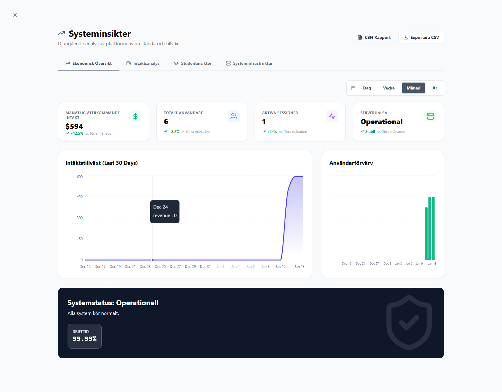
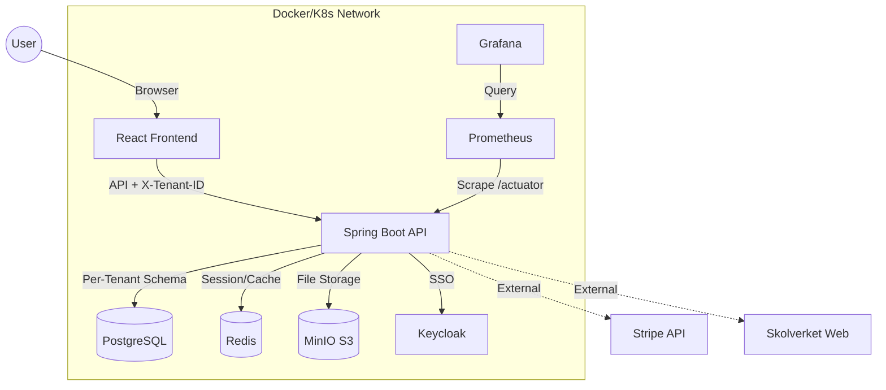
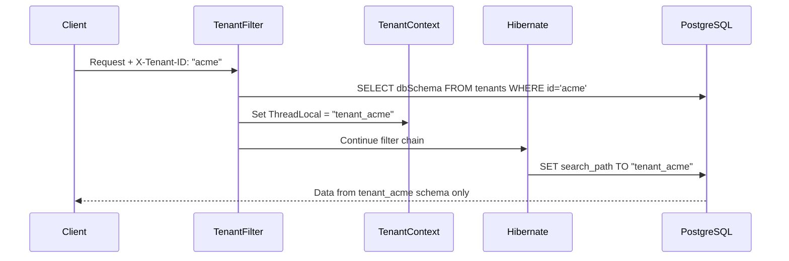

<p align="center">
  
</p>

<h1 align="center">🎓 EduFlex LMS 2.0</h1>

<p align="center">
  <em>The Complete Enterprise Learning Platform for Modern Education</em><br/>
  <em>Developed & maintained by <strong>Alex Weström / Fenrir Studio</strong></em>
</p>

<p align="center">
  <a href="#-english">🇬🇧 English</a> &nbsp;&nbsp;&nbsp;|&nbsp;&nbsp;&nbsp; <a href="#-svenska">🇸🇪 Svenska</a>
</p>

---

<p align="center">
  
  
  
  
  
  
  
  
  
  
  
</p>

---

*   **⚡ ONLYOFFICE Expansion & System Settings (Jan 24, 2026):**
    *   **Course Material Integration:** Support for in-browser editing of course attachments for teachers.
    *   **System Settings UI:** New "ONLYOFFICE" configuration tab for administrators to manage server URLs and status.
    *   **Health Checks:** Real-time connectivity monitoring between EduFlex and ONLYOFFICE Document Server.
    *   **Generalized Architecture:** Document editing framework now supports any repository-backed entity (Documents, Materials, Lessons).
    *   **OpenAPI / Swagger:** Implemented `springdoc-openapi` for automated API documentation at `/swagger-ui.html`.
    *   **Documentation Restructuring:** Organized guides and API docs into clear subdirectories in `docs/`.

*   **🔗 LTI 1.3 Certified Integration & Admin Tools (Jan 24, 2026):**
    *   **Secure Launch Flow:** Implemented full cryptographic verification (public key/JWKS) using Nimbus JOSE. No mocks—real OIDC authentication.
    *   **Auto-Provisioning:** Users launching from Canvas/Moodle are automatically created/updated with correct roles (Instructor -> Teacher) and names.
    *   **Administration UI:** Added a dedicated **"Integrationer"** tab in the Admin Dashboard to manage LTI platforms without DB access.
    *   **Frontend Handlers:** Created specific `/lti-success` and `/lti-error` handlers for a seamless single-sign-on experience.
    *   **Bug Fixes:** Resolved deprecated URL constructors and User model issues in the security layer.

*   **📅 Enhanced Calendar & Search Tools (Jan 23, 2026):**
    *   **View Flexibility:** Added seamless switching between **Day, Week, and Month** views for better planning visibility.
    *   **Visual Enhancements:** Sundays are now clearly highlighted with a red background for improved week-at-a-glance readability.
    *   **Advanced Filtering:** Added multi-select for event types (Lesson, Meeting, Workshop, etc.) in the calendar view.
    *   **Admin Search:** Integrated a global search bar in the calendar header for administrative roles.
    *   **Student Course Filtering:** Students can now isolate events for specific courses, just like teachers.
    *   **Hybrid Authentication:** Enabled simultaneous support for Keycloak SSO and Internal Auth, fixing 401 issues in hybrid mode.
    *   **Backend Support:** Updated `CalendarService` and controllers with server-side filtering and search logic.

*   **🛡️ System Stability & Security:**
    *   **Whitelabel & 500 Fixes:** Resolved the circular "Whitelabel Error Page" loop and hidden NPEs. Enhanced diagnostic logging with 💥 markers for easier troubleshooting.
    *   **Auth Principal Resolution:** Fixed 401/500 errors by supporting both `Jwt` and `UserDetails` across all core controllers.
    *   **HTTPS Enforcement:** All mixed content resolved; file URLs (materials, avatars) now use secure HTTPS.
    *   **Infrastructure Cleanup:** Cleaned root directory; moved scripts to `/scripts`, logs to `/logs`, and internal files to `.agent` (all now git-ignored).

*   **📅 Calendar & Navigation Refactor:**
    *   **Dynamic Role-Based Filtering:** Replaced hardcoded staff roles with a dynamic "Role -> Person" two-step selection for better scalability.
    *   **Student-Centric View:** Students now filter directly by **Course**, removing unnecessary people-lists for a cleaner experience.
    *   **Enhanced Visibility:** Principals hidden by default; improved visibility rules for Teachers and Mentors.

*   **✉️ Communication & Support Tools:**
    *   **Support Ticket System:** Full-stack multi-tenant system with priority levels (Görs nu/Löst) and high-visibility Dashboard widgets.
    *   **Messaging 2.0:** Rich Text (Quill), message threading, and 10MB multi-file attachments. Added admin-specific "fel-loggar" folder.
    *   **Global Access:** Integrated "Kontakt & Support" across all dashboard themes (Standard, Voltage, Nebula, Pulse, etc.).

*   **⚙️ Platform Foundation & Gamification:**
    *   **Gamification Engine:** Real-time XP, streaks, challenges, and achievements with per-tenant toggle support.
    *   **Multi-Tenancy:** Robust schema-per-tenant isolation with automatic provisioning and OIDC/Keycloak support.
    *   **Skolverket Integration:** Direct mapping to Swedish national curriculum standards and course codes.
    *   **Monitoring:** Full Prometheus/Grafana stack with pre-configured dashboards and a live "Matrix-style" debug terminal.

*   **🎨 UI/UX & Polish:**
    *   **Multilingual Landing Page:** Full i18n support (Swedish/English) with a refined "Request Demo" workflow.
    *   **Theme Engine:** 8 professional design systems with glassmorphism and advanced mobile customization tools.

---

<div id="-english"></div>

## 🇬🇧 English

### 📖 Table of Contents
- [About the Project](#-about-the-project)
- [Key Features](#-key-features)
- [System Architecture](#-system-architecture)
- [Technology Stack](#-technology-stack)
- [Multi-Tenancy](#-multi-tenancy)
- [Getting Started](#-getting-started)
- [Configuration](#-configuration)
- [Authentication Modes](#-authentication-modes)
- [API Reference](#-api-reference)
- [Modules Deep Dive](#-modules-deep-dive)
- [Monitoring & Observability](#-monitoring--observability)
- [Localization](#-localization)
- [Deployment Options](#-deployment-options)
- [Roadmap](#-roadmap)
- [License](#-license)

---

### 🏫 About the Project

**EduFlex 2.0** is a robust, cloud-native Learning Management System (LMS) engineered for scalability and user engagement. It bridges the gap between traditional enterprise LMS (often clunky and boring) and modern consumer apps (gamified, fast, and beautiful).

Whether you are a single educator, a private school, or a municipal education board, EduFlex scales to meet your needs using a microservices-ready architecture orchestrating storage, caching, and compute.

**Key Differentiators:**
- 🏢 **True Multi-Tenancy:** Schema-per-tenant isolation for complete data separation
- 🎮 **Gamification Built-in:** Points, badges, levels, and leaderboards
- 🇸🇪 **Skolverket Integration:** Direct integration with Swedish National Curriculum
- 💼 **SaaS Ready:** Subscription tiers, invoicing, and payment processing
- 🎨 **White-label Support:** 8 design systems with complete visual customization

---

### 🌟 Key Features

#### 🍎 Core Education
| Feature | Description |
|---------|-------------|
| **Course Management** | Rich courses with text, video, attachments, and quizzes |
| **SCORM / xAPI Support** | Import packages from Articulate/Adobe Captivate |
| **Assignment Engine** | File submissions with teacher grading and feedback |
| **Certification** | Auto-generated verifiable PDF certificates |
| **Lesson Progress** | Track student progress through course materials |
| **Quiz System** | Multiple choice, open-ended, and true/false questions |

#### 🎮 Gamification & Engagement
| Feature | Description |
|---------|-------------|
| **Points & Levels** | XP for logins, lessons, and quiz scores |
| **Badges & Achievements** | Visual achievements with Lucide iconography and unlock conditions |
| **Daily Challenges** | Rotating challenges with bonus XP rewards |
| **Streaks** | Track consecutive login days with streak bonuses |
| **Leaderboards** | Optional class/course rankings |
| **Activity Tracking** | Detailed student activity logs |
| **Per-Tenant Config** | Admins can enable/disable gamification features per organization |
| **Achievement Toast** | Real-time popups when achievements are unlocked |
| **XP Boost Indicator** | Visual indicator for active XP multipliers |

#### 🇸🇪 Skolverket Integration
| Feature | Description |
|---------|-------------|
| **Curriculum Mapping** | Direct Skolverket database integration |
| **Automated Import** | Python tools for course codes and descriptions |
| **Grading Criteria** | "Kunskapskrav" (E-A) directly in course view |
| **CSN Reporting** | Attendance export for CSN compliance |

#### 💼 Revenue & Administration
| Feature | Description |
|---------|-------------|
| **Subscription Tiers** | Free, Pro, Enterprise licensing |
| **Invoicing** | Automatic PDF invoice generation |
| **Payment Integration** | Stripe/Swish abstraction layer |
| **User Management** | Profiles with MinIO-backed avatar uploads |
| **RBAC** | Fine-grained permissions per role |
| **Audit Logging** | Track all critical changes |

#### 🏢 Multi-Tenancy
| Feature | Description |
|---------|-------------|
| **Schema Isolation** | Each tenant in separate PostgreSQL schema |
| **Automatic Provisioning** | Schema + migrations + admin user on registration |
| **Request Routing** | `X-Tenant-ID` header for tenant selection |
| **Tenant API** | Full CRUD for tenant management |

#### 🔔 Real-time Notifications
| Feature | Description |
|---------|-------------|
| **WebSocket Push** | Instant notifications via STOMP/SockJS |
| **Notification Bell** | Header component with unread count badge |
| **Multiple Types** | Assignment, achievement, system, and social notifications |
| **Read/Unread State** | Track which notifications have been seen |
| **Notification History** | Persistent storage with pagination |

#### 👥 Social Features
| Feature | Description |
|---------|-------------|
| **Online Friends Panel** | See who's currently online |
| **Student Contact Modal** | Quick contact options for teachers |
| **Activity Feed** | Recent activity from connections |

#### 🎨 Enterprise Themes & Whitelabel
Complete visual customization with 8 professional design systems:
- **EduFlex Classic** – Traditional sidebar layout
- **EduFlex Focus** – Minimalist with floating container
- **EduFlex Horizon** – Top navigation with beige gradient
- **EduFlex Nebula** – Glassmorphic purple/lavender
- **EduFlex Ember** – Card sidebar with orange accents
- **EduFlex Voltage** – Acid lime neon with dark sidebar
- **EduFlex Midnight** – Dark mode with mint accents
- **EduFlex Pulse** – Music player-inspired red theme

#### 📊 Analytics & Insights
| Feature | Description |
|---------|-------------|
| **Principal Dashboard** | High-level metrics (Revenue, Active Users, Health) |
| **Risk Analysis** | AI-driven at-risk student identification |
| **Student Activity Logs** | Deep-dive into individual history |
| **Real-time Debug Terminal** | Matrix-style live log streaming |

#### 🌍 Localization
Fully translated UI supporting:
- 🇸🇪 Swedish (Primary)
- 🇬🇧 English
- 🇸🇦 Arabic
- 🇳🇴 Norwegian
- 🇩🇰 Danish
- 🇫🇮 Finnish
- 🇩🇪 German
- 🇫🇷 French
- 🇪🇸 Spanish

---

### 📸 Screenshots

|  |  |
|:---:|:---:|
| **Admin Dashboard** | **Teacher Dashboard** |

|  |  |
|:---:|:---:|
| **AI Quiz Generator** | **System Settings** |

|  |  |
|:---:|:---:|
| **Analytics & Insights** | **Live Debug Terminal** |

---

### 🛠 System Architecture

EduFlex uses a containerized architecture managed by **Docker Compose** or **Kubernetes (Helm)**.



#### Multi-Tenancy Data Flow



---

### 💻 Technology Stack

#### Frontend Service (`eduflex-frontend`)
| Category | Technologies |
|----------|-------------|
| **Core** | React 19, Vite 5 |
| **State** | Zustand, React Context |
| **Styling** | Tailwind CSS v4, CSS Variables |
| **Icons** | Lucide React |
| **Charts** | Recharts |
| **Real-time** | SockJS + STOMP (WebSockets) |
| **i18n** | i18next (9 languages) |
| **Rich Text** | React-Quill-new |

#### Backend Service (`eduflex-backend`)
| Category | Technologies |
|----------|-------------|
| **Core** | Java 21, Spring Boot 3.4 |
| **Security** | Spring Security 6, JWT, OAuth2 |
| **Data** | Spring Data JPA, Hibernate 6.4 |
| **Database** | PostgreSQL 15 |
| **Caching** | Spring Data Redis |
| **Storage** | MinIO/S3 SDK |
| **PDF** | OpenPDF |
| **Migrations** | Flyway (programmatic per-tenant) |
| **API Docs** | Swagger / OpenAPI 3.0 |
| **Monitoring** | Micrometer + Actuator |

#### Infrastructure
| Component | Technology |
|-----------|------------|
| **Database** | PostgreSQL 15 (Alpine) |
| **Cache** | Redis 7 (Alpine) |
| **Object Storage** | MinIO (S3-compatible) |
| **SSO Provider** | Keycloak 24 |
| **Monitoring** | Prometheus + Grafana |
| **Backups** | Daily PostgreSQL dumps |
| **Container Runtime** | Docker 24+ |
| **Orchestration** | Docker Compose / Kubernetes |

---

### 🏢 Multi-Tenancy

EduFlex implements **schema-based multi-tenancy** for complete data isolation.

#### Architecture
```
┌─────────────────────────────────────────────────────────────┐
│                     PostgreSQL Database                      │
├─────────────────┬─────────────────┬─────────────────────────┤
│  public schema  │  tenant_acme    │  tenant_school2        │
│  ───────────────│  ───────────────│  ───────────────────── │
│  • tenants      │  • app_users    │  • app_users           │
│  (metadata)     │  • roles        │  • roles               │
│                 │  • courses      │  • courses             │
│                 │  • (40+ tables) │  • (40+ tables)        │
└─────────────────┴─────────────────┴─────────────────────────┘
```

#### Creating a Tenant

**Via API:**
```bash
curl -X POST http://localhost:8080/api/tenants \
  -H "Content-Type: application/json" \
  -d '{
    "name": "Acme School",
    "domain": "acme.local",
    "dbSchema": "tenant_acme",
    "organizationKey": "acme",
    "adminEmail": "admin@acme.local",
    "adminPassword": "SecurePass123",
    "adminFirstName": "John",
    "adminLastName": "Admin"
  }'
```

**What happens automatically:**
1. ✅ Tenant metadata saved to `public.tenants`
2. ✅ PostgreSQL schema `tenant_acme` created
3. ✅ All 40+ tables migrated via Flyway
4. ✅ ADMIN role created
5. ✅ Admin user created with encrypted password

#### Using X-Tenant-ID Header

All API requests must include the tenant header:
```http
X-Tenant-ID: acme
```

#### Key Components
| File | Purpose |
|------|---------|
| `TenantContext.java` | ThreadLocal tenant storage |
| `TenantFilter.java` | Extracts and validates X-Tenant-ID |
| `TenantIdentifierResolver.java` | Hibernate tenant resolution |
| `SchemaMultiTenantConnectionProvider.java` | Sets PostgreSQL search_path |

> 📖 **Full documentation:** [docs/TENANT_ADMIN_GUIDE.md](docs/TENANT_ADMIN_GUIDE.md)

---

### 🚀 Getting Started

#### Prerequisites
- **Docker Desktop** (latest version)
- **Git**
- **Java 21** (for local backend development)
- **Node.js 20+** (for local frontend development)

#### Quick Start with Docker

1. **Clone the Repository**
   ```bash
   git clone https://github.com/alexwest1981/EduFlex.git
   cd EduFlex
   ```

2. **Start Everything**
   ```bash
   docker compose up --build -d
   ```

3. **Access the Application**
   | Service | URL | Credentials |
   |---------|-----|-------------|
   | **Frontend (LMS)** | http://localhost:5173 | – |
   | **Backend API** | http://localhost:8080/api | – |
   | **Swagger Docs** | http://localhost:8080/swagger-ui.html | – |
   | **MinIO Console** | http://localhost:9001 | minioadmin / minioadmin |
   | **Grafana** | http://localhost:3000 | admin / admin |
   | **Keycloak** | http://localhost:8180 | admin / admin |
   | **Prometheus** | http://localhost:9090 | – |

#### Local Development

**Backend (Spring Boot):**
```bash
cd eduflex
mvn spring-boot:run
```

**Frontend (Vite):**
```bash
cd frontend
npm install
npm run dev
```

---

### ⚙️ Configuration

#### Environment Variables

| Service | Variable | Description | Default |
|---------|----------|-------------|---------|
| **Backend** | `SPRING_DATASOURCE_URL` | DB connection | `jdbc:postgresql://db:5432/eduflex` |
| **Backend** | `MINIO_URL` | S3 endpoint (internal) | `http://minio:9000` |
| **Backend** | `MINIO_PUBLIC_URL` | Public S3 URL (for clients) | `https://storage.eduflexlms.se` |
| **Backend** | `SPRING_REDIS_HOST` | Redis host | `redis` |
| **Backend** | `EDUFLEX_AUTH_MODE` | Auth mode | `internal` |
| **Frontend** | `VITE_API_BASE_URL` | API endpoint | `http://localhost:8080/api` |

#### application.properties Key Settings

```properties
# Multi-tenancy
spring.jpa.properties.hibernate.multiTenancy=SCHEMA
spring.flyway.enabled=false  # Managed programmatically

# SSO Mode (internal, keycloak, hybrid)
eduflex.auth.mode=internal

# License
eduflex.license.path=eduflex.license
```

---

### 🔐 Authentication Modes

EduFlex supports three authentication modes:

| Mode | Description | Use Case |
|------|-------------|----------|
| `internal` | JWT-based local authentication | Small deployments, development |
| `keycloak` | Full Keycloak SSO | Enterprise with existing IdP |
| `hybrid` | Both internal and Keycloak | Migration scenarios |

Configure via `eduflex.auth.mode` property.

> 📖 **Keycloak Setup:** [docs/TENANT_ADMIN_GUIDE.md#keycloak-administration](docs/TENANT_ADMIN_GUIDE.md#-keycloak-administration)

---

### 📡 API Reference

**Base URL:** `http://localhost:8080/api`

All requests (except `/api/tenants`) require `X-Tenant-ID` header.

#### Key Endpoints

| Method | Endpoint | Description |
|--------|----------|-------------|
| `POST` | `/api/tenants` | Create new tenant |
| `POST` | `/api/auth/login` | Authenticate user |
| `GET` | `/api/courses` | List courses |
| `GET` | `/api/users/me` | Current user profile |
| `GET` | `/api/modules` | System modules |

#### Gamification Endpoints

| Method | Endpoint | Description |
|--------|----------|-------------|
| `GET` | `/api/gamification/achievements` | List all achievements |
| `GET` | `/api/gamification/achievements/user` | User's unlocked achievements |
| `GET` | `/api/gamification/streak` | Current user's streak info |
| `GET` | `/api/gamification/challenges/daily` | Today's daily challenges |
| `POST` | `/api/gamification/challenges/{id}/complete` | Mark challenge as complete |
| `GET` | `/api/gamification/config` | Tenant gamification settings |
| `PUT` | `/api/gamification/config` | Update gamification settings (Admin) |

#### Notification Endpoints

| Method | Endpoint | Description |
|--------|----------|-------------|
| `GET` | `/api/notifications` | List user notifications |
| `GET` | `/api/notifications/unread/count` | Unread notification count |
| `PUT` | `/api/notifications/{id}/read` | Mark notification as read |
| `PUT` | `/api/notifications/read-all` | Mark all as read |

> 📖 **Full API docs:** [docs/API.md](docs/API.md) or Swagger UI

---

### 🎛 Modules Deep Dive

EduFlex uses a **"Kernel + Extensions"** architecture. Features are toggleable:

| Module | Description | License |
|--------|-------------|---------|
| **SCORM** | Upload/play courseware | Enterprise |
| **REVENUE** | Subscriptions & invoicing | Pro+ |
| **GAMIFICATION** | XP, Badges, Leaderboards | Pro+ |
| **CHAT** | WebSocket messaging | Pro+ |
| **SSO** | Keycloak integration | Enterprise |
| **WHITELABEL** | Custom branding/themes | Enterprise |

Toggle via `/api/modules/{key}/toggle` (Admin only).

---

### 📊 Monitoring & Observability

#### Prometheus Metrics
Backend exposes metrics at `/actuator/prometheus`:
- JVM memory, GC, threads
- HTTP request latency & counts
- Database connection pool stats
- Custom business metrics

#### Grafana Dashboards
Pre-configured dashboards for:
- System Overview
- JVM Performance
- HTTP Request Analysis
- Database Performance

#### Real-time Debug Terminal
Admin users can access live log streaming via the built-in "Matrix-style" debug terminal in the Admin UI.

---

### 🚢 Deployment Options

#### Option 1: Docker Compose (Recommended for Dev/Small)
```bash
docker compose up -d
```

#### Option 2: Kubernetes with Helm (Production)
```bash
helm install eduflex ./helm/eduflex \
  --namespace eduflex \
  --create-namespace \
  -f values-production.yaml
```

> 📖 **Helm documentation:** [HELM_README.md](HELM_README.md)

#### Option 3: Manual Deployment
See [docs/ARCHITECTURE.md](docs/ARCHITECTURE.md) for manual setup.

---

### 🗺 Roadmap

| Feature | Status |
|---------|--------|
| Multi-tenancy (Schema-per-tenant) | ✅ Implemented |
| Kubernetes Native (Helm Charts) | ✅ Implemented |
| Keycloak SSO Integration | ✅ Implemented |
| Prometheus/Grafana Monitoring | ✅ Implemented |
| Gamification Engine | ✅ Implemented |
| SCORM/xAPI Support | ✅ Implemented |
| Real-time Notifications (WebSocket) | ✅ Implemented |
| Daily Challenges & Streaks | ✅ Implemented |
| Achievement System | ✅ Implemented |
| Social Features (Online Friends) | ✅ Implemented |
| Support Ticket System | ✅ Implemented |
| HTTPS Storage (Cloudflare Tunnel) | ✅ Implemented |
| Enhanced Calendar (MiniCalendar, Events) | ✅ Implemented |
| Admin UI Redesign (Whitelabel) | ✅ Implemented |
| Microservices Split (Video/PDF) | 🔜 Q2 2026 |
| Event Bus (Kafka/RabbitMQ) | 🔜 Q3 2026 |
| AI-powered Quiz Generation | 🔜 Q2 2026 |
| Mobile App (React Native) | 🔜 Q4 2026 |
| Push Notifications (Mobile) | 🔜 Q4 2026 |
| Advanced Analytics Dashboard | 🔜 Q2 2026 |

---

### ❓ Troubleshooting

#### Common Issues

**1. "Port 8080 is already in use"**
```bash
# Find and kill process
netstat -ano | findstr :8080
taskkill /PID <PID> /F
```

**2. "Tenant not found" errors**
- Ensure `X-Tenant-ID` header is present
- Verify tenant exists: `curl http://localhost:8080/api/tenants`

**3. Database connection refused**
- Wait 10-15 seconds after startup
- Check: `docker logs eduflex-db`

**4. WebSocket "OFFLINE"**
- Hard refresh browser (Ctrl+F5)
- Check SecurityConfig allows `/ws-log/**`

---

<br />
<br />
<div id="-svenska"></div>

## 🇸🇪 Svenska

### ⚡ Senaste Uppdateringarna
*   **⚡ ONLYOFFICE-expansion & Systeminställningar (24 jan 2026):**
    *   **Kursmaterial-integration:** Stöd för redigering av bilagor i kurser direkt i webbläsaren för lärare.
    *   **Systeminställningar:** Ny "ONLYOFFICE"-flik för administratörer för att hantera server-URL:er och status.
    *   **Hälsokontroller:** Realtidsövervakning av anslutningen till ONLYOFFICE Document Server.
    *   **Generaliserad Arkitektur:** Ramverket för dokumentredigering stöder nu alla entiteter (Dokument, Material, Lektioner).

### 📖 Innehållsförteckning
- [Om Projektet](#-om-projektet)
- [Nyckelfunktioner](#-nyckelfunktioner)
- [Multi-Tenancy](#-multi-tenancy-sv)
- [Kom igång](#-kom-igång)
- [Konfiguration](#-konfiguration-sv)

---

### 🏫 Om Projektet

**EduFlex 2.0** är ett komplett, molnbaserat **Learning Management System (LMS)** designat för att skala från små utbildningsföretag till stora kommunala verksamheter. Systemet kombinerar modern pedagogik (Gamification, interaktiva element) med affärskritisk funktionalitet (fakturering, prenumerationer) i en säker, Docker-baserad arkitektur.

**Huvudsakliga fördelar:**
- 🏢 **Äkta Multi-Tenancy:** Schema-per-organisation för komplett dataisoleringen
- 🎮 **Inbyggd Gamification:** Poäng, utmärkelser, nivåer och topplistor
- 🇸🇪 **Skolverket-integration:** Direkt koppling till svenska läroplanen
- 💼 **SaaS-redo:** Prenumerationsnivåer, fakturering och betalningar
- 🎨 **White-label:** 8 designsystem med full visuell anpassning

---

### 🌟 Nyckelfunktioner

#### 🍎 Utbildning (Core)
- **Kurshantering:** Rika kurser med text, video, bilagor och quiz
- **SCORM / xAPI:** Stöd för Articulate/Captivate-paket
- **Uppgifter:** Filinlämningar med lärarbedömning
- **Certifikat:** Automatiska, spårbara PDF-diplom

#### 🎮 Gamification
- **Poäng & Nivåer:** XP genom aktivitet och framsteg
- **Utmärkelser:** Visuella badges för prestationer
- **Dagliga Utmaningar:** Roterande utmaningar med bonus-XP
- **Streaks:** Spåra konsekutiva inloggningsdagar med bonusar
- **Topplistor:** Frivilliga rankingar per klass/kurs
- **Achievement Toast:** Realtids-popup vid upplåsta prestationer

#### 🔔 Notifikationer
- **WebSocket Push:** Direkta notifikationer via STOMP/SockJS
- **Notifikationsklocka:** Header-komponent med oläst-räknare
- **Flera Typer:** Uppgifter, prestationer, system och sociala notiser

#### 👥 Sociala Funktioner
- **Online-vänner:** Se vilka som är online just nu
- **Snabbkontakt:** Enkla kontaktalternativ för lärare

#### 🇸🇪 Skolverket-integration
- **Kurskoppling:** Direkt Skolverket-databaskoppling
- **Automatisk Import:** Python-verktyg för kurskoder
- **Kunskapskrav:** Betygsmatriser (E-A) direkt i kursvyn

#### 🏢 Multi-Tenancy (NYTT)
- **Schema-isolering:** Varje organisation i eget PostgreSQL-schema
- **Automatisk Provisionering:** Schema + migrationer + admin vid registrering
- **Request-routing:** `X-Tenant-ID` header för organisation-val

---

### 🏢 Multi-Tenancy (Sv)

EduFlex implementerar **schema-baserad multi-tenancy** för komplett dataisolering.

#### Skapa ny Tenant
```bash
curl -X POST http://localhost:8080/api/tenants \
  -H "Content-Type: application/json" \
  -d '{
    "name": "Stockholms Tekniska Gymnasium",
    "domain": "stg.local",
    "dbSchema": "tenant_stg",
    "organizationKey": "stg",
    "adminEmail": "admin@stg.local",
    "adminPassword": "SäkertLösen123",
    "adminFirstName": "Anna",
    "adminLastName": "Andersson"
  }'
```

> 📖 **Full dokumentation:** [docs/TENANT_ADMIN_GUIDE.md](docs/TENANT_ADMIN_GUIDE.md)

---

### 🚀 Kom igång

#### Förutsättningar
- **Docker Desktop** (senaste versionen)
- **Git**

#### Snabbstart

1. **Klona projektet**
   ```bash
   git clone https://github.com/alexwest1981/EduFlex.git
   cd EduFlex
   ```

2. **Starta systemet**
   ```bash
   docker compose up --build -d
   ```

3. **Öppna applikationen**
   | Tjänst | URL | Inloggning |
   |--------|-----|------------|
   | **LMS (Frontend)** | http://localhost:5173 | – |
   | **API Docs** | http://localhost:8080/swagger-ui.html | – |
   | **MinIO (Filer)** | http://localhost:9001 | minioadmin / minioadmin |
   | **Grafana** | http://localhost:3000 | admin / admin |
   | **Keycloak** | http://localhost:8180 | admin / admin |

---

### ⚙️ Konfiguration (Sv)

#### Miljövariabler

| Tjänst | Variabel | Beskrivning | Standard |
|--------|----------|-------------|----------|
| **Backend** | `SPRING_DATASOURCE_URL` | Databaslänk | `jdbc:postgresql://db:5432/eduflex` |
| **Backend** | `EDUFLEX_AUTH_MODE` | Autentiseringsläge | `internal` |
| **Frontend** | `VITE_API_BASE_URL` | API-länk | `http://localhost:8080/api` |

---

### ❓ Felsökning

**1. "Port 8080 is already in use"**
- Stäng andra tjänster på port 8080
- Eller ändra port i `docker-compose.yml`

**2. "Tenant not found"**
- Kontrollera att `X-Tenant-ID` header skickas
- Verifiera att tenant finns: `curl http://localhost:8080/api/tenants`

**3. Databasfel vid uppstart**
- Vänta 10-15 sekunder (PostgreSQL startar)
- Kolla loggar: `docker logs eduflex-db`

---

## 📚 Documentation

| Document | Description |
|----------|-------------|
| [README.md](README.md) | This file - overview |
| [HELM_README.md](HELM_README.md) | Kubernetes/Helm deployment |
| [docs/API.md](docs/API.md) | REST API reference |
| [docs/ARCHITECTURE.md](docs/ARCHITECTURE.md) | System architecture |
| [docs/TENANT_ADMIN_GUIDE.md](docs/TENANT_ADMIN_GUIDE.md) | Multi-tenancy & Keycloak guide |
| [docs/ROADMAP_TO_AAA.md](docs/ROADMAP_TO_AAA.md) | Strategic Enterprise Blueprint |

---

## ⚖️ Licens & Kontakt

**EduFlex™ © 2026 Alex Weström / Fenrir Studio**

**Proprietary Software.**
Otillåten kopiering, modifiering eller distribution är förbjuden utan giltig licens.
Källkoden tillhandahålls endast för auktoriserad utveckling och underhåll.

För Enterprise-frågor:
📧 **alexwestrom81@gmail.com**

<p align="center"> 
   
</p>

---

*Last updated: 2026-01-24*
