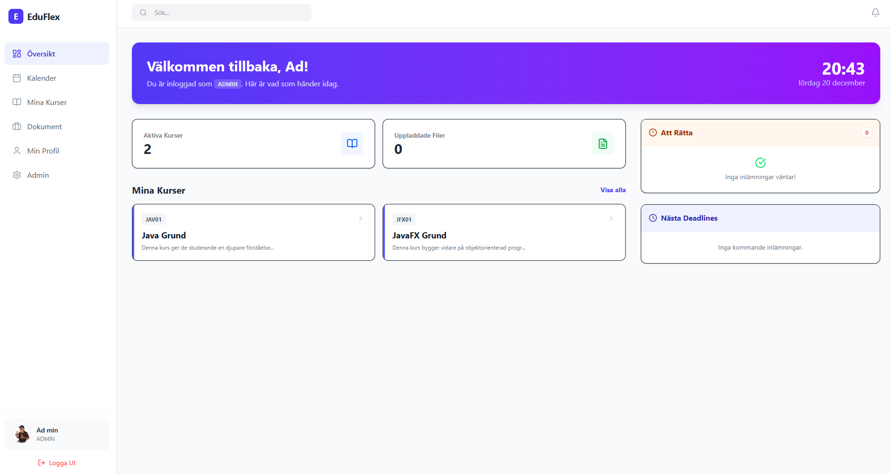

<p align="center">
  
</p>

<h1 align="center">🎓 EduFlex LMS</h1>

<p align="center">
  <em>Developed & maintained by <strong>Alex Weström / Fenrir Studio</strong></em>
</p>

---


---

## 🏫 Om Projektet

**EduFlex** är ett modernt, rollbaserat **Learning Management System (LMS)** som syftar till att förenkla **administration, undervisning och lärande** i både utbildnings- och företagsmiljöer.  
Systemet är utvecklat med fokus på **säkerhet, effektivitet och användarupplevelse** – med en tydlig rollfördelning mellan administratörer, lärare och studenter.

  
*(Byt gärna ut denna platsbild mot en riktig skärmdump av din dashboard när systemet är redo för demonstration.)*

---

## 🚀 Funktioner

### 👤 För Alla Användare
- **Säker Autentisering:** JWT-baserad inloggning och registrering.  
- **Personlig Dashboard:** Widgets som visar relevant information baserat på roll (t.ex. deadlines, nya uppgifter eller orättade inlämningar).  
- **Min Profil:** Hantera personuppgifter, adress, byt lösenord, och ladda upp profilbild (avatar).  
- **Dokumentarkiv:** Ladda upp och lagra egna filer (CV, betyg, anteckningar m.m.).  
- **Kalender:** Grafisk översikt över kursstarter, uppgifter och deadlines.  

### 🎓 För Studenter
- **Kurskatalog:** Bläddra bland tillgängliga kurser och registrera dig direkt.  
- **Kursvy:** Ta del av kursmaterial såsom video, text, filer och externa länkar.  
- **Uppgifter:** Ladda upp inlämningar och följ status/betyg.  
- **Utvärderingar:** Fyll i kursutvärderingar direkt från dashboarden.  

### 🍎 För Lärare
- **Kurshantering:** Skapa och administrera kurser, upplägg och schema.  
- **Material & Uppgifter:** Ladda upp lektionsinnehåll och skapa inlämningsuppgifter med deadlines.  
- **Rättningssystem:** Se studentinlämningar, sätt betyg (IG/G/VG) och lämna individuell feedback.  
- **Elevhantering:** Lägg till eller ta bort studenter manuellt i respektive kurs.  
- **Kvalitetssäkring:** Skapa och distribuera kursutvärderingar.  

### 🛡️ För Administratörer
- **Användarhantering:** Skapa, redigera och ta bort användare med säkerhetsvarning vid kopplade resurser.  
- **Kursöversikt:** Full insyn i alla aktiva och arkiverade kurser.  
- **Systemarkiv:** Global åtkomst till samtliga filer som laddats upp.  
- **Rolltilldelning:** Administrativ registrering av nya användare med anpassade roller.  

---

## 🛠️ Teknisk Stack

### Frontend
- **Ramverk:** React 18  
- **Byggverktyg:** Vite  
- **Styling:** Tailwind CSS (v4)  
- **Ikoner:** Lucide React  
- **Routing:** Custom state-based routing (SPA)  

### Backend (Separat Repository)
- **Ramverk:** Java Spring Boot  
- **Säkerhet:** Spring Security + JWT  
- **Databas:** H2 / MySQL  
- **API-struktur:** RESTful API  

---

## ⚙️ Installation & Setup

### Förutsättningar
- Node.js och npm installerat  
- Backend (Spring Boot) igång på [**http://127.0.0.1:8080/api**](http://127.0.0.1:8080/api)

### Steg-för-steg

1. **Klona repot**
```
git clone https://github.com/fenrirstudio/eduflex-frontend.git
cd eduflex-frontend
```

2. **Installera beroenden**
```
npm install
```

3. **Starta utvecklingsservern**
```
npm run dev
```

4. **Backend**
Starta din Spring Boot-applikation på port `8080` så att frontend kan kommunicera med API:et.

---

## 🗺️ Roadmap

### ✅ Fas 1: Kärnfunktionalitet *(Klar)*
- [x] JWT-autentisering (Login/Register)  
- [x] Rollbaserad åtkomst (Admin / Teacher / Student)  
- [x] Grundläggande kurshantering (CRUD)  
- [x] Materialhantering (Video, Fil, Text)  
- [x] Inlämning & rättning  

### ✅ Fas 2: Användarupplevelse *(Klar)*
- [x] Kalender med schemalagda deadlines  
- [x] Dashboard-widgets (Att göra, kurslistor)  
- [x] Avatar-uppladdning och adressfält  
- [x] Kurskatalog med self-enrollment  
- [x] Kursutvärderingssystem  

### 🚧 Fas 3: Framtida Förbättringar *(Planerad)*
- [ ] Notifieringar i realtid / e-post  
- [ ] Chatt- och meddelandesystem mellan lärare och student  
- [ ] Dark Mode  
- [ ] Statistikmodul (klassbetyg, kursdata)  
- [ ] Full mobilresponsivitet  

---

## ⚖️ Juridisk Information och Licensvillkor

### Äganderätt
**EduFlex™** och all tillhörande källkod, designmaterial, datamodellering, dokumentation och varumärkesidentitet ägs av **Alex Weström / Fenrir Studio**.  
Allt innehåll skyddas av **svensk upphovsrättslag (1960:729)** samt relevanta internationella konventioner (bl.a. Bernkonventionen och TRIPS-avtalet).  
Ingen del av systemet får återanvändas, reproduceras eller spridas utan uttryckligt skriftligt medgivande.

### Licens
Projektet är för närvarande föremål för en **privat, begränsad licens**.  
All användning, distribution, reproduktion eller modifiering av koden är **förbjuden utan skriftligt tillstånd** från **Alex Weström / Fenrir Studio**.  
Otillåten användning betraktas som **rättighetsintrång** och kan medföra **juridiska konsekvenser** enligt gällande lag.

### Förfrågningar och Samarbetsavtal
Kontakta vid frågor om licens, samarbete eller kommersiell användning:

> **Alex Weström**  
> *Fenrir Studio*  
> 📧 [alexwestrom81@gmail.com](mailto:alexwestrom81@gmail.com)  
> 📍 Svenljunga, Sverige  

Tillstånd beviljas endast efter individuell prövning och skriftligt avtal.

---

## 🕊️ Framtida Licensmodell

En övergång till en **öppen licensmodell (t.ex. MIT eller Apache 2.0)** planeras inför den publika releaseversionen.  
Fram till dess gäller den nuvarande **privata licensen** fullt ut.

---

## 🧭 Varumärke

**EduFlex™** är ett programvaruprojekt utvecklat och underhållet av **Fenrir Studio**.  
Namnet och logotypen *EduFlex* är reserverade och får inte användas i reklam, projekt eller derivat utan uttryckligt tillstånd.

---

© 2025 **Alex Weström / Fenrir Studio**  
Alla rättigheter förbehållna.  

---

<p align="center">
  <br/>
  Made with ❤️ by <strong>Fenrir Studio</strong><br/>
  <sub>Where innovation meets precision.</sub>
</p>
```
