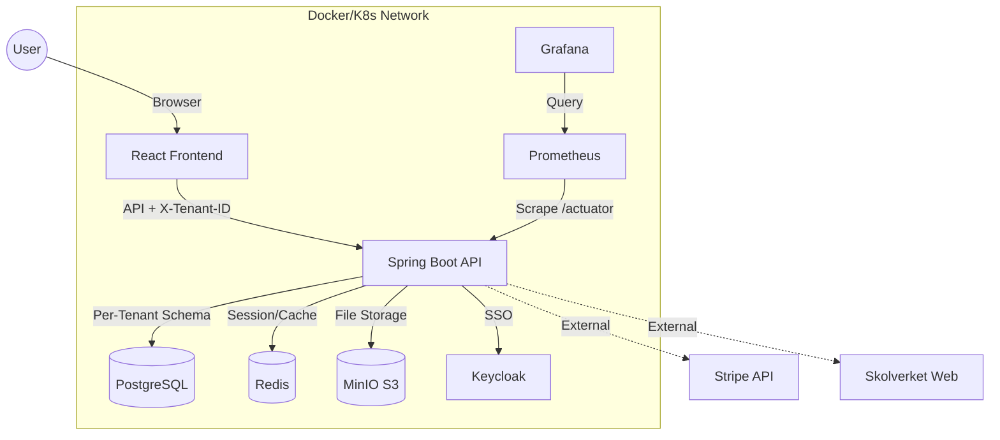
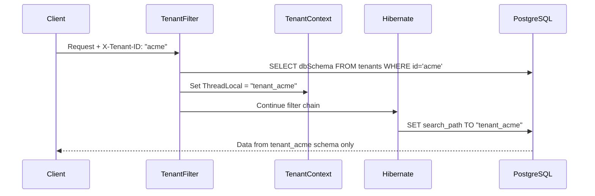

<p align="center">
  
</p>

<h1 align="center">🎓 EduFlex LLP v3.0.0</h1>

<p align="center">
  <em>The Complete Enterprise Learning Platform for Modern Education</em><br/>
  <em>Developed & maintained by <strong>Alex Weström / Fenrir Studio</strong></em>
</p>

<p align="center">
  <a href="#-svenska">🇸🇪 Svenska</a> &nbsp;&nbsp;&nbsp;|&nbsp;&nbsp;&nbsp; <a href="#-english">🇬🇧 English</a>
</p>

---

<p align="center">
  
  
  
  
  
  
  
  
  
  
  
  
  
</p>

---

### 🚀 **v3.5.0** (1 mar 2026) – B2B Sales Enablement & Compliance
*   **🛡️ Compliance Center**: Nytt gränssnitt för HR/Admins för att övervaka regelefterlevnad och certifieringar i realtid med automatisk expiry-tracking.
*   **🔌 HR Sync API (API-First)**: Kraftfullt API för automatiserad user provisioning från externa HR-system som Workday.
*   **📊 Interactive TCO Calculator**: Säljverktyg för live ROI-beräkningar direkt i plattformen för att stänga Enterprise-affärer.
*   **📄 Compliance Battle Kit**: Komplett dokumentation (`ComplianceDocumentation.md`) som täcker GDPR, kryptering och WCAG för IT-due diligence.

---

### 🕒 Senaste uppdateringarna (Session sammanfattning)
*   **Global Library Engine**: Implementerat pointer-baserad distribution för kurser, vilket möjliggör Single Source of Truth över alla tenants.
*   **Reseller Module**: Fullt stöd för återförsäljare att paketera och sälja kurslicenser (Seat Licenses) till företag.
*   **Automation**: Ny HrSyncController för Zero-Touch onboarding av personal.
*   **Sales Kit**: Integrerat TCO-kalkylator och Compliance Dashboard för att underlätta B2B-försäljning.

---

### 🚀 **v3.4.0** (28 feb 2026) – Enterprise B2B & Global i18n
*   **🌍 AI-Driven i18n Localization**: Automatiskt översättningssystem lanserat som stödjer 8 språk (Engelska, Franska, Tyska, Spanska, Arabiska, Norska, Danska, Finska) utöver Svenska via Gemini AI-driven pipeline.
*   **💼 B2B Extended Enterprise Engine**: "Pointer"-baserad distribution för företag, som gör att de kan köpa paket med Seat Licenses och manuellt tilldela platser inom sin egen organisation (Tenant Isolation).
*   **🛒 Reseller Module Finalization**: Analysfunktioner med total försäljning, antal ordrar samt distribuerade licenser via dedikerad API Analytics-endpoint in i Sales Dashboard.

---

### 🚀 **v3.2.0** (28 feb 2026) – Database Resilience & Quality
*   **🛡️ Database Resilience**: Löste en kritisk blockerare vid uppstart genom att uppdatera `resources_visibility_check`-contrainten för att tillåta den nya `GLOBAL_LIBRARY`-siktbarheten via Flyway-migration (V103).
*   **📚 Global Library Live Data**: Helt övergått från mockups till 100% live-data från databasen i Resource Bank.
*   **✨ Code Optimization**: Genomfört en storskalig rensning av oanvända imports och fält i över 15 backend-controllers för förbättrad stabilitet och underhållsvänlighet.

---

### 🚀 **v3.3.0** (28 feb 2026) – Native Mobile Foundations (Fas 2-6)
*   **📱 Komplett React Native App**: Implementerat fullt offlinestöd med Redux Persist och egen Sync Manager.
*   **🏫 Rolldashboards**: Byggt in separata, skräddarsydda vyer för Elev, Lärare, SYV, Mentor, Kurator och Vårdnadshavare.
*   **🧠 EduAI & Gamification**: 3D-kartvy, AI-Coach med offline-historik och Flashcards med automatisk intervallberäkning.
*   **⚙️ Native Integrationer**: Förberedelser för Biometrisk Inloggning, Push-notiser och Mörkt/Ljust tema.

<div id="-svenska"></div>

### 🚀 **v3.1.0** (28 feb 2026) – EduFlex LLP & Gap Closures
*   **🚀 Branding Transition (LLP)**: Omdöpt plattformen från LMS till **Learning Lifecycle Platform (LLP)** för att bättre spegla systemets helhetsansvar. Uppdaterat ikoner, titlar och meta-data i hela systemet.
*   **🛒 Gap 3: Advanced E-commerce**: 
    - **Public Storefront**: Ny vacker butikssida (`/store`) för externa besökare.
    - **Shopping Cart & Checkout**: Komplett utcheckningsprocess via Stripe med `/checkout`, Success och Cancel-sidor. Provisionerar automatiskt kursen vid lyckad betalning.
    - **Sales Dashboard**: Ny "Försäljning"-flik för Rektorer/Admins (`/admin/sales`) där man kan följa försäljning, KPI:er, ordrar och belopp i en snygg översikt.
    - **Reseller Role**: Introduktion av `ROLE_RESELLER` som hanterar kursförsäljning med least-privilege.
    - **Store Administration**: Flikar under Sales Dashboard för att dynamiskt ändra kurspriser, aktivera/inaktivera Store-synlighet samt skapa kampanjkoder (Discount codes).
    - **Discount Code Implementation**: Möjlighet att lägga in koder i kassan (`/checkout`) som live-valideras mot `/api/promocodes` innan Stripeskick.
    - **B2B Extended Enterprise**: Implementerat "Seat Licenses" ("Pointer"-baserad distribution) där företag kan köpa ett visst antal platser till en kurs i Global Library, vilket möjliggör "Single Source of Truth" för master-kurser, samtidigt som datasekretess och Data Isolation garanteras i kundens eget schemas (Tenants).
    - **Reseller System Module**: E-handelsmotorn och B2B Dashboard är nu en dedikerad modul (`RESELLER_SYSTEM`), exklusiv för kunder med `ENTERPRISE`-licens, konfigurerbar via Admin System Settings.
*   **📱 Gap 1: Native Mobile Foundation**:
    - **Mobile Project**: Uppstart av React Native-strukturen i `/mobile`.
    - **Sync Architecture**: Dokumenterad strategi för offline-synk och data-persistens.

---

### 🚀 **v3.0.0** (28 feb 2026) – Ops Control Center & Quality Fixes
*   **🛠️ Control Center (EduFlex Ops):**
    *   **Unified Overview**: Helt ombyggd kontrollpanel som visar status för samtliga tjänster (Backend, Frontend, PG, MinIO, Redis, OnlyOffice, Video, PDF).
    *   **One-Click Start**: Ny "Starta alla tjänster"-knapp som exekverar en optimerad startsekvens.
    *   **Premium Branding**: Integrerat den officiella EduFlex-logotypen i Ops-gränssnittet.
*   **🎓 ISP (Individuell Studieplan) Fixes:**
    *   **404 Handling**: Förbättrad felhantering när en student saknar en aktiv plan. Istället för ett tekniskt fel visas nu ett hjälpsamt meddelande med direktlänk till supporten.
    *   **Link Persistence**: Korrigerat API-kopplingar för att säkerställa att `/api/isp/my` fungerar korrekt i alla miljöer.
*   **📚 E-bokshantering & Kvalitet:**
    *   **Sparade böcker**: Implementerat personliga bokmärken för att spara litteratur.
    *   **Ljudböcker**: Ny dedikerad kategori i biblioteket för enklare navigering till ljudfiler.
    *   **Student Access**: Fixat behörighetsbugg som gjorde att elever omdirigerades från biblioteket.
    *   **Progress Stability**: Fixat 400 Bad Request-fel och SQL-fel för framstegssparande via `SecurityUtils` och Flyway.
    *   **Enhetlig Säkerhet**: Refaktorerat samtliga controllers för stabil användar-lookup.
*   **✨ Sidomeny-uppdatering**: Uppdaterat sidomenyn så att den nu visar rätt versionsnummer (**v3.0.0**).
*   **💾 Course Content Saving Fix:** Garanterar att `X-Tenant-ID` skickas med varje sparning, vilket löser problem med att lektioner, uppgifter och quiz inte sparades korrekt.

---

### 🚀 **v2.9.5** (25 feb 2026) – Sidebar Refactor & Career Portal
*   **📂 Centraliserad Sidomeny**: Implementerat `navigation.jsx` för att centralisera menyval och ikoner för alla 8 roller.
*   **💼 EduCareer Portal**: Realtidssökning via JobTech API för LIA- och praktikplatser med AI-analys för karriärmatchning.
*   **📖 Systemmanual 1.0**: Komplett dokumentation för alla användarroller i [docs/Manual.md](docs/Manual.md).

---

### 🚀 **v2.9.0** (24 feb 2026) – Integration Hub Pro & AI Audit
*   **🔗 Integration Hub**: Nytt admin-gränssnitt för att hantera LTI 1.3, Zoom, Teams, Skolverket, SIS-import och bibliotekssökning.
*   **🤖 AI Audit Logging**: Fullständig spårbarhet för alla Gemini-anrop med Compliance Portal för GDPR-transparens.
*   **🛡️ SCORM & xAPI Integration**: Fullt stöd för Articulate/Captivate-paket med automatisk tracking av framsteg (`suspend_data`).
*   **🛡️ PII Kryptering (AES-256 GCM)**: All känslig persondata krypteras nu i vila i databasen för ISO 27001-efterlevnad.

---

### 🚀 **v2.8.0** (21 feb 2026) – EduAI Hub & Social Gamification
*   **🧠 EduAI Hub Integration**: Unifierat Intelligence Center med Live Radar, Mastery Score och interaktiva AI-sessioner.
*   **🏆 Social Gamification**: Introducerat ligasystem (Brons-Rubin) och klassmål för att stärka motivationen.
*   **📈 ROI Reporting Engine**: Korrelera mastery-data med affärsresultat för ledningsrapportering.

---

### 🚀 **v2.5.0** (20 feb 2026) – Collaborative Editing & LiveKit
*   **📄 OnlyOffice Integration**: Fullt fungerande samredigering av dokument med fixad SSL/JWT-säkerhet.
*   **🎬 LiveKit Premium Video**: Migrerat till LiveKit med stöd för bakgrundsoskärpa och premium-mötesvyer.
*   **⭐ Guardian Portal 2.0**: Uppdaterad dashboard för vårdnadshavare med AI-sammanfattningar och digital sjukanmälan.

---

### 🚀 **v2.0.0** (Januari - Februari 2026) – Foundation & Core Launch
*   **🏛️ Core Architecture**: Schema-baserad Multi-Tenancy och Spring Boot/React stack.
*   **🧠 Intelligent Learning**: Grundläggande Gemini-integration för Quiz och dokumentanalys.
*   **📱 PWA Support**: Installerad app för offline-åtkomst och push-notiser.
*   **🏥 Elevhälsa & SKA**: Grundläggande moduler för elevhälsa, journalsystem och systematiskt kvalitetsarbete.

---

### 📖 Innehållsförteckning
- [Om Projektet](#-om-projektet)
- [Nyckelfunktioner](#-nyckelfunktioner)
- [Multi-Tenancy](#-multi-tenancy-sv)
- [Kom igång](#-kom-igång)
- [Konfiguration](#-konfiguration-sv)
- [Felsökning & Infrastruktur](docs/InfrastructureGuide.md)

---
### 👤 Vem är du? (Snabbguider)

Hitta rätt dokumentation snabbare baserat på din roll i organisationen:

*   **🎓 För Rektorer & Skolledare:**
    *   [Mission Control Dashboard](docs/reference/PrincipalLanding_Specification.md) – Realtids-KPIer och ledningsstöd.
    *   [SKA-motorn](docs/ROADMAP.md) – Systematiskt kvalitetsarbete och målrapportering.
    *   [AI Management Reports](docs/reference/AI_Reports.md) – Automatiserade beslutsunderlag.

*   **🍎 För Lärare & Mentorer:**
    *   [AI-assistenten](docs/reference/AI_Tutor_Guide.md) – Skapa quiz, lektioner och uppgifter på sekunder.
    *   [Kurshantering](docs/reference/CourseManagement.md) – Betygsmatriser, Skolverket-synk och inlämningar.
    *   [Vårdnadshavarkontakt](docs/docs/GuardianDashboard_Specification.md) – Sjukanmälan och status uppdateringar.

*   **💻 För IT-drift & Tekniker:**
    *   [Due Diligence Guide](docs/DueDiligence.md) – Komplett teknisk genomgång för investerare/IT-revision.
    *   [Infrastrukturguide](docs/InfrastructureGuide.md) – Docker, MinIO, Redis och PostgreSQL.
    *   [Multi-Tenancy Setup](docs/TENANT_ADMIN_GUIDE.md) – Schema-baserad isolering och organisationer.
    *   [Komplett Systemmanual](docs/Manual.md) – Detaljerad genomgång av alla funktioner per roll.
    *   [API-referens](docs/api/README.md) – Swagger och integrationer (LTI 1.3, xAPI).
    *   [AI Compliance](docs/compliance/AI_Audit.md) – Loggning och transparens (AI Audit Log).

---

### 🚀 Kom igång

#### Förutsättningar
- **Docker Desktop** (senaste versionen)
- **Git**

#### Snabbstart

1. **Klona projektet**
   ```bash
   git clone https://github.com/alexwest1981/EduFlex.git
   cd EduFlex
   ```

2. **Starta systemet**
   ```bash
   docker compose up --build -d
   ```

3. **Öppna applikationen**
   | Tjänst | URL | Inloggning |
   |--------|-----|------------|
   | **LMS (Frontend)** | http://localhost:5173 | – |
   | **API Docs** | http://localhost:8080/swagger-ui.html | – |
   | **MinIO (Filer)** | http://localhost:9001 | minioadmin / minioadmin |

---

### ⚙️ Konfiguration (Sv)

#### Miljövariabler

| Tjänst | Variabel | Beskrivning | Standard |
|--------|----------|-------------|----------|
| **Backend** | `SPRING_DATASOURCE_URL` | Databaslänk | `jdbc:postgresql://db:5432/eduflex` |
| **Backend** | `EDUFLEX_AUTH_MODE` | Autentiseringsläge | `internal` |
| **Backend** | `GEMINI_API_KEY` | Google Gemini API-nyckel för AI Quiz | – |

---

<br/><br/>

<div id="-english"></div>

## 🇬🇧 English

### 🚀 **v3.4.0** (Feb 28, 2026) – Enterprise B2B & Global i18n
*   **🌍 AI-Driven i18n Localization**: Automatic translation system launched supporting 8 languages (English, French, German, Spanish, Arabic, Norwegian, Danish, Finnish) in addition to Swedish via a Gemini AI-driven pipeline.
*   **💼 B2B Extended Enterprise Engine**: "Pointer"-based distribution for companies, allowing them to purchase packages of Seat Licenses and manually assign seats within their own organization (Tenant Isolation).
*   **🛒 Reseller Module Finalization**: Analytics features including total sales, number of orders, and distributed licenses via dedicated API frontend in the Sales Dashboard.

---

### 🚀 **v3.2.0** (Feb 28, 2026) – Database Resilience & Quality
*   **🛡️ Database Resilience**: Resolved a critical startup blocker by updating the `resources_visibility_check` constraint to allow the new `GLOBAL_LIBRARY` visibility.
*   **📚 Global Library Live Data**: Successfully transitioned the Global Library from mockups to 100% database-driven resources.
*   **✨ Code Optimization**: Performed large-scale linting and cleanup of unused imports and fields across 15+ backend controllers.

---

### 🚀 **v3.3.0** (Feb 28, 2026) – Native Mobile Foundations (Phase 2-6)
*   **📱 Complete React Native App**: Implemented robust offline support with Redux Persist and custom Sync Manager.
*   **🏫 Role Dashboards**: Tailored views for Students, Teachers, Counselors (SYV), Mentors, Health Team, and Guardians.
*   **🧠 EduAI & Gamification**: 3D EduQuest map, AI Coach with local history cache, and Flashcards with spaced repetition.
*   **⚙️ Native Integrations**: Prepared for Biometric Login, Push Notifications, and Dark/Light theming toggle.


### 🚀 **v3.0.0** (Feb 28, 2026) – Control Center & Quality Fixes
*   **🛠️ Control Center (EduFlex Ops):**
    *   **Unified Overview**: Completely rebuilt control panel showing status for all services (Backend, Frontend, PG, MinIO, Redis, OnlyOffice, Video, PDF).
    *   **One-Click Start**: New "Start All Services" button for optimized system bootup.
    *   **Premium Branding**: Integrated official EduFlex logo into the Ops interface.
*   **🎓 ISP (Individual Study Plan) Fixes:**
    *   **Graceful 404 Handling**: Improved UX for students without an active plan. Message with direct support link instead of error.
    *   **API Stability**: Fixed `/api/isp/my` endpoint consistency across environments.
*   **📚 E-book Management & Quality:**
    *   **Saved Books**: Implemented personal bookmarks for saving literature.
    *   **Audiobooks**: New dedicated category in the library for easier navigation to audio files.
    *   **Student Access Fix**: Resolved redirection bug for student roles in the library.
    *   **Progress & Stability**: Resolved 400 Bad Request and SQL errors for progress saving using `SecurityUtils` and Flyway migrations.
    *   **Unified Security**: Refactored controllers for robust user identification.
*   **✨ Versioning Alignment**: Updated sidebar and dashboards to the official **v3.0.0** release.

---

### 🚀 **v2.9.5** (Feb 25, 2026) – Sidebar Refactor & Career Portal
*   **📂 Centralized Sidebar**: Implemented `navigation.jsx` as a single source of truth for all 8 user roles.
*   **💼 EduCareer Portal**: Live job search via JobTech API and AI-driven career matching.
*   **📖 System Manual 1.0**: Comprehensive documentation for all roles in [docs/Manual.md](docs/Manual.md).

---

### 🚀 **v2.9.0** (Feb 24, 2026) – Integration Hub Pro & AI Audit
*   **🔗 Integration Hub**: New admin interface for LTI 1.3, Zoom, Teams, SIS, and Library search.
*   **🤖 AI Audit Logging**: Full traceability for all Gemini AI calls for GDPR compliance.
*   **🛡️ SCORM & xAPI**: Full support for Articulate/Captivate packages with automatic progress tracking.
*   **🛡️ PII Encryption**: AES-256 GCM encryption at rest for sensitive student data (ISO 27001).

---

### 🚀 **v2.8.0** (Feb 21, 2026) – EduAI Hub & Social Gamification
*   **🧠 EduAI Hub Integration**: Unified Intelligence Center with Live Radar and interactive AI sessions.
*   **🏆 Social Gamification**: Introduced League system and Class Pride goals for collective motivation.
*   **📈 ROI Reporting**: Correlate student mastery data with business KPIs.

---

### 🚀 **v2.5.0** (Feb 20, 2026) – Collaborative Editing & LiveKit
*   **📄 OnlyOffice integration**: Resolved SSL/JWT errors for real-time document collaboration.
*   **🎬 LiveKit Premium Video**: Migrated to LiveKit with support for background blur and glassmorphic UI.
*   **⭐ Guardian Portal 2.0**: Updated dashboard with AI summaries and digital absence reporting.

---

### 🚀 **v2.0.0** (Jan - Feb 2026) – Foundation & Core Launch
*   **🏛️ Core Architecture**: Schema-based Multi-Tenancy and Spring Boot/React stack.
*   **🧠 Intelligent Learning**: Initial Gemini integration for Quizzes and document indexing.
*   **📱 PWA Support**: Installable application with offline support and push notifications.

---

### 📖 Table of Contents
- [About the Project](#-about-the-project)
- [Key Features](#-key-features)
- [System Architecture](#-system-architecture)
- [Technology Stack](#-technology-stack)
- [Multi-Tenancy](#-multi-tenancy)
- [Getting Started](#-getting-started-en)
- [Configuration](#-configuration-en)
- [Authentication Modes](#-authentication-modes)
- [API Reference](#-api-reference)
- [Modules Deep Dive](#-modules-deep-dive)
- [Monitoring & Observability](#-monitoring--observability)
- [Localization](#-localization)
- [Deployment Options](#-deployment-options)
- [Roadmap](#-roadmap)
- [License](#-license)

---

### 🏫 About the Project

**EduFlex 2.0** is a robust, cloud-native Learning Lifecycle Platform (LLP) engineered for scalability and user engagement. It bridges the gap between traditional enterprise LMS (often clunky and boring) and modern consumer apps (gamified, fast, and beautiful).

**Key Differentiators:**
- 🏢 **True Multi-Tenancy:** Schema-per-tenant isolation for complete data separation
- 🎮 **Gamification Built-in:** Points, badges, levels, and leaderboards
- 🇸🇪 **Skolverket Integration:** Direct integration with Swedish National Curriculum
- 💼 **SaaS Ready:** Subscription tiers, invoicing, and payment processing
- 🎨 **White-label Support:** 8 design systems with complete visual customization

---

### 🌟 Key Features

#### 🍎 Core Education
| Feature | Description |
|---------|-------------|
| **Course Management** | Rich courses with text, video, attachments, and quizzes |
| **Video Lessons** | Self-hosted video uploads with chapters, speed control, and analytics |
| **Live Classrooms** | LiveKit-powered video conferencing with scheduling, background blur, and premium UI |
| **SCORM / xAPI / LTI 1.3 Advantage** | Import packages from Articulate/Adobe Captivate & LMS Integration |
| **Assignment Engine** | File submissions with teacher grading and feedback |
| **Certification** | Auto-generated verifiable PDF certificates |
| **Lesson Progress** | Track student progress through course materials |
| **Quiz System** | Multiple choice, open-ended, and true/false questions |
| **AI Quiz Generator** | Generate quizzes from documents using Google Gemini AI |
| **E-book Library** | Standalone library for EPUB/PDF with categorized browsing |

#### 🎮 Gamification & Engagement
| Feature | Description |
|---------|-------------|
| **Points & Levels** | XP for logins, lessons, and quiz scores |
| **Badges & Achievements** | Visual achievements with Lucide iconography and unlock conditions |
| **Daily Challenges** | Rotating challenges with bonus XP rewards |
| **Streaks** | Track consecutive login days with streak bonuses |
| **Leaderboards** | Optional class/course rankings |
| **Activity Tracking** | Detailed student activity logs |
| **Per-Tenant Config** | Admins can enable/disable gamification features per organization |
| **EduAI Center v2.0** | AI-driven study hub (Spaced Repetition, AI Coach, Mini-Games). |
| **Workflow Integration** | Training directly in Slack/Teams/Salesforce ("Headless LLP"). |

#### 🇸🇪 Skolverket Integration
| Feature | Description |
|---------|-------------|
| **Curriculum Mapping** | Direct Skolverket database integration |
| **Automated Import** | Python tools for course codes and descriptions |
| **Grading Criteria** | "Kunskapskrav" (E-A) directly in course view |
| **CSN Reporting** | Attendance export for CSN compliance |

#### 💼 Revenue & Administration
| Feature | Description |
|---------|-------------|
| **Subscription Tiers** | Free, Pro, Enterprise licensing |
| **Invoicing** | Automatic PDF invoice generation |
| **Payment Integration** | Stripe/Swish abstraction layer |
| **User Management** | Profiles with MinIO-backed avatar uploads |
| **RBAC** | Fine-grained permissions per role |
| **Audit Logging** | Track all critical changes |

#### 🏢 Multi-Tenancy
| Feature | Description |
|---------|-------------|
| **Schema Isolation** | Each tenant in separate PostgreSQL schema |
| **Automatic Provisioning** | Schema + migrations + admin user on registration |
| **Request Routing** | `X-Tenant-ID` header for tenant selection |
| **Tenant API** | Full CRUD for tenant management |

#### 🔔 Real-time Notifications
| Feature | Description |
|---------|-------------|
| **WebSocket Push** | Instant notifications via STOMP/SockJS |
| **Notification Bell** | Header component with unread count badge |
| **Multiple Types** | Assignment, achievement, system, and social notifications |
| **Read/Unread State** | Track which notifications have been seen |
| **Notification History** | Persistent storage with pagination |

#### 👥 Social Features
| Feature | Description |
|---------|-------------|
| **Online Friends Panel** | See who's currently online |
| **Student Contact Modal** | Quick contact options for teachers |
| **Activity Feed** | Recent activity from connections |

#### 🏪 Community Marketplace
| Feature | Description |
|---------|-------------|
| **Content Sharing** | Teachers can publish Quiz, Assignments, and Lessons to a shared marketplace |
| **Moderation Flow** | Admin approval with pending/published/rejected states |
| **Question Bank Sync** | Quiz questions automatically copied to personal Question Bank on install |
| **Subject Categories** | 20+ subject categories with custom icons and colors |
| **Search & Filter** | Find content by subject, type, keywords, and ratings |
| **Ratings & Reviews** | 5-star rating system with user comments |
| **Download Tracking** | Track popular content with download counts |
| **Cross-Tenant** | Content accessible across all EduFlex tenants |

#### 🎨 Enterprise Themes & Whitelabel
Complete visual customization with 8 professional design systems:
- **EduFlex Classic** – Traditional sidebar layout
- **EduFlex Focus** – Minimalist with floating container
- **EduFlex Horizon** – Top navigation with beige gradient
- **EduFlex Nebula** – Glassmorphic purple/lavender
- **EduFlex Ember** – Card sidebar with orange accents
- **EduFlex Voltage** – Acid lime neon with dark sidebar
- **EduFlex Midnight** – Dark mode with mint accents
- **EduFlex Pulse** – Music player-inspired red theme

#### 📊 Analytics & Insights
| Feature | Description |
|---------|-------------|
| **Advanced Analytics Dashboard** | Real-time user activity tracking, course performance metrics, and at-risk student identification. |
| **Student Activity Logs** | Deep-dive into individual history |
| **Real-time Debug Terminal** | Matrix-style live log streaming |

#### 🌍 Localization
Fully translated UI supporting:
- 🇸🇪 Swedish (Primary)
- 🇬🇧 English
- 🇸🇦 Arabic
- 🇳🇴 Norwegian
- 🇩🇰 Danish
- 🇫🇮 Finnish
- 🇩🇪 German
- 🇫🇷 French
- 🇪🇸 Spanish

---

### 📸 Screenshots

|  |  |
|:---:|:---:|
| **Admin Dashboard** | **Teacher Dashboard** |

|  |  |
|:---:|:---:|
| **AI Quiz Generator** | **System Settings** |

|  |  |
|:---:|:---:|
| **Analytics & Insights** | **Live Debug Terminal** |

|  |  |
|:---:|:---:|
| **E-book Library** | **Course Catalog** |

|  | |
|:---:|:---:|
| **Resource Bank / Community** | |

---

### 🛠 System Architecture

EduFlex uses a containerized architecture managed by **Docker Compose** or **Kubernetes (Helm)**.



#### Multi-Tenancy Data Flow



---

### 💻 Technology Stack

#### Frontend Service (`eduflex-frontend`)
| Category | Technologies |
|----------|-------------|
| **Core** | React 19, Vite 5 |
| **State** | Zustand, React Context |
| **Styling** | Tailwind CSS v4, CSS Variables |
| **Icons** | Lucide React |
| **Charts** | Recharts |
| **Real-time** | SockJS + STOMP (WebSockets) |
| **i18n** | i18next (9 languages) |
| **Rich Text** | React-Quill-new |

#### Backend Service (`eduflex-backend`)
| Category | Technologies |
|----------|-------------|
| **Core** | Java 21, Spring Boot 3.4 |
| **Security** | Spring Security 6, JWT, OAuth2 |
| **Data** | Spring Data JPA, Hibernate 6.4 |
| **Database** | PostgreSQL 15 |
| **Caching** | Spring Data Redis |
| **Storage** | MinIO/S3 SDK |
| **PDF** | OpenPDF |
| **Migrations** | Flyway (programmatic per-tenant) |
| **API Docs** | Swagger / OpenAPI 3.0 |
| **Monitoring** | Micrometer + Actuator |

#### Infrastructure
| Component | Technology |
|-----------|------------|
| **Database** | PostgreSQL 15 (Alpine) |
| **Cache** | Redis 7 (Alpine) |
| **Object Storage** | MinIO (S3-compatible) |
| **SSO Provider** | Keycloak 24 |
| **Monitoring** | Prometheus + Grafana |
| **Backups** | Daily PostgreSQL dumps |
| **Container Runtime** | Docker 24+ |
| **Orchestration** | Docker Compose / Kubernetes |

---

### 🏢 Multi-Tenancy

EduFlex implements **schema-based multi-tenancy** for complete data isolation.

#### Architecture
```
┌─────────────────────────────────────────────────────────────┐
│                     PostgreSQL Database                      │
├─────────────────┬─────────────────┬─────────────────────────┤
│  public schema  │  tenant_acme    │  tenant_school2        │
│  ───────────────│  ───────────────│  ───────────────────── │
│  • tenants      │  • app_users    │  • app_users           │
│  (metadata)     │  • roles        │  • roles               │
│                 │  • courses      │  • courses             │
│                 │  • (40+ tables) │  • (40+ tables)        │
└─────────────────┴─────────────────┴─────────────────────────┘
```

#### Creating a Tenant

**Via API:**
```bash
curl -X POST http://localhost:8080/api/tenants \
  -H "Content-Type: application/json" \
  -d '{
    "name": "Acme School",
    "domain": "acme.local",
    "dbSchema": "tenant_acme",
    "organizationKey": "acme",
    "adminEmail": "admin@acme.local",
    "adminPassword": "SecurePass123",
    "adminFirstName": "John",
    "adminLastName": "Admin"
  }'
```

**What happens automatically:**
1. ✅ Tenant metadata saved to `public.tenants`
2. ✅ PostgreSQL schema `tenant_acme` created
3. ✅ All 40+ tables migrated via Flyway
4. ✅ ADMIN role created
5. ✅ Admin user created with encrypted password

#### Using X-Tenant-ID Header

All API requests must include the tenant header:
```http
X-Tenant-ID: acme
```

#### Key Components
| File | Purpose |
|------|---------|
| `TenantContext.java` | ThreadLocal tenant storage |
| `TenantFilter.java` | Extracts and validates X-Tenant-ID |
| `TenantIdentifierResolver.java` | Hibernate tenant resolution |
| `SchemaMultiTenantConnectionProvider.java` | Sets PostgreSQL search_path |

> 📖 **Full documentation:** [docs/TENANT_ADMIN_GUIDE.md](docs/TENANT_ADMIN_GUIDE.md)

---

<div id="-getting-started-en"></div>

### 🚀 Getting Started

#### Prerequisites
- **Docker Desktop** (latest version)
- **Git**
- **Java 21** (for local backend development)
- **Node.js 20+** (for local frontend development)

#### Quick Start with Docker

1. **Clone the Repository**
   ```bash
   git clone https://github.com/alexwest1981/EduFlex.git
   cd EduFlex
   ```

2. **Start Everything**
   ```bash
   docker compose up --build -d
   ```

3. **Access the Application**
   | Service | URL | Credentials |
   |---------|-----|-------------|
   | **Frontend (LLP)** | http://localhost:5173 | – |
   | **Backend API** | http://localhost:8080/api | – |
   | **Swagger Docs** | http://localhost:8080/swagger-ui.html | – |
   | **MinIO Console** | http://localhost:9001 | minioadmin / minioadmin |
   | **Grafana** | http://localhost:3000 | admin / admin |
   | **Keycloak** | http://localhost:8180 | admin / admin |
   | **Prometheus** | http://localhost:9090 | – |

#### Local Development

**Backend (Spring Boot):**
```bash
cd eduflex
mvn spring-boot:run
```

**Frontend (Vite):**
```bash
cd frontend
npm install
npm run dev
```

---

<div id="-configuration-en"></div>

### ⚙️ Configuration

#### Environment Variables

| Service | Variable | Description | Default |
|---------|----------|-------------|---------|
| **Backend** | `SPRING_DATASOURCE_URL` | DB connection | `jdbc:postgresql://db:5432/eduflex` |
| **Backend** | `MINIO_URL` | S3 endpoint (internal) | `http://minio:9000` |
| **Backend** | `MINIO_PUBLIC_URL` | Public S3 URL (for clients) | `https://storage.eduflexlms.se` |
| **Backend** | `SPRING_REDIS_HOST` | Redis host | `redis` |
| **Backend** | `EDUFLEX_AUTH_MODE` | Auth mode | `internal` |
| **Backend** | `GEMINI_API_KEY` | Google Gemini API key for AI Quiz | – |
| **Frontend** | `VITE_API_BASE_URL` | API endpoint | `http://localhost:8080/api` |

---

### 🔐 Authentication Modes

EduFlex supports three authentication modes:

| Mode | Description | Use Case |
|------|-------------|----------|
| `internal` | JWT-based local authentication | Small deployments, development |
| `keycloak` | Full Keycloak SSO | Enterprise with existing IdP |
| `hybrid` | Both internal and Keycloak | Migration scenarios |

Configure via `eduflex.auth.mode` property.

---

### 📡 API Reference

**Base URL:** `http://localhost:8080/api`

All requests (except `/api/tenants`) require `X-Tenant-ID` header.

#### Key Endpoints

| Method | Endpoint | Description |
|--------|----------|-------------|
| `POST` | `/api/tenants` | Create new tenant |
| `POST` | `/api/auth/login` | Authenticate user |
| `GET` | `/api/courses` | List courses |
| `GET` | `/api/users/me` | Current user profile |
| `GET` | `/api/modules` | System modules |

#### Gamification Endpoints

| Method | Endpoint | Description |
|--------|----------|-------------|
| `GET` | `/api/gamification/achievements` | List all achievements |
| `GET` | `/api/gamification/achievements/user` | User's unlocked achievements |
| `GET` | `/api/gamification/streak` | Current user's streak info |
| `GET` | `/api/gamification/challenges/daily` | Today's daily challenges |
| `POST` | `/api/gamification/challenges/{id}/complete` | Mark challenge as complete |

> 📖 **Full API docs:** [docs/API.md](docs/API.md) or Swagger UI

---

### 🎛 Modules Deep Dive

EduFlex uses a **"Kernel + Extensions"** architecture. Features are toggleable:

| Module | Description | License |
|--------|-------------|---------|
| **SCORM** | Upload/play courseware | Enterprise |
| **REVENUE** | Subscriptions & invoicing | Pro+ |
| **GAMIFICATION** | XP, Badges, Leaderboards | Pro+ |
| **CHAT** | WebSocket messaging | Pro+ |
| **SSO** | Keycloak integration | Enterprise |
| **WHITELABEL** | Custom branding/themes | Enterprise |

---

### 📊 Monitoring & Observability

#### Prometheus Metrics
Backend exposes metrics at `/actuator/prometheus`:
- JVM memory, GC, threads
- HTTP request latency & counts
- Database connection pool stats
- Custom business metrics

#### Grafana Dashboards
Pre-configured dashboards for:
- System Overview
- JVM Performance
- HTTP Request Analysis
- Database Performance

#### Real-time Debug Terminal
Admin users can access live log streaming via the built-in "Matrix-style" debug terminal in the Admin UI.

---

### 🚢 Deployment Options

#### Option 1: Docker Compose (Recommended for Dev/Small)
```bash
docker compose up -d
```

#### Option 2: Kubernetes with Helm (Production)
```bash
helm install eduflex ./helm/eduflex \
  --namespace eduflex \
  --create-namespace \
  -f values-production.yaml
```

---

### 🗺 Roadmap

| Feature | Status |
|---------|--------|
| Multi-tenancy (Schema-per-tenant) | ✅ Implemented |
| Kubernetes Native (Helm Charts) | ✅ Implemented |
| Keycloak SSO Integration | ✅ Implemented |
| Prometheus/Grafana Monitoring | ✅ Implemented |
| Gamification Engine | ✅ Implemented |
| SCORM/xAPI Support | ✅ Implemented |
| Real-time Notifications (WebSocket) | ✅ Implemented |
| Daily Challenges & Streaks | ✅ Implemented |
| Achievement System | ✅ Implemented |
| Social Features (Online Friends) | ✅ Implemented |
| Support Ticket System | ✅ Implemented |
| HTTPS Storage (Cloudflare Tunnel) | ✅ Implemented |
| Enhanced Calendar (MiniCalendar, Events) | ✅ Implemented |
| Admin UI Redesign (Whitelabel) | ✅ Implemented |
| Video Lessons (Self-hosted, Chapters) | ✅ Implemented |
| Live Classrooms (Jitsi Integration) | ✅ Implemented |
| Community Marketplace | ✅ Implemented |
| Question Bank Integration | ✅ Implemented |
| AI-powered Quiz Generation (Gemini) | ✅ Implemented |
| Advanced Analytics Dashboard | ✅ Implemented |
| PWA (Installable App & Offline Support) | ✅ Implemented |
| Integration Hub Pro (LTI, Zoom, Teams, SIS, Skolverket, Bibliotek) | ✅ Implemented |
| CSN Rapportering Pro (Excel, Bulk-export, GDPR Art. 15) | ✅ Implemented |
| Exam Integrity Pro (LiveKit Proctoring & AI-larm) | ✅ Implemented |
| Role-specific AI Coaches (Student / Teacher / Principal) | ✅ Implemented |
| AI Compliance Portal (Full audit trail for all AI calls) | ✅ Implemented |
| Social Gamification (Leagues & Class Goals) | ✅ Implemented |
| Predictive AI Analysis (At-Risk Early Warning) | ✅ Implemented |
| Adaptive Learning Engine (VAK Profiling + Gemini) | ✅ Implemented |
| Guardian Portal 2.0 (AI Status & Digital Absence) | ✅ Implemented |
| Principal Mission Control (Live KPI Dashboard) | ✅ Implemented |
| Support Content CMS (Admin-managed FAQ & Guides) | ✅ Implemented |
| SKA Motor (Systematic Quality Work) | ✅ Implemented |
| Multi-Channel Notifications (Email / SMS / Push) | ✅ Implemented |
| Pilot Kit Onboarding Wizard | ✅ Implemented |
| AI Resource Generator (Quiz, Lesson, Task via Gemini) | ✅ Implemented |
| Microservices Split (Video/PDF) | 🔜 Q2 2026 |
| ISO 27001 Prep & Security Hardening | 🔜 Q2 2026 |
| Event Bus (Kafka/RabbitMQ) | 🔜 Q3 2026 |
| Mobile App (React Native) | ✅ Implemented |
| Push Notifications (Mobile) | ✅ Implemented |

---

<div id="-license"></div>

### ❓ Troubleshooting

#### Common Issues

**1. "Port 8080 is already in use"**
```bash
# Find and kill process
netstat -ano | findstr :8080
taskkill /PID <PID> /F
```

**2. "Tenant not found" errors**
- Ensure `X-Tenant-ID` header is present
- Verify tenant exists: `curl http://localhost:8080/api/tenants`

---

## 📚 Documentation

| Document | Description |
|----------|-------------|
| [README.md](README.md) | This file - overview |
| [HELM_README.md](HELM_README.md) | Kubernetes/Helm deployment |
| [docs/API.md](docs/API.md) | REST API reference |
| [docs/ARCHITECTURE.md](docs/ARCHITECTURE.md) | System architecture |
| [docs/TENANT_ADMIN_GUIDE.md](docs/TENANT_ADMIN_GUIDE.md) | Multi-tenancy & Keycloak guide |
| [docs/ROADMAP_2026.md](docs/ROADMAP_2026.md) | Project Roadmap |

---

## ⚖️ License & Contact

**EduFlex™ © 2026 Alex Weström / Fenrir Studio**

**Proprietary Software.**
Unauthorized copying or distribution is strictly prohibited.

For inquiries: 📧 **alexwestrom81@gmail.com**

<p align="center"> 
   
</p>

---

*Last updated: 2026-02-28 (Control Center, ISP Fix, Versioning Alignment - v3.0.0)*
