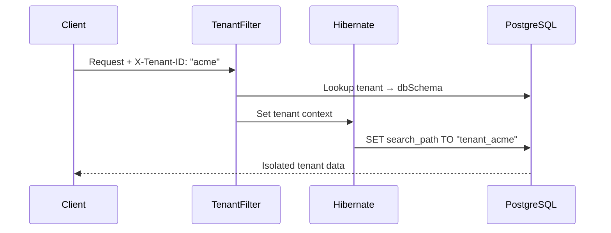
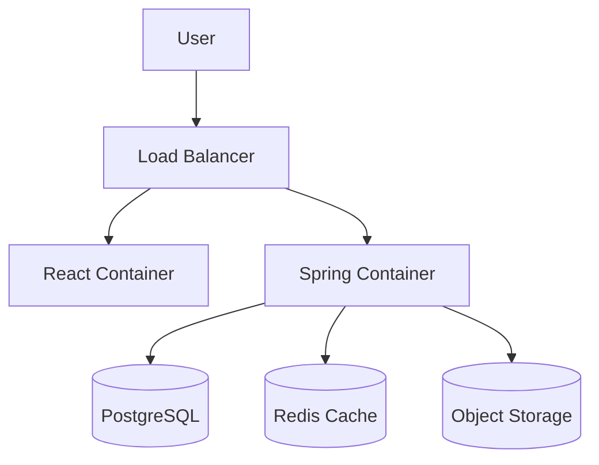

# EduFlex 2.0 – System Architecture

---

## 1. System Overview

EduFlex 2.0 is an enterprise-grade **Learning Management System (LMS)** designed for high scalability and modularity.
Unlike traditional monolithic LMSs, EduFlex uses a **"Kernel + Modules"** architecture where features like SCORM, Gamification, and Revenue Management are decoupled and toggleable.

---

## 2. Technical Stack

### Frontend
- **Framework:** React 19 (Vite)
- **Styling:** Tailwind CSS v4 (Dark Mode, CSS Variables)
- **State Management:** Zustand + React Context
- **Real-time:** SockJS + STOMP (WebSockets)
- **Visuals:** Recharts (Analytics), Lucide React (Icons), React-Quill-new (Rich Text)

### Backend
- **Framework:** Spring Boot 3.4
- **Database:** PostgreSQL 15 (Production) / H2 (Test)
- **Caching:** Redis 7 (Sessions, Data)
- **Storage:** MinIO / AWS S3 (Documents, SCORM)
- **Security:** Spring Security 6, JWT, OAuth2 (Google/GitHub/Entra ID)
- **PDF Generation:** OpenPDF (Certificates, Invoices)

### Infrastructure
- **Containerization:** Docker Compose / Swarm
- **Monitoring:** Prometheus + Grafana
- **Proxy:** Nginx (Recommended for Prod)

---

## 3. Core Architecture

### A. The Module System ("Kernel + Extensions")
The core philosophy is that "Core" should only handle Users, Auth, and Basic Course Logic. Everything else is an extension.

#### 1. SystemModules
The feature flag engine. Controlled via `/api/modules`.
- **SCORM:** Toggles uploading/playing courseware.
- **REVENUE:** Toggles subscriptions and invoices.
- **GAMIFICATION:** Toggles XP, Badges, and Leaderboards.
- **CHAT:** Toggles WebSocket services.

#### 2. License Enforcement
A strict filter (`LicenseFilter`) intercepts requests.
- **BASIC:** Limited features.
- **PRO:** Enables Gamification, Reporting.
- **ENTERPRISE:** Enables SCORM, White-labeling, SSO.
- **Verification:** RSA-signed license keys (`eduflex.license`).

### B. Data & Storage Flow

#### File Uploads (Hybrid Strategy)
1. **User Upload:** File sent to `MultipartFile` endpoint.
2. **Persistence:**
    - **Small Files (Images/Docs):** Stored in MinIO/S3 buckets.
    - **SCORM Packages:** Unzipped to local SSD volume (`/uploads/scorm/`) for low-latency static serving via Nginx/Spring ResourceHandler.

#### Caching Strategy (Redis)
- **Session:** User tokens and active WebSocket sessions.
- **Data:** Frequent lookups (e.g., "Get All Modules", "Course List").

---

## 4. Key Subsystems

### 🎓 SCORM / xAPI Engine
- **Parser:** Detects `imsmanifest.xml` or `index.html`.
- **Player:** Serves content in sandboxed iFrames.
- **Tracking:** (Upcoming) Intercepts API calls to store CMI data (completion, score).

### 💰 Revenue Management
- **Subscription Wrapper:** Users have a `SubscriptionPlan`.
- **Invoice Generator:** Cron job runs on the 25th of each month.
- **Payment Abstraction:** `PaymentService` abstracts Stripe/Swish logic.

### 🛡️ Security Layer
- **RBAC:** `TEACHER`, `STUDENT`, `ADMIN`, `MENTOR`, `PRINCIPAL`.
- **CORS:** Explicitly allowed headers for Auth/Content-Type.
- **Audit:** EntityListeners track all critical changes (`AuditLog`).

### 🏢 Multi-Tenancy (NEW)
EduFlex supports **schema-based multi-tenancy** for complete data isolation between organizations.

#### Architecture
```
┌─────────────────────────────────────────────────────────────┐
│                     PostgreSQL Database                      │
├─────────────────┬─────────────────┬─────────────────────────┤
│  public schema  │  tenant_acme    │  tenant_school2        │
│  ───────────────│  ───────────────│  ───────────────────── │
│  • tenants      │  • app_users    │  • app_users           │
│  (metadata)     │  • courses      │  • courses             │
│                 │  • roles        │  • roles               │
│                 │  • (40+ tables) │  • (40+ tables)        │
└─────────────────┴─────────────────┴─────────────────────────┘
```

#### Key Components
| Component | Role |
|-----------|------|
| `TenantFilter` | Extracts `X-Tenant-ID` header, validates tenant, sets context |
| `TenantContext` | ThreadLocal storage for current tenant schema |
| `TenantIdentifierResolver` | Tells Hibernate which tenant to use |
| `SchemaMultiTenantConnectionProvider` | Sets PostgreSQL `search_path` per-request |

#### Request Flow


---

## 5. Deployment Model



### Volume Persistence
- `postgres_data`: Database files.
- `minio_data`: Object storage blobs.
- `uploads`: Unzipped SCORM / Static assets.
- `logs`: Application logs.

---

## 6. Future Architecture (Roadmap)

| Feature | Status |
|---------|--------|
| **Multi-tenancy** (Schema-per-tenant) | ✅ Implemented |
| **Microservices Split** (Video/PDF workers) | 🔜 Planned |
| **Event Bus** (RabbitMQ/Kafka) | 🔜 Planned |
| **Kubernetes Native** (Helm Charts) | ✅ Implemented |

---

*Updated: 2026-01-15*
