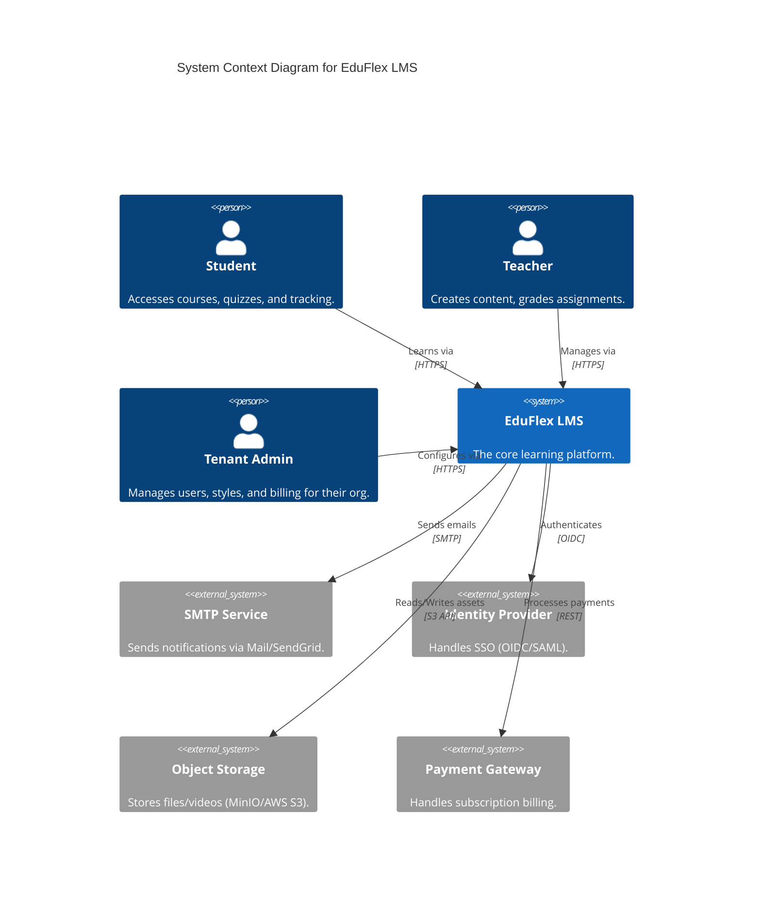
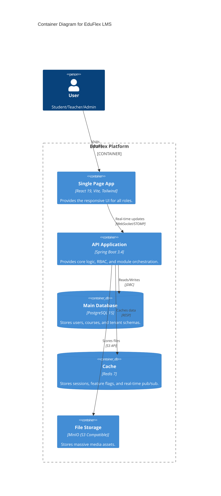
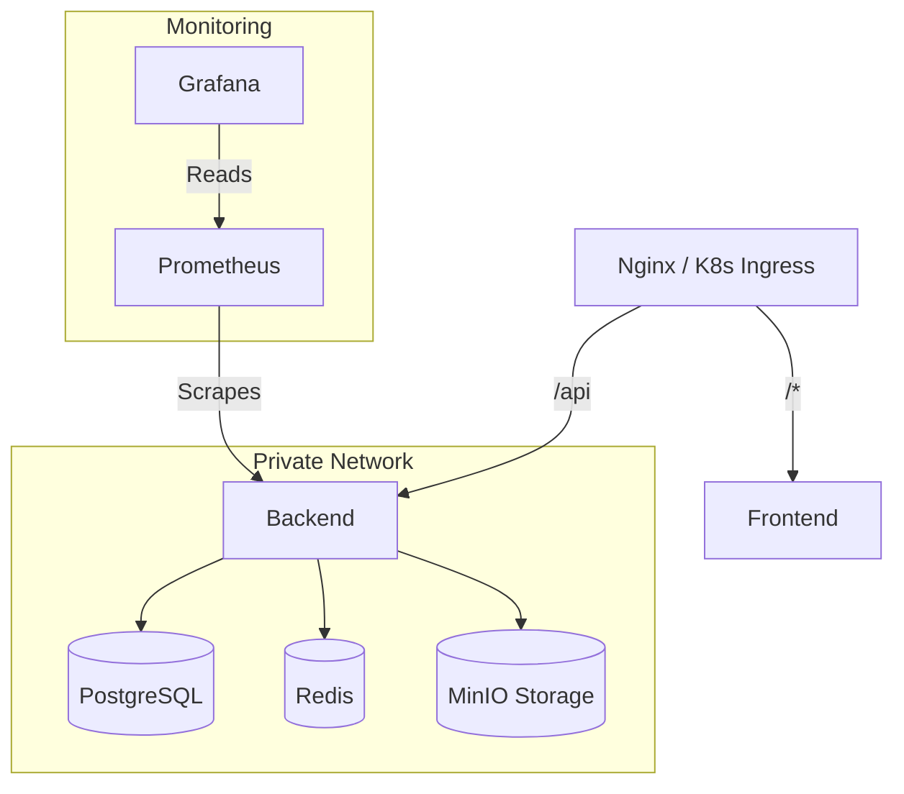

# 🏛️ EduFlex 2.0 – System Architecture

> **Enterprise-Grade LMS Architecture** designed for high scalability, multi-tenancy, and modularity.

---

## 1. Architectural Principles
EduFlex uses a **"Kernel + Modules"** architecture.
*   **Kernel:** Only handles critical domains: Users, Auth, Tenants, and Basic Course Logic.
*   **Modules:** All other features (SCORM, Gamification, Revenue, Chat) are decoupled extensions controlled by feature flags.
*   **Multi-Tenancy:** Schema-based isolation (one schema per tenant) ensures 100% data separation.

---

## 2. C4 Model Diagrams

### Level 1: System Context
Who uses the system and how it fits into the IT landscape.

### Level 2: Container Diagram
High-level technology choices and communication.

---

## 3. Technical Stack Deep Dive

### Frontend ("The Face")
*   **Framework:** React 19 (Vite) for blazing fast loads.
*   **Styling:** Tailwind CSS v4 (Dark Mode, CSS Variables).
*   **State:** Zustand (global state) + React Context (theme/auth).
*   **Real-time:** SockJS + STOMP (WebSockets) for instant chat/notifications.

### Backend ("The Brain")
*   **Framework:** Spring Boot 3.4 (Java 21).
*   **Security:** Spring Security 6 + OAuth2 Resource Server.
*   **Database:** PostgreSQL 15 with **Schema-per-Tenant** strategy.
*   **Observability:** Micrometer + Prometheus endpoints.

---

## 4. Key Subsystems

### 🏢 Schema-Based Multi-Tenancy
We typically use **One Database, Multiple Schemas**.
1.  **Request:** Client sends `X-Tenant-ID` header.
2.  **Filter:** `TenantFilter` intercepts request, sets `TenantContext`.
3.  **Connection:** `SchemaMultiTenantConnectionProvider` attempts `SET search_path TO tenant_xyz`.
4.  **Isolation:** Hibernate only sees tables in that schema. Cross-tenant data leakage is IMPOSSIBLE.

### 🎓 SCORM / xAPI Player
*   **Upload:** Zips are extracted to distinct folders.
*   **Manifest:** `imsmanifest.xml` is parsed to build the course tree.
*   **Sandbox:** Content plays in an `iframe` to isolate legacy JS.
*   **Tracking:** Bridge API captures `LMSInitialize`, `LMSSetValue` calls and forwards to Spring Boot.

### 🛡️ Access Control (RBAC)
| Role | Responsibility |
|------|----------------|
| `STUDENT` | Consume content, take quizzes. |
| `TEACHER` | Create courses, grade users. |
| `MENTOR` | View progress of assigned students (read-only). |
| `PRINCIPAL` | View analytics for the school. |
| `ADMIN` | Manage tenant settings, users, and billing. |

---

## 5. Deployment & Operations

### Standard K8s / Docker Compose Setup

### Volume Persistence Strategies
*   **`postgres_data`**: Critical business data. (RPO: 5 mins)
*   **`minio_data`**: Heavy assets. (Backup: Daily)
*   **`uploads`**: Unzipped SCORM packages. (Can be rebuilt from MinIO if needed).
